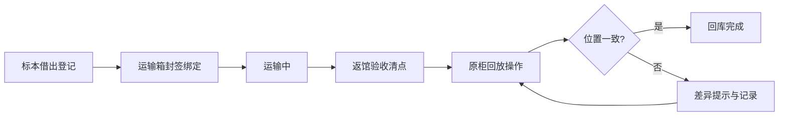

## 1. 产品概述
自然博物馆借展回库核对台是一套标本借展全流程管理系统，串联标本借出、运输箱封签、返馆验收和原柜回放四大环节，实现回库核对的数字化和自动化。
- 核心目的：解决传统人工核对效率低、易出错的问题，确保标本回库位置的准确性
- 目标用户：博物馆馆员、标本管理员
- 核心价值：实时柜位差异检测、封签状态追溯、回库差异清单自动生成

## 2. 核心功能

### 2.1 用户角色
| 角色 | 注册方式 | 核心权限 |
|------|----------|----------|
| 标本馆员 | 系统账号 | 柜位操作、验收记录、查看差异 |
| 管理员 | 系统账号 | 全功能权限、柜位版本管理 |

### 2.2 功能模块
1. **借展工作台**：标本借出登记、运输箱管理
2. **封签管理**：封签绑定、状态追踪、解封验证
3. **返馆验收**：标本清点、状态检查、验收记录
4. **柜位核对台**：柜位可视化、拖拽回放、实时差异提示
5. **差异中心**：回库差异清单、历史版本对比

### 2.3 页面详情
| 页面名称 | 模块名称 | 功能描述 |
|----------|----------|----------|
| 工作台首页 | 流程概览 | 四阶段流程进度展示、待办任务提醒 |
| 柜位核对台 | 柜位示意图 | 标本柜可视化布局、拖拽操作、实时差异提示 |
| 柜位核对台 | 验收记录 | 标本验收状态列表、快速筛选 |
| 封签管理 | 封签列表 | 运输箱封签状态、扫码验证 |
| 差异中心 | 差异清单 | 回库位置差异、历史版本对比 |

## 3. 核心流程
馆员在系统中依次完成：标本借出登记→运输箱封签绑定→返馆验收清点→原柜回放核对。在回放环节，系统实时检测拖拽位置与原柜布局的一致性，异常时立即提示。

## 4. 用户界面设计

### 4.1 设计风格
- **主色调**：深青色(#1a535c) - 代表专业与可信赖
- **辅助色**：琥珀色(#ff9f1c) - 警示与强调；深绿(#2d6a4f) - 通过与确认
- **按钮风格**：圆角矩形，悬停微缩放效果
- **字体**：标题使用 Noto Serif SC（学术感），正文使用 Noto Sans SC（清晰易读）
- **布局风格**：卡片式布局，左侧导航+主工作区
- **图标风格**：线性图标，博物馆主题元素

### 4.2 页面设计概述
| 页面名称 | 模块名称 | UI元素 |
|----------|----------|--------|
| 工作台 | 流程进度条 | 四阶段时间轴、当前阶段高亮 |
| 柜位核对台 | 柜位示意图 | 网格布局、可拖拽标本卡片、差异高亮边框 |
| 柜位核对台 | 验收列表 | 表格布局、状态标签、快速筛选 |
| 差异中心 | 差异清单 | 对比视图、差异项标红、确认操作 |

### 4.3 响应式
- 桌面端优先设计，适配1280px及以上
- 柜位示意图区域自适应缩放
- 侧边栏可折叠以增加工作区空间
