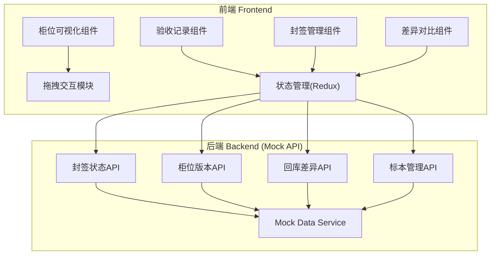
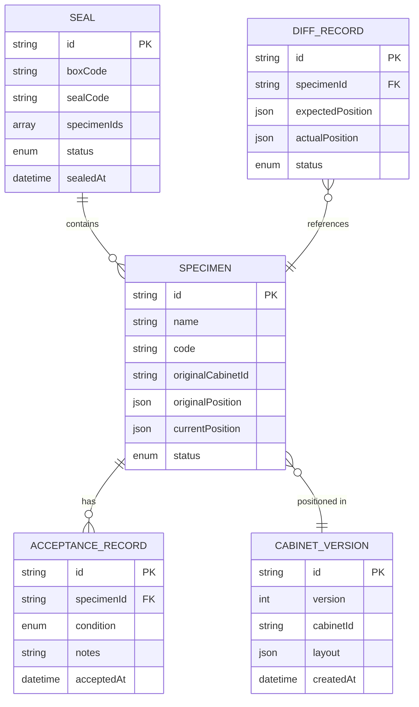

## 1. 架构设计



## 2. 技术描述

* **前端**：React\@18 + TypeScript + Redux Toolkit + tailwindcss\@3 + vite

* **初始化工具**：vite-init

* **后端**：Express\@4（可选，当前使用Mock API）

* **数据库**：SQLite（Mock阶段使用本地JSON存储）

* **拖拽库**：@dnd-kit/core + @dnd-kit/sortable

* **图标**：lucide-react

## 3. 路由定义

| 路由          | 页面名称   |
| ----------- | ------ |
| /           | 工作台首页  |
| /checkout   | 标本借出登记 |
| /seal       | 封签管理   |
| /acceptance | 返馆验收   |
| /cabinet    | 柜位核对台  |
| /diff       | 差异中心   |

## 4. API 定义

### 4.1 TypeScript 类型定义

```typescript
// 标本
interface Specimen {
  id: string;
  name: string;
  code: string;
  category: string;
  image?: string;
  originalCabinetId: string;
  originalPosition: { row: number; col: number };
  currentPosition?: { row: number; col: number };
  status: 'in-storage' | 'lent-out' | 'in-transit' | 'returned' | 'verified';
}

// 运输箱封签
interface Seal {
  id: string;
  boxCode: string;
  specimenIds: string[];
  sealCode: string;
  sealedAt: Date;
  unsealedAt?: Date;
  status: 'sealed' | 'in-transit' | 'unsealed';
}

// 柜位版本
interface CabinetVersion {
  id: string;
  version: number;
  cabinetId: string;
  layout: Array<{ position: { row: number; col: number }; specimenId?: string }>;
  createdAt: Date;
  createdBy: string;
}

// 回库差异
interface DiffRecord {
  id: string;
  specimenId: string;
  specimenName: string;
  expectedPosition: { row: number; col: number };
  actualPosition: { row: number; col: number };
  status: 'pending' | 'resolved' | 'approved';
  createdAt: Date;
}

// 验收记录
interface AcceptanceRecord {
  id: string;
  specimenId: string;
  condition: 'good' | 'damaged' | 'needs-repair';
  notes?: string;
  acceptedBy: string;
  acceptedAt: Date;
}
```

### 4.2 API 接口

```typescript
// 标本相关
GET /api/specimens?status=:status
GET /api/specimens/:id
PUT /api/specimens/:id/position

// 封签相关
GET /api/seals
POST /api/seals
PUT /api/seals/:id/unseal

// 柜位版本
GET /api/cabinets/:id/versions
GET /api/cabinets/:id/versions/latest
POST /api/cabinets/:id/versions

// 差异记录
GET /api/diffs
POST /api/diffs/:id/resolve
```

## 5. 数据模型



