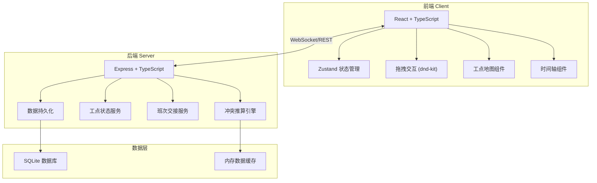
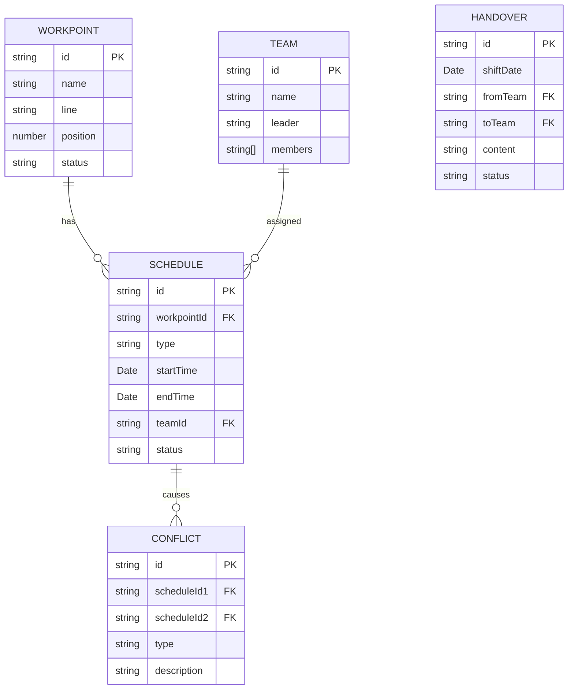

# 地铁检修联排台系统 技术架构文档

## 1. 系统架构设计



## 2. 技术栈说明

### 2.1 前端技术栈
- **框架**: React 18 + TypeScript
- **构建工具**: Vite
- **状态管理**: Zustand
- **UI 框架**: Tailwind CSS 3
- **拖拽库**: @dnd-kit/core
- **路由**: react-router-dom
- **图标**: lucide-react
- **日期处理**: date-fns

### 2.2 后端技术栈
- **框架**: Express 4 + TypeScript
- **实时通信**: Socket.io (WebSocket)
- **数据库**: SQLite (开发环境)
- **ORM**: Prisma
- **日期处理**: date-fns

### 2.3 开发工具
- **包管理器**: npm
- **代码规范**: ESLint + Prettier
- **类型检查**: TypeScript

## 3. 路由定义

### 3.1 前端路由
| 路由 | 页面 | 功能 |
|------|------|------|
| / | 联排台主页 | 时间轴、工点地图、冲突告警 |
| /applications | 申请管理 | 传感器更换、旧件回收申请 |
| /teams | 班组管理 | 人员管理、进场排班 |
| /handover | 班次交接 | 交接班记录、交接单 |

### 3.2 后端 API 路由
| 方法 | 路由 | 功能 |
|------|------|------|
| GET | /api/workpoints | 获取所有工点 |
| GET | /api/workpoints/:id | 获取单个工点详情 |
| GET | /api/schedules | 获取所有排班 |
| POST | /api/schedules | 创建排班 |
| PUT | /api/schedules/:id | 更新排班（拖拽调整） |
| DELETE | /api/schedules/:id | 删除排班 |
| GET | /api/conflicts | 获取所有冲突 |
| POST | /api/conflicts/check | 实时冲突检测 |
| GET | /api/teams | 获取班组信息 |
| GET | /api/handover | 获取交接单列表 |
| POST | /api/handover | 创建交接单 |

## 4. 数据模型

### 4.1 实体关系图



### 4.2 核心数据类型定义

```typescript
// 工点类型
interface WorkPoint {
  id: string;
  name: string;
  line: string;
  position: number;
  status: 'normal' | 'maintenance' | 'offline';
}

// 排班类型
type ScheduleType = 'power-off' | 'sensor-replace' | 'team-entry' | 'recovery';

interface Schedule {
  id: string;
  workpointId: string;
  type: ScheduleType;
  startTime: Date;
  endTime: Date;
  teamId?: string;
  status: 'pending' | 'in-progress' | 'completed' | 'cancelled';
  title: string;
  description?: string;
}

// 冲突类型
interface Conflict {
  id: string;
  scheduleId1: string;
  scheduleId2: string;
  type: 'time-overlap' | 'resource-conflict' | 'safety-violation';
  description: string;
  severity: 'warning' | 'critical';
}

// 班组类型
interface Team {
  id: string;
  name: string;
  leader: string;
  members: string[];
  shift: 'day' | 'night';
}

// 交接单类型
interface Handover {
  id: string;
  shiftDate: Date;
  fromTeam: string;
  toTeam: string;
  content: string;
  tasks: HandoverTask[];
  status: 'draft' | 'submitted' | 'confirmed';
  createdAt: Date;
}

interface HandoverTask {
  id: string;
  title: string;
  status: 'pending' | 'completed';
  priority: 'high' | 'medium' | 'low';
}
```

## 5. 冲突检测算法

### 5.1 时间重叠检测
```typescript
function checkTimeOverlap(s1: Schedule, s2: Schedule): boolean {
  return s1.startTime < s2.endTime && s2.startTime < s1.endTime;
}
```

### 5.2 冲突类型
1. **时间重叠冲突**: 同一工点同一时间有多个作业
2. **资源冲突**: 同一班组同时被分配到多个工点
3. **安全违规**: 传感器更换未在断电窗口内进行

### 5.3 实时检测流程
1. 前端拖拽调整窗口时，发送临时数据到后端
2. 后端计算所有可能的时间重叠
3. 检查业务规则约束（如更换必须在断电窗口内）
4. 返回冲突列表给前端实时展示

## 6. 项目结构

```
.
├── .trae/documents/          # 项目文档
├── src/                      # 前端源码
│   ├── components/           # 组件
│   │   ├── Timeline/         # 时间轴组件
│   │   ├── WorkpointMap/     # 工点地图组件
│   │   ├── ConflictAlert/    # 冲突告警组件
│   │   └── ScheduleCard/     # 排班卡片组件
│   ├── pages/                # 页面
│   ├── store/                # Zustand 状态管理
│   ├── types/                # TypeScript 类型
│   ├── utils/                # 工具函数
│   └── App.tsx               # 应用入口
├── api/                      # 后端源码
│   ├── src/
│   │   ├── controllers/      # 控制器
│   │   ├── services/         # 业务逻辑
│   │   ├── models/           # 数据模型
│   │   └── server.ts         # 服务入口
│   └── prisma/               # 数据库 schema
├── shared/                   # 共享类型
├── package.json
├── tsconfig.json
└── vite.config.ts
```

## 7. 核心业务流程实现

### 7.1 窗口拖拽调整
1. 用户拖拽 ScheduleCard 组件
2. dnd-kit 捕获拖拽事件，计算新的时间位置
3. 实时调用冲突检测 API
4. 显示冲突告警，用户确认后提交更新

### 7.2 实时冲突推送
1. 后端使用 Socket.io 建立 WebSocket 连接
2. 任何排班变更触发冲突重计算
3. 通过 WebSocket 主动推送冲突更新到所有客户端

### 7.3 班次交接单生成
1. 根据当前班次的所有排班状态自动生成任务列表
2. 支持手动添加备注和特殊说明
3. 交接双方确认后更新状态，生成历史记录
