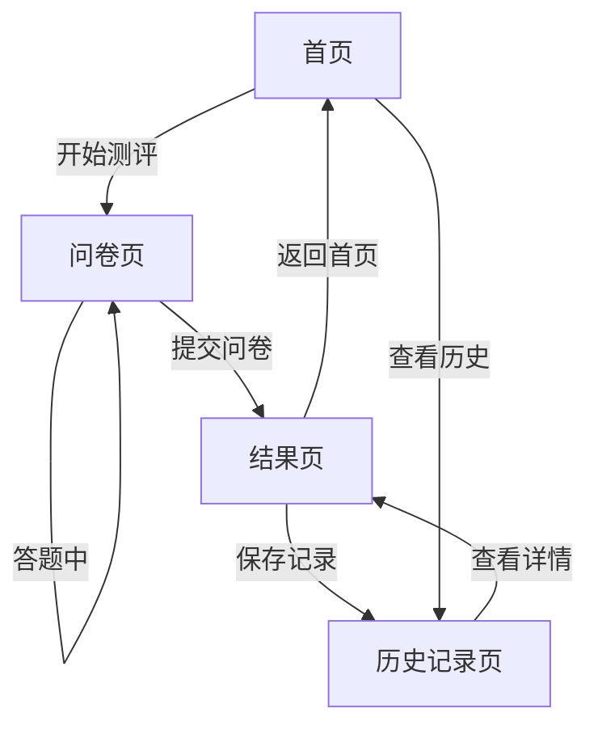

## 1. 产品概述

中医体质辨识系统，基于中华中医药学会《中医体质分类与判定》标准，通过60道标准化问卷帮助用户辨识自身体质类型，获取个性化养生建议，并追踪体质变化趋势。
- 面向关注健康养生的普通用户，提供科学、便捷的中医体质自测工具
- 通过体质辨识+养生建议+趋势追踪的闭环，打造专业的中医健康管理平台

## 2. 核心功能

### 2.1 用户角色
| 角色 | 注册方式 | 核心权限 |
|------|----------|----------|
| 普通用户 | 无需注册（本地存储） | 填写问卷、查看结果、保存历史、对比趋势 |

### 2.2 功能模块
1. **首页**：产品介绍、开始测评入口、历史记录快速入口
2. **问卷页**：60道标准化题目，九种体质分类，1-5分评分
3. **结果页**：体质雷达图（九宫格）、主要体质/兼有体质判定、个性化养生建议
4. **历史记录页**：历史测评列表、体质变化趋势折线图对比

### 2.3 页面详情
| 页面名称 | 模块名称 | 功能描述 |
|----------|----------|----------|
| 首页 | 品牌区 | Logo、产品名称、标语，背景采用渐变水墨风 |
| 首页 | 功能入口 | 「开始测评」主按钮、「查看历史」次按钮 |
| 首页 | 体质简介 | 九种体质简要介绍卡片横向滚动展示 |
| 问卷页 | 进度指示 | 顶部进度条、当前题号/总题数 |
| 问卷页 | 题目卡片 | 单题显示，1-5分评分按钮，支持上一题/下一题 |
| 问卷页 | 提交按钮 | 全部答完后显示，点击进入结果 |
| 结果页 | 体质雷达图 | 九种体质得分0-100的九宫格雷达图，突出主要体质 |
| 结果页 | 体质判定 | 主要体质（最高分）+ 兼有体质（次高分）展示卡片 |
| 结果页 | 养生建议 | 饮食调养、起居调摄、运动保健、穴位按摩四大模块 |
| 结果页 | 保存记录 | 保存本次测评结果到本地历史 |
| 历史记录页 | 记录列表 | 按时间倒序展示所有测评记录，点击查看详情 |
| 历史记录页 | 趋势折线图 | 各体质得分随时间变化的折线图，可切换体质查看 |
| 历史记录页 | 对比模式 | 选择两次测评进行对比，显示差值变化 |

## 3. 核心流程

用户从首页点击「开始测评」，进入问卷页逐步答题，提交后查看体质分析结果，可保存到历史记录。在历史记录页可查看所有过去的测评结果，并通过折线图对比体质变化趋势。

## 4. 用户界面设计

### 4.1 设计风格
- 主色调：墨绿 `#2d5a4a` 与中医金 `#c9a962`，辅以米白 `#f5f0e6` 作为底色
- 辅助色：平和质-青 `#4a9e7e`、气虚质-淡红 `#e8a87c`、阳虚质-橙 `#d4753c`、阴虚质-紫 `#9b7ec4`、痰湿质-灰蓝 `#6b8e9e`、湿热质-红棕 `#c4654a`、血瘀质-深红 `#a34040`、气郁质-靛青 `#4a6e8e`、特禀质-黄绿 `#8cb369`
- 按钮风格：圆角8px，带微阴影，主按钮用金色填充+墨绿文字
- 字体：标题用「思源宋体」展现中医韵味，正文用「思源黑体」保证可读性
- 布局：卡片式布局为主，最大宽度1200px居中，留白充足
- 图标风格：线性风格，线条粗细2px，圆角端点

### 4.2 页面设计概述
| 页面名称 | 模块名称 | UI元素 |
|----------|----------|----------|
| 首页 | 品牌区 | 居中大标题，副标题渐变墨绿→金色，下方装饰性分隔线 |
| 首页 | 功能入口 | 「开始测评」大号主按钮（金色），「查看历史」次要按钮（墨绿边框） |
| 首页 | 体质简介 | 横向滚动卡片，每张卡片含体质图标、名称、简介文字 |
| 问卷页 | 进度指示 | 顶部细线进度条（金色），右侧显示当前题数 |
| 问卷页 | 题目卡片 | 白色圆角卡片，题目文字大号居中，评分按钮5个横向排列 |
| 问卷页 | 导航按钮 | 左下角「上一题」、右下角「下一题/提交」 |
| 结果页 | 体质雷达图 | 居中300×300px 雷达图，九角形填充半透明墨绿，主要体质顶点高亮金色 |
| 结果页 | 体质判定 | 并排两张卡片：主要体质（金色边框+填充）、兼有体质（墨绿边框） |
| 结果页 | 养生建议 | 四个标签页切换：饮食🥗、起居🌙、运动🏃、穴位💆 |
| 结果页 | 保存记录 | 右上角图标按钮，点击后提示已保存 |
| 历史记录页 | 记录列表 | 时间线样式，每条记录含日期、主要体质、查看详情按钮 |
| 历史记录页 | 趋势折线图 | 彩色折线，每条体质一种颜色，图例可点击切换显示 |
| 历史记录页 | 对比模式 | 勾选两次记录，下方显示得分对比表格+箭头指示变化方向 |

### 4.3 响应式设计
- 桌面端优先设计，适配1200px以上屏幕
- 平板端（768px-1199px）：卡片布局调整为两列
- 移动端（768px以下）：单列布局，雷达图缩小至240px，按钮全屏宽度
- 触摸优化：评分按钮最小高度44px，可点击区域不小于44×44px
