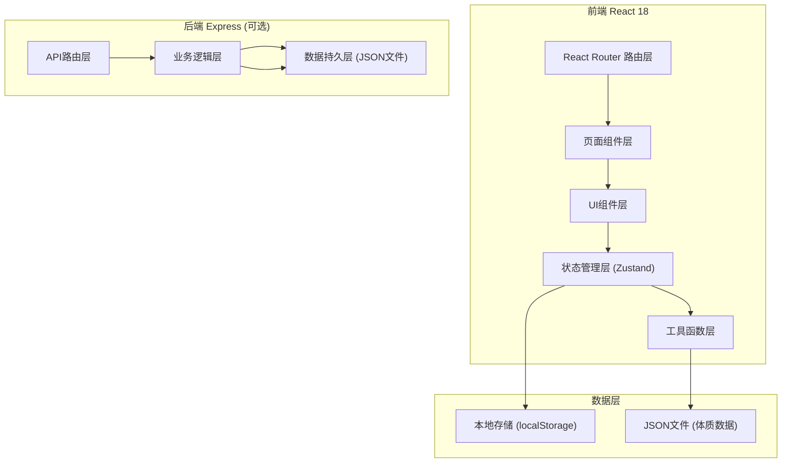
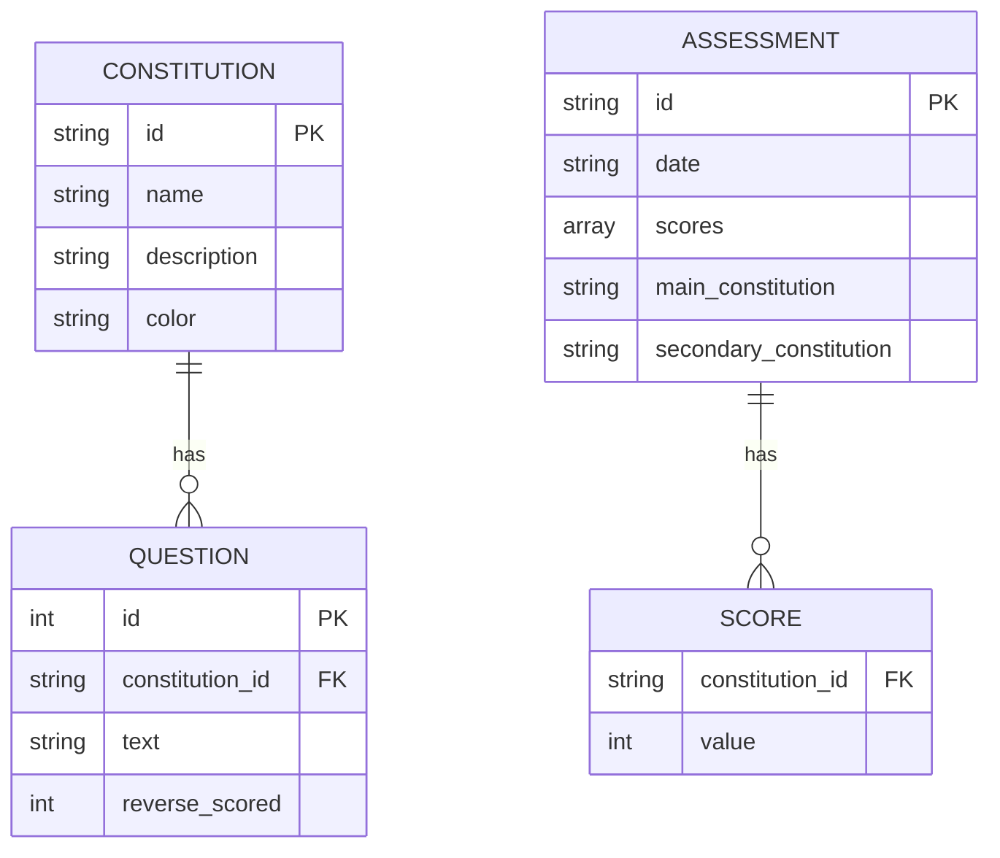

## 1. 架构设计



## 2. 技术说明
- 前端：React 18 + TypeScript + Tailwind CSS 3 + Vite
- 状态管理：Zustand
- 图表库：recharts（雷达图、折线图）
- 后端：无后端，使用 localStorage 本地存储历史记录
- 数据：体质问卷数据使用 JSON 文件静态加载

## 3. 路由定义
| 路由 | 用途 |
|------|------|
| `/` | 首页，展示产品介绍和功能入口 |
| `/questionnaire` | 问卷页，60道体质测评题目 |
| `/result` | 结果页，展示体质分析、雷达图、养生建议 |
| `/history` | 历史记录页，展示历史测评和趋势对比 |

## 4. 数据模型

### 4.1 数据模型定义



### 4.2 九种体质数据

| 体质ID | 体质名称 | 颜色 |
|--------|----------|------|
| pinghe | 平和质 | #4a9e7e |
| qixu | 气虚质 | #e8a87c |
| yangxu | 阳虚质 | #d4753c |
| yinxu | 阴虚质 | #9b7ec4 |
| tanshi | 痰湿质 | #6b8e9e |
| shire | 湿热质 | #c4654a |
| xueyu | 血瘀质 | #a34040 |
| qiyu | 气郁质 | #4a6e8e |
| tebing | 特禀质 | #8cb369 |

### 4.3 存储数据结构

localStorage key: `tcm_assessments`

```json
{
  "assessments": [
    {
      "id": "uuid",
      "date": "2024-01-15T10:30:00.000Z",
      "scores": {
        "pinghe": 65,
        "qixu": 32,
        "yangxu": 28,
        "yinxu": 45,
        "tanshi": 38,
        "shire": 52,
        "xueyu": 30,
        "qiyu": 42,
        "tebing": 25
      },
      "mainConstitution": "pinghe",
      "secondaryConstitution": "shire"
    }
  ]
}
```

## 5. 体质计算算法（中华中医药学会标准）

### 5.1 原始分计算
每种体质包含若干题目（平和质8题，其他各7-8题，共60题）。

原始分 = 该体质所有题目得分之和（反向题需转换：6 - 得分）

### 5.2 转化分计算
转化分 = [(原始分 - 题目数) / (题目数 × 4)] × 100

即：转化分 = (原始分 - 题目数) / (题目数 × 4) × 100

### 5.3 体质判定标准
- 平和质：平和质得分 ≥ 60 分 且 其他8种体质得分均 < 30 分
- 偏颇体质：该种体质得分 ≥ 40 分
- 兼夹体质：同时有2种及以上偏颇体质得分 ≥ 40 分

### 5.4 主要体质与兼有体质
- 主要体质：得分最高的体质
- 兼有体质：得分次高的体质（与主要体质不同时）
