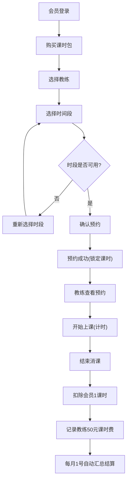

## 1. 产品概述

本系统是一个面向健身/培训行业的会员课时预约管理系统，解决会员购课、预约课程、教练消课、课时费自动结算等核心业务流程，支持500会员、20教练的高并发预约场景。

## 2. 核心功能

### 2.1 用户角色

| 角色 | 注册方式 | 核心权限 |
|------|----------|----------|
| 会员 | 手机号注册 | 购买课时包、预约课程、查看剩余课时、查看预约记录 |
| 教练 | 管理员添加 | 查看预约列表、开始上课计时、结束消课、查看课时费结算 |
| 管理员 | 系统预置 | 教练管理、数据统计、系统配置 |

### 2.2 功能模块

1. **会员端首页**：剩余课时展示、课时包购买入口、快速预约、预约记录
2. **课时包购买页**：10节课/20节课/50节课套餐选择与支付
3. **课程预约页**：教练选择、时间段选择、提交预约
4. **预约记录页**：历史预约、待上课、已完成、已取消列表
5. **教练端首页**：今日预约列表、待上课提醒
6. **教练预约管理**：预约详情、开始上课计时、消课操作
7. **教练结算页**：课时费明细、月度汇总、结算记录

### 2.3 页面详情

| 页面名称 | 模块名称 | 功能描述 |
|----------|----------|----------|
| 会员首页 | 课时概览 | 显示剩余课时、即将过期课时、最近预约 |
| 会员首页 | 快速入口 | 购买课时包、立即预约、查看记录 |
| 课时包购买 | 套餐展示 | 10节/20节/50节套餐卡片，显示单价和优惠 |
| 课时包购买 | 支付流程 | 选择套餐、确认支付、购买成功提示 |
| 课程预约 | 教练列表 | 显示所有可预约教练、教练简介、可预约时段 |
| 课程预约 | 时间选择 | 日期选择器、时间段网格、已占用时段标记 |
| 课程预约 | 预约确认 | 确认教练、时间、扣除课时后提交 |
| 预约记录 | 列表展示 | 分类标签（待上课/已完成/已取消）、时间排序 |
| 预约记录 | 详情查看 | 预约详情、取消预约（仅待上课状态） |
| 教练首页 | 今日预约 | 按时间排序的今日预约列表、状态标记 |
| 教练预约管理 | 预约详情 | 会员信息、预约时间、课时信息 |
| 教练预约管理 | 上课计时 | 开始上课按钮、实时计时器、结束消课按钮 |
| 教练结算 | 明细列表 | 每节课50元、日期、会员、状态 |
| 教练结算 | 月度汇总 | 每月1号自动汇总、总课时、总金额 |

## 3. 核心流程

### 3.1 会员购课预约流程
会员登录 → 购买课时包 → 选择教练 → 选择时间段 → 确认预约 → 预约成功（锁定课时）→ 教练开始上课 → 课程结束消课（扣除课时）

### 3.2 教练消课流程
教练登录 → 查看今日预约 → 点击开始上课（启动计时器）→ 课程结束点击消课 → 确认扣除会员1课时 → 系统自动记录教练课时费（50元）

### 3.3 课时费结算流程
每月1号0点 → 系统自动汇总上月所有已完成课程 → 按教练统计课时数 × 50元 → 生成月度结算单 → 教练可查看结算明细

## 4. 用户界面设计

### 4.1 设计风格
- **主色调**：深蓝渐变（#1e3a8a → #3b82f6），专业可信赖
- **辅助色**：翡翠绿（#10b981）表示成功/可用，珊瑚红（#ef4444）表示警告/占用
- **中性色**：深灰（#1f2937）正文，中灰（#6b7280）辅助文字，浅灰（#f3f4f6）背景
- **按钮风格**：圆角8px，悬停微上浮+阴影增强，点击缩放反馈
- **字体**：标题使用 Noto Sans SC Bold，正文使用 Noto Sans SC Regular
- **布局风格**：卡片式布局，清晰的信息层级，充足的留白
- **图标风格**：线性图标，统一2px描边，圆角端点

### 4.2 页面设计概述

| 页面名称 | 模块名称 | UI元素 |
|----------|----------|--------|
| 会员首页 | 课时概览 | 大数字展示剩余课时，渐变进度条显示有效期，微动效 |
| 会员首页 | 快速入口 | 三个功能卡片，图标+文字，hover上浮效果 |
| 课时包购买 | 套餐卡片 | 三栏布局，推荐套餐高亮边框，价格大字显示 |
| 课程预约 | 教练列表 | 头像+姓名+简介+评分，横向滑动选择 |
| 课程预约 | 时间网格 | 7天日期选择器，每日6个时间段，已占用灰色禁用 |
| 预约记录 | 列表 | 时间轴布局，状态标签颜色区分，左滑取消 |
| 教练首页 | 预约列表 | 卡片式，按时间分组，倒计时提醒 |
| 教练计时页 | 计时器 | 大字体数字计时，圆形进度环，开始/结束按钮 |
| 教练结算 | 月度汇总 | 顶部月度卡片，下方明细列表，柱状图展示趋势 |

### 4.3 响应性
- Desktop-first设计，桌面端1200px以上最优体验
- 平板端（768-1199px）：两栏变一栏，卡片自适应宽度
- 移动端（<768px）：单列布局，底部导航栏，触摸优化按钮尺寸48px
- 所有交互元素支持touch事件，关键操作有二次确认

### 4.4 关键业务约束
- 同一时段同一教练不可重复预约（数据库唯一索引 + 应用层双重校验）
- 支持500会员、20教练并发预约（数据库事务 + 连接池优化）
- 消课操作不可逆，需二次确认
- 课时包有有效期（默认180天），过期自动作废
