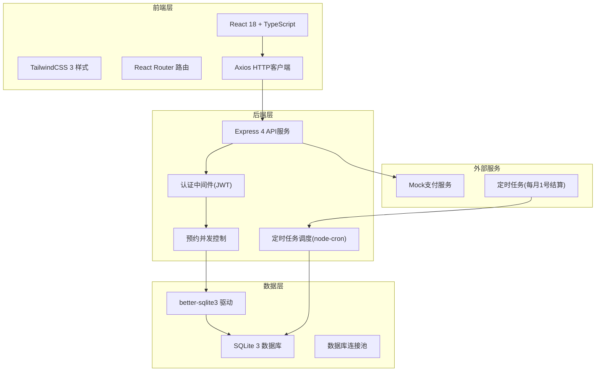
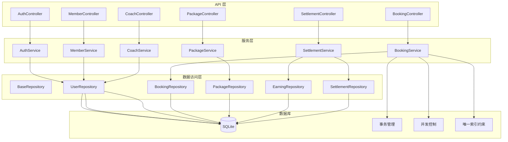

## 1. 架构设计



## 2. 技术描述

- **前端**: React@18 + TypeScript + TailwindCSS@3 + Vite@5 + React Router@6 + Axios
- **初始化工具**: Vite 官方模板 `npm create vite@latest`
- **后端**: Express@4 + TypeScript + better-sqlite3 + jsonwebtoken + node-cron
- **数据库**: SQLite 3 (通过 better-sqlite3 驱动，支持事务和并发)
- **状态管理**: React Context (用户状态) + useState/useReducer (组件状态)
- **构建工具**: 前端 Vite, 后端 ts-node + tsup

## 3. 路由定义

### 前端路由

| 路由 | 页面 | 说明 |
|------|------|------|
| /login | 登录页 | 角色选择登录 |
| /member | 会员首页 | 课时概览、快速入口 |
| /member/packages | 课时包购买 | 10/20/50节课套餐 |
| /member/booking | 课程预约 | 教练选择、时间选择 |
| /member/records | 预约记录 | 历史预约列表 |
| /coach | 教练首页 | 今日预约列表 |
| /coach/bookings | 预约管理 | 开始上课、消课 |
| /coach/settlement | 结算中心 | 课时费明细、月度汇总 |

### 后端API路由

| 方法 | 路由 | 说明 | 权限 |
|------|------|------|------|
| POST | /api/auth/login | 用户登录 | 公开 |
| GET | /api/member/profile | 会员信息 | 会员 |
| GET | /api/member/remaining-classes | 剩余课时 | 会员 |
| GET | /api/packages | 课时包列表 | 会员 |
| POST | /api/packages/:id/purchase | 购买课时包 | 会员 |
| GET | /api/coaches | 教练列表 | 会员 |
| GET | /api/coaches/:id/available-slots | 教练可用时段 | 会员 |
| POST | /api/bookings | 创建预约 | 会员 |
| GET | /api/member/bookings | 会员预约列表 | 会员 |
| DELETE | /api/bookings/:id | 取消预约 | 会员 |
| GET | /api/coach/bookings | 教练预约列表 | 教练 |
| PATCH | /api/bookings/:id/start | 开始上课 | 教练 |
| PATCH | /api/bookings/:id/complete | 结束消课 | 教练 |
| GET | /api/coach/earnings | 教练收入明细 | 教练 |
| GET | /api/coach/settlements | 月度结算列表 | 教练 |

## 4. API 类型定义

```typescript
// 用户类型
interface User {
  id: number;
  phone: string;
  name: string;
  role: 'member' | 'coach' | 'admin';
  avatar?: string;
  createdAt: string;
}

// 会员信息
interface MemberProfile {
  userId: number;
  remainingClasses: number;
  totalPurchased: number;
  totalUsed: number;
  expireDate?: string;
}

// 课时包
interface Package {
  id: number;
  name: string;
  classes: number;
  price: number;
  originalPrice: number;
  validityDays: number;
  description: string;
  isRecommended: boolean;
}

// 教练
interface Coach {
  id: number;
  userId: number;
  name: string;
  avatar: string;
  specialty: string;
  bio: string;
  rating: number;
  totalClasses: number;
}

// 时间段
interface TimeSlot {
  date: string;
  startTime: string;
  endTime: string;
  isAvailable: boolean;
}

// 预约
interface Booking {
  id: number;
  memberId: number;
  memberName: string;
  coachId: number;
  coachName: string;
  date: string;
  startTime: string;
  endTime: string;
  status: 'pending' | 'in-progress' | 'completed' | 'cancelled';
  startedAt?: string;
  completedAt?: string;
  createdAt: string;
}

// 课时费记录
interface Earning {
  id: number;
  coachId: number;
  bookingId: number;
  memberName: string;
  amount: number;
  classDate: string;
  createdAt: string;
}

// 月度结算
interface Settlement {
  id: number;
  coachId: number;
  month: string;
  totalClasses: number;
  totalAmount: number;
  status: 'pending' | 'paid';
  createdAt: string;
}
```

## 5. 服务器架构图



## 6. 数据模型

### 6.1 ER 图

```mermaid
erDiagram
    USER ||--|| MEMBER : is
    USER ||--|| COACH : is
    MEMBER ||--o{ BOOKING : makes
    COACH ||--o{ BOOKING : receives
    PACKAGE ||--o{ MEMBER_PACKAGE : "purchased by"
    MEMBER ||--o{ MEMBER_PACKAGE : owns
    BOOKING ||--|| EARNING : generates
    COACH ||--o{ EARNING : has
    COACH ||--o{ SETTLEMENT : receives
    EARNING }o--|| SETTLEMENT : "included in"
    
    USER {
        INTEGER id PK
        VARCHAR phone UNIQUE
        VARCHAR name
        VARCHAR role
        VARCHAR avatar
        DATETIME created_at
    }
    
    MEMBER {
        INTEGER id PK
        INTEGER user_id FK
        INTEGER remaining_classes
        DATETIME created_at
    }
    
    COACH {
        INTEGER id PK
        INTEGER user_id FK
        VARCHAR specialty
        TEXT bio
        DECIMAL rating
        INTEGER total_classes
        DATETIME created_at
    }
    
    PACKAGE {
        INTEGER id PK
        VARCHAR name
        INTEGER classes
        DECIMAL price
        DECIMAL original_price
        INTEGER validity_days
        TEXT description
        BOOLEAN is_recommended
    }
    
    MEMBER_PACKAGE {
        INTEGER id PK
        INTEGER member_id FK
        INTEGER package_id FK
        INTEGER remaining_classes
        DATETIME expire_date
        DATETIME purchased_at
    }
    
    BOOKING {
        INTEGER id PK
        INTEGER member_id FK
        INTEGER coach_id FK
        DATE date
        TIME start_time
        TIME end_time
        VARCHAR status
        DATETIME started_at
        DATETIME completed_at
        DATETIME created_at
    }
    
    EARNING {
        INTEGER id PK
        INTEGER coach_id FK
        INTEGER booking_id FK UNIQUE
        VARCHAR member_name
        DECIMAL amount
        DATE class_date
        DATETIME created_at
    }
    
    SETTLEMENT {
        INTEGER id PK
        INTEGER coach_id FK
        VARCHAR month
        INTEGER total_classes
        DECIMAL total_amount
        VARCHAR status
        DATETIME created_at
    }
```

### 6.2 DDL 语句

```sql
-- 用户表
CREATE TABLE users (
    id INTEGER PRIMARY KEY AUTOINCREMENT,
    phone VARCHAR(20) UNIQUE NOT NULL,
    name VARCHAR(50) NOT NULL,
    role VARCHAR(20) NOT NULL CHECK (role IN ('member', 'coach', 'admin')),
    avatar VARCHAR(255),
    password_hash VARCHAR(255) NOT NULL,
    created_at DATETIME DEFAULT CURRENT_TIMESTAMP
);

-- 会员表
CREATE TABLE members (
    id INTEGER PRIMARY KEY AUTOINCREMENT,
    user_id INTEGER UNIQUE NOT NULL REFERENCES users(id),
    remaining_classes INTEGER DEFAULT 0,
    created_at DATETIME DEFAULT CURRENT_TIMESTAMP
);

-- 教练表
CREATE TABLE coaches (
    id INTEGER PRIMARY KEY AUTOINCREMENT,
    user_id INTEGER UNIQUE NOT NULL REFERENCES users(id),
    specialty VARCHAR(100),
    bio TEXT,
    rating DECIMAL(3,2) DEFAULT 5.0,
    total_classes INTEGER DEFAULT 0,
    created_at DATETIME DEFAULT CURRENT_TIMESTAMP
);

-- 课时包表
CREATE TABLE packages (
    id INTEGER PRIMARY KEY AUTOINCREMENT,
    name VARCHAR(50) NOT NULL,
    classes INTEGER NOT NULL,
    price DECIMAL(10,2) NOT NULL,
    original_price DECIMAL(10,2) NOT NULL,
    validity_days INTEGER NOT NULL DEFAULT 180,
    description TEXT,
    is_recommended BOOLEAN DEFAULT 0,
    created_at DATETIME DEFAULT CURRENT_TIMESTAMP
);

-- 会员购买记录表
CREATE TABLE member_packages (
    id INTEGER PRIMARY KEY AUTOINCREMENT,
    member_id INTEGER NOT NULL REFERENCES members(id),
    package_id INTEGER NOT NULL REFERENCES packages(id),
    remaining_classes INTEGER NOT NULL,
    expire_date DATETIME NOT NULL,
    purchased_at DATETIME DEFAULT CURRENT_TIMESTAMP
);

-- 预约表 (核心业务表)
CREATE TABLE bookings (
    id INTEGER PRIMARY KEY AUTOINCREMENT,
    member_id INTEGER NOT NULL REFERENCES members(id),
    coach_id INTEGER NOT NULL REFERENCES coaches(id),
    date DATE NOT NULL,
    start_time TIME NOT NULL,
    end_time TIME NOT NULL,
    status VARCHAR(20) NOT NULL DEFAULT 'pending' 
        CHECK (status IN ('pending', 'in-progress', 'completed', 'cancelled')),
    started_at DATETIME,
    completed_at DATETIME,
    created_at DATETIME DEFAULT CURRENT_TIMESTAMP
);

-- 唯一索引：同一时段同一教练不可重复预约
CREATE UNIQUE INDEX idx_bookings_coach_time 
ON bookings(coach_id, date, start_time) 
WHERE status IN ('pending', 'in-progress');

-- 课时费记录表
CREATE TABLE earnings (
    id INTEGER PRIMARY KEY AUTOINCREMENT,
    coach_id INTEGER NOT NULL REFERENCES coaches(id),
    booking_id INTEGER UNIQUE NOT NULL REFERENCES bookings(id),
    member_name VARCHAR(50) NOT NULL,
    amount DECIMAL(10,2) NOT NULL DEFAULT 50.00,
    class_date DATE NOT NULL,
    settlement_id INTEGER REFERENCES settlements(id),
    created_at DATETIME DEFAULT CURRENT_TIMESTAMP
);

-- 月度结算表
CREATE TABLE settlements (
    id INTEGER PRIMARY KEY AUTOINCREMENT,
    coach_id INTEGER NOT NULL REFERENCES coaches(id),
    month VARCHAR(7) NOT NULL,
    total_classes INTEGER NOT NULL DEFAULT 0,
    total_amount DECIMAL(10,2) NOT NULL DEFAULT 0,
    status VARCHAR(20) NOT NULL DEFAULT 'pending' 
        CHECK (status IN ('pending', 'paid')),
    created_at DATETIME DEFAULT CURRENT_TIMESTAMP,
    UNIQUE(coach_id, month)
);

-- 索引优化
CREATE INDEX idx_bookings_member ON bookings(member_id);
CREATE INDEX idx_bookings_coach ON bookings(coach_id);
CREATE INDEX idx_bookings_date ON bookings(date);
CREATE INDEX idx_bookings_status ON bookings(status);
CREATE INDEX idx_earnings_coach ON earnings(coach_id);
CREATE INDEX idx_earnings_settlement ON earnings(settlement_id);
CREATE INDEX idx_member_packages_member ON member_packages(member_id);
CREATE INDEX idx_settlements_coach ON settlements(coach_id);

-- 初始化课时包数据
INSERT INTO packages (name, classes, price, original_price, validity_days, description, is_recommended) VALUES
('体验套餐', 10, 1500, 2000, 180, '适合初次体验的用户，10节课有效期半年', 0),
('进阶套餐', 20, 2800, 4000, 180, '热门推荐，性价比最高，20节课有效期半年', 1),
('尊享套餐', 50, 6000, 10000, 365, '长期训练首选，50节课有效期一年', 0);

-- 初始化测试教练数据
INSERT INTO users (phone, name, role, password_hash) VALUES
('13800000001', '张教练', 'coach', '$2b$10$test'),
('13800000002', '李教练', 'coach', '$2b$10$test'),
('13800000003', '王教练', 'coach', '$2b$10$test'),
('13800000004', '刘教练', 'coach', '$2b$10$test'),
('13800000005', '陈教练', 'coach', '$2b$10$test');

INSERT INTO coaches (user_id, specialty, bio, rating) VALUES
(1, '健身教练', '国家一级健身教练，10年经验', 4.9),
(2, '瑜伽教练', '高级瑜伽导师，擅长阴瑜伽', 4.8),
(3, '私教教练', '专业私人教练，减脂增肌专家', 4.95),
(4, '舞蹈教练', '现代舞、爵士舞教练', 4.7),
(5, '游泳教练', '前国家队游泳运动员', 5.0);

-- 初始化测试会员
INSERT INTO users (phone, name, role, password_hash) VALUES
('13900000001', '测试会员', 'member', '$2b$10$test');

INSERT INTO members (user_id, remaining_classes) VALUES (6, 0);
```

### 6.3 并发控制设计

1. **数据库层面**：
   - 使用 `UNIQUE INDEX idx_bookings_coach_time` 确保同一时段同一教练不可重复预约
   - 预约创建、消课操作使用事务保证原子性
   - 使用 `BEGIN IMMEDIATE` 开启写事务防止并发冲突

2. **应用层面**：
   - 预约创建前先查询时段可用性
   - 使用乐观锁/重试机制处理并发冲突
   - 数据库连接池设置合适的连接数（SQLite单文件数据库，建议连接池大小=5）

3. **性能优化**：
   - 合理设置索引，避免全表扫描
   - 查询分页，避免一次性加载大量数据
   - 热点数据缓存（如教练列表、课时包列表）
