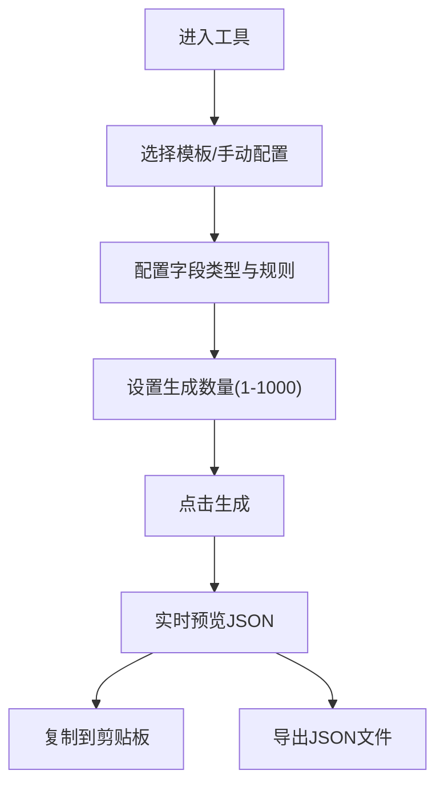

## 1. 产品概述

JSON模拟数据生成工具是一个面向开发者的在线数据生成平台，通过可视化界面快速配置数据结构和规则，实时生成高质量的Mock JSON数据，解决前端开发中后端接口未就绪时的数据模拟问题。

- 核心价值：提升开发效率，减少手动编写Mock数据的重复劳动
- 目标用户：前端开发者、测试工程师、API设计者
- 核心优势：纯前端实时生成、无需后端、支持复杂嵌套结构、内置常用模板

## 2. 核心特性

### 2.1 用户角色
| 角色 | 注册方式 | 核心权限 |
|------|----------|----------|
| 普通用户 | 无需注册 | 配置数据结构、生成数据、预览、导出JSON文件、使用内置模板 |

### 2.2 功能模块
1. **数据结构配置区**：字段名编辑、数据类型选择、数据规则配置
2. **数据预览区**：实时预览生成的JSON数据、支持格式化显示
3. **模板选择区**：内置用户列表、商品列表、文章列表等常用模板
4. **数据量控制区**：1-1000条数据生成数量设置
5. **导出功能区**：JSON文件导出、复制到剪贴板

### 2.3 页面详情
| 页面名称 | 模块名称 | 功能描述 |
|----------|----------|----------|
| 主页面 | 顶部导航栏 | 工具名称、操作按钮（清空、重置、复制、导出） |
| 主页面 | 左侧配置面板 | 字段列表管理、添加/删除字段、字段类型选择（字符串/数字/布尔/数组/对象）、规则配置 |
| 主页面 | 中间预览面板 | JSON数据实时预览、语法高亮、格式化显示、折叠展开 |
| 主页面 | 右侧模板与设置面板 | 内置模板快速选择、数据量设置（1-1000）、生成按钮 |

## 3. 核心流程

用户进入工具 → 选择内置模板或手动配置字段 → 设置每个字段的数据类型和规则 → 调整生成数量 → 点击生成按钮 → 实时预览JSON数据 → 复制或导出JSON文件

## 4. 用户界面设计

### 4.1 设计风格
- **设计方向**：开发者工具风格，深色主题配合亮色强调色，专业且现代
- **主色调**：深靛蓝 #1e293b（背景）、亮青色 #22d3ee（强调色）
- **辅助色**：橙色 #f97316（警告/按钮）、绿色 #10b981（成功）、紫色 #8b5cf6（对象类型）、蓝色 #3b82f6（数组类型）
- **按钮样式**：圆角8px，扁平设计，悬停时有微妙的发光效果
- **字体**：代码字体使用 JetBrains Mono，界面字体使用 Inter
- **布局风格**：三栏式布局，左侧配置、中间预览、右侧模板与设置
- **图标风格**：线性简约风格，使用Lucide图标库

### 4.2 页面设计概述
| 页面名称 | 模块名称 | UI元素 |
|----------|----------|--------|
| 主页面 | 顶部导航栏 | 半透明毛玻璃效果、工具Logo、快速操作按钮组 |
| 主页面 | 字段配置卡片 | 可拖拽排序、字段名输入框、类型下拉选择、规则动态表单、删除按钮 |
| 主页面 | JSON预览区 | 带行号、语法高亮、可折叠节点、滚动区域 |
| 主页面 | 模板选择区 | 卡片式模板展示、点击快速应用、模板预览图标 |
| 主页面 | 数据量滑块 | 自定义范围滑块、数值显示、快捷选择按钮 |

### 4.3 响应式设计
- **桌面端（默认）**：三栏布局，左侧30%、中间50%、右侧20%
- **平板端**：左右两栏，上半部分配置区、下半部分预览区
- **移动端**：单栏堆叠布局，标签页切换配置/预览
- 所有交互元素最小尺寸44x44px，支持触摸操作

### 4.4 视觉细节
- **背景**：深色渐变背景，配合微妙的网格纹理和噪点叠加
- **卡片**：半透明深色卡片，边框带微光效果，悬停时轻微上浮
- **动画**：字段添加/删除的平滑过渡、JSON生成时的渐入效果、按钮点击反馈
- **代码高亮**：JSON不同类型使用不同颜色（字符串绿色、数字橙色、布尔紫色、键名青色）
