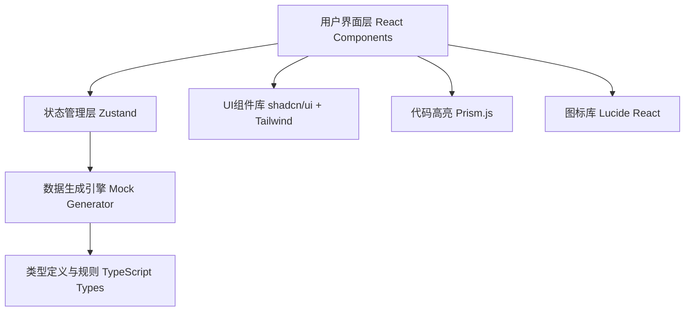

## 1. 架构设计

纯前端单页应用，无后端依赖，所有数据生成逻辑在浏览器端执行。



## 2. 技术选型说明

- **前端框架**：React@18 + TypeScript
- **构建工具**：Vite@5
- **样式方案**：TailwindCSS@3
- **状态管理**：Zustand（轻量级，适合中小规模应用）
- **UI组件**：shadcn/ui + Radix UI Primitives
- **代码高亮**：prismjs
- **图标**：lucide-react
- **后端**：无（纯前端实现）
- **数据库**：无（使用 localStorage 持久化用户配置）

## 3. 路由定义

| 路由 | 用途 |
|------|------|
| / | 主页面，包含所有功能模块 |

## 4. 核心数据结构定义

### 4.1 字段配置类型

```typescript
type FieldType = 'string' | 'number' | 'boolean' | 'array' | 'object';

interface FieldRule {
  // 字符串规则
  minLength?: number;
  maxLength?: number;
  pattern?: 'name' | 'email' | 'phone' | 'address' | 'sentence' | 'word' | 'uuid' | 'url' | 'date';
  customPattern?: string;
  
  // 数字规则
  min?: number;
  max?: number;
  isInteger?: boolean;
  decimalPlaces?: number;
  
  // 布尔规则
  trueProbability?: number; // 0-1
  
  // 数组规则
  arrayMinLength?: number;
  arrayMaxLength?: number;
  arrayItemType?: FieldType;
  arrayItemRules?: FieldRule;
  
  // 对象规则
  objectFields?: FieldConfig[];
}

interface FieldConfig {
  id: string;
  name: string;
  type: FieldType;
  rules: FieldRule;
  level: number; // 嵌套层级，最多3层
  parentId?: string;
  children?: FieldConfig[];
}
```

### 4.2 模板类型

```typescript
interface Template {
  id: string;
  name: string;
  description: string;
  icon: string;
  fields: FieldConfig[];
}
```

### 4.3 应用状态

```typescript
interface AppState {
  fields: FieldConfig[];
  generatedData: any[];
  dataCount: number;
  selectedTemplate: string | null;
  isGenerating: boolean;
}
```

## 5. 模块划分

### 5.1 目录结构

```
src/
├── components/
│   ├── Header.tsx              # 顶部导航
│   ├── FieldConfigPanel/       # 字段配置面板
│   │   ├── FieldConfigPanel.tsx
│   │   ├── FieldItem.tsx
│   │   ├── FieldTypeSelector.tsx
│   │   └── RuleConfigForm.tsx
│   ├── PreviewPanel/           # 预览面板
│   │   ├── PreviewPanel.tsx
│   │   └── JsonViewer.tsx
│   ├── TemplatePanel/          # 模板面板
│   │   ├── TemplatePanel.tsx
│   │   └── TemplateCard.tsx
│   └── SettingsPanel/          # 设置面板
│       ├── SettingsPanel.tsx
│       └── DataCountSlider.tsx
├── store/
│   └── useAppStore.ts          # Zustand状态管理
├── utils/
│   ├── mockGenerator.ts        # 数据生成引擎核心
│   ├── stringGenerators.ts     # 字符串生成器
│   ├── numberGenerators.ts     # 数字生成器
│   ├── exportUtils.ts          # 导出工具函数
│   └── templates.ts            # 内置模板配置
├── types/
│   └── index.ts                # TypeScript类型定义
├── App.tsx
├── main.tsx
└── index.css
```

### 5.2 核心模块说明

1. **数据生成引擎** (`mockGenerator.ts`)
   - 递归解析字段配置树
   - 根据字段类型调用对应生成器
   - 支持最多3层嵌套
   - 处理数组和对象的嵌套生成

2. **字符串生成器** (`stringGenerators.ts`)
   - 随机中/英文姓名、邮箱、手机号、地址
   - 随机句子、单词、UUID、URL、日期
   - 自定义正则表达式生成
   - 长度控制

3. **数字生成器** (`numberGenerators.ts`)
   - 整数/浮点数范围生成
   - 小数位数控制
   - 支持负数

4. **导出工具** (`exportUtils.ts`)
   - JSON文件下载
   - 复制到剪贴板
   - 格式化缩进

## 6. 核心算法说明

### 6.1 递归数据生成算法

```
函数 generateData(fieldConfig, level):
    如果 level > 3: 返回 null
    
    根据 fieldConfig.type 分支处理:
    - 'string': 调用字符串生成器
    - 'number': 调用数字生成器  
    - 'boolean': 按概率生成 true/false
    - 'array':
        - 生成 arrayMinLength 到 arrayMaxLength 之间的长度 N
        - 循环 N 次，递归调用 generateData(arrayItemConfig, level+1)
        - 返回数组
    - 'object':
        - 创建空对象
        - 遍历每个子字段，递归调用 generateData(childField, level+1)
        - 将结果赋值给对象对应属性
        - 返回对象
```

### 6.2 字段嵌套层级控制

- 根层级 level = 0
- 每进入一层嵌套 level + 1
- 当 level > 2 时，禁用添加子字段按钮
- UI上通过缩进和颜色区分不同层级

## 7. 性能优化

- 大数据量（>100条）时使用 requestIdleCallback 分批生成
- JSON预览使用虚拟滚动（只渲染可见区域）
- 字段配置变更使用防抖，避免频繁重生成
- 使用 useMemo 缓存计算结果
