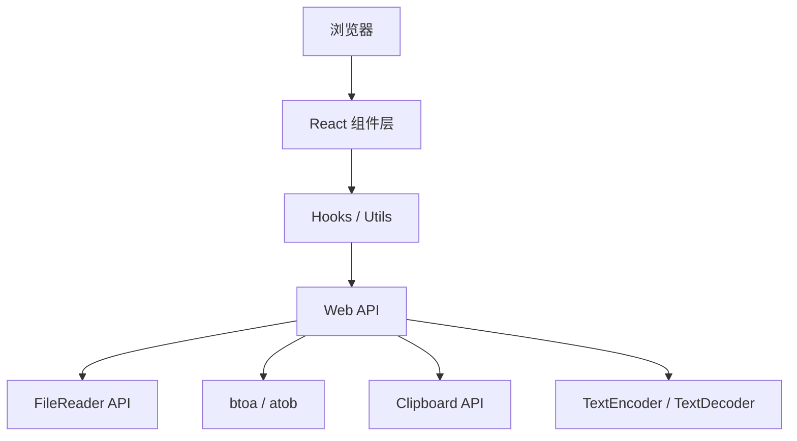

## 1. Architecture Design



## 2. Technology Description

- **前端**：React@18 + TypeScript + Vite + TailwindCSS@3
- **状态管理**：React useState（简单场景，无需zustand）
- **图标**：lucide-react
- **核心技术**：全部使用浏览器原生API，无后端依赖
  - `FileReader`：读取本地文件
  - `btoa` / `atob`：Base64编解码
  - `TextEncoder` / `TextDecoder`：处理Unicode字符
  - `Clipboard API`：复制到剪贴板
- **后端**：无（纯前端应用，所有处理在浏览器本地完成）
- **数据库**：无

## 3. Route Definitions

| Route | Purpose |
|-------|---------|
| / | 首页，包含所有功能模块 |

## 4. Project Structure

```
src/
├── components/
│   ├── TextConverter.tsx      # 文本编解码组件
│   ├── FileToBase64.tsx       # 文件转Base64组件
│   ├── Base64ToImage.tsx      # Base64转图片组件
│   ├── CopyButton.tsx         # 复制按钮组件
│   └── Header.tsx             # 页头组件
├── hooks/
│   └── useCopyToClipboard.ts  # 剪贴板Hook
├── utils/
│   └── base64.ts              # Base64编解码工具函数
├── App.tsx                    # 主应用组件
├── main.tsx                   # 入口文件
└── index.css                  # 全局样式
```

## 5. Core Utils Definition

### 5.1 Base64编解码工具函数

```typescript
// 编码：支持Unicode字符
export const encodeToBase64 = (text: string): string => {
  const encoder = new TextEncoder();
  const data = encoder.encode(text);
  return btoa(String.fromCharCode(...data));
};

// 解码：支持Unicode字符
export const decodeFromBase64 = (base64: string): string => {
  const binary = atob(base64);
  const bytes = new Uint8Array(binary.length);
  for (let i = 0; i < binary.length; i++) {
    bytes[i] = binary.charCodeAt(i);
  }
  const decoder = new TextDecoder();
  return decoder.decode(bytes);
};

// 文件转Base64
export const fileToBase64 = (file: File): Promise<string> => {
  return new Promise((resolve, reject) => {
    const reader = new FileReader();
    reader.onload = () => resolve(reader.result as string);
    reader.onerror = reject;
    reader.readAsDataURL(file);
  });
};

// 格式化文件大小
export const formatFileSize = (bytes: number): string => {
  if (bytes < 1024) return bytes + ' B';
  if (bytes < 1024 * 1024) return (bytes / 1024).toFixed(2) + ' KB';
  return (bytes / (1024 * 1024)).toFixed(2) + ' MB';
};
```

## 6. 关键技术说明

### 6.1 Unicode字符处理

由于原生`btoa`/`atob`只能处理Latin-1字符，需要通过`TextEncoder`/`TextDecoder`进行转码：
- 编码：文本 → Uint8Array → Latin-1字符串 → btoa → Base64
- 解码：Base64 → atob → Latin-1字符串 → Uint8Array → 文本

### 6.2 文件处理

使用`FileReader.readAsDataURL()`直接获取带MIME类型前缀的Base64字符串，方便直接用于``标签或其他场景。

### 6.3 剪贴板操作

优先使用现代`Clipboard API`（`navigator.clipboard.writeText`），提供更好的用户体验和错误处理。
