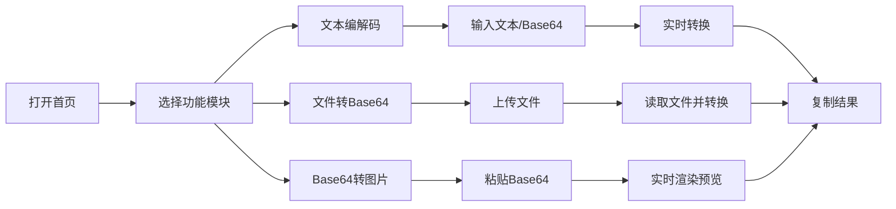

## 1. 产品概述

Base64编码解码工具，是一款面向开发者和普通用户的在线编码转换工具。支持文本、文件与Base64之间的双向转换，解决日常开发中Base64编码解码的需求，同时支持Unicode字符（中文、emoji）和文件处理。

- 核心价值：提供便捷、实时、安全的Base64转换服务，所有处理均在本地浏览器完成，无需上传服务器
- 目标用户：开发者、设计师、内容创作者
- 市场定位：轻量级、功能完整的在线编码转换工具

## 2. 核心 Features

### 2.1 Feature Module

1. **文本编解码模块**：普通文本与Base64字符串的实时双向转换
2. **文件转Base64模块**：支持图片、PDF等文件转Base64字符串，显示文件大小
3. **Base64转图片模块**：粘贴Base64字符串实时渲染图片预览
4. **剪贴板操作模块**：一键复制转换结果到剪贴板

### 2.2 Page Details

| 页面名称 | 模块名称 | Feature description |
|---------|---------|---------------------|
| 首页 | 文本编解码 | 输入普通文本实时显示Base64；输入Base64实时解码显示原文；支持中文、emoji等Unicode字符 |
| 首页 | 文件转Base64 | 拖拽或点击上传图片/PDF文件；显示文件名称、大小、类型；生成Base64字符串；支持复制 |
| 首页 | Base64转图片 | 粘贴/输入Base64字符串（支持data:image前缀）；实时渲染图片预览；支持下载图片 |
| 首页 | 通用功能 | 各模块均提供"复制到剪贴板"按钮；复制成功提示；输入清空功能 |

## 3. 核心流程

用户打开首页 → 选择需要的功能模块（文本/文件/图片） → 输入内容或上传文件 → 实时显示转换结果 → 点击复制按钮复制结果

## 4. User Interface Design

### 4.1 Design Style

- **设计风格**：现代简约科技风，深色主题，适合开发者使用场景
- **主色调**：深蓝/青色系（#0ea5e9），搭配深色背景，营造专业技术感
- **按钮风格**：圆角矩形，带有微妙的hover动效和阴影
- **字体**：使用现代无衬线字体，代码区域使用等宽字体
- **布局风格**：卡片式布局，三栏式设计，各功能模块独立卡片展示
- **图标风格**：使用Lucide图标库，线性简约风格

### 4.2 Page Design Overview

| 页面名称 | 模块名称 | UI Elements |
|---------|---------|-------------|
| 首页 | 头部 | 大标题、副标题、功能切换标签栏、主题切换按钮 |
| 首页 | 文本编解码卡片 | 双栏布局（输入区/输出区）、标签切换（编码/解码）、textarea、实时转换、复制按钮 |
| 首页 | 文件转Base64卡片 | 拖拽上传区域、文件信息展示、Base64输出区、复制按钮 |
| 首页 | Base64转图片卡片 | Base64输入区、图片预览区、下载按钮 |
| 首页 | 页脚 | 版权信息、技术说明 |

### 4.3 Responsiveness

- **Desktop-first**：桌面端三栏并排布局
- **Tablet**：两栏布局，第三栏换行
- **Mobile**：单列布局，各模块垂直堆叠
- **Touch优化**：按钮最小高度44px，输入区域适配虚拟键盘

### 4.4 动效设计

- 页面加载：卡片渐入动画，错落有致的延迟
- 输入反馈：边框颜色变化、阴影增强
- 复制成功：按钮文字切换为"已复制"，带缩放动效
- 拖拽上传：区域高亮、边框动画
