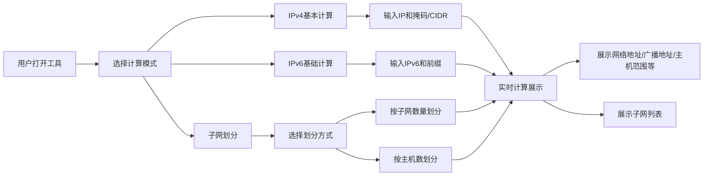

## 1. 产品概述

IP地址与子网计算工具是一款面向网络工程师、IT运维人员和计算机网络学习者的纯前端计算工具，帮助用户快速准确地完成IP地址规划、子网划分和网络参数计算。

- 主要用途：提供IPv4/IPv6地址的网络参数计算和子网划分功能，解决手工计算复杂易错的问题
- 目标用户：网络工程师、系统管理员、IT学生、网络安全从业者
- 产品价值：提高网络规划效率，减少计算错误，辅助网络知识学习

## 2. 核心功能

### 2.1 用户角色

| 角色 | 注册方式 | 核心权限 |
|------|----------|----------|
| 普通用户 | 无需注册 | 使用所有计算功能，无需登录 |

### 2.2 功能模块

1. **IPv4地址计算**：输入IP和子网掩码，计算网络地址、广播地址、可用主机范围、可用主机数量
2. **CIDR格式支持**：支持`192.168.1.100/24`格式的快捷输入
3. **IPv6基础支持**：支持IPv6地址的前缀计算和网络参数解析
4. **子网划分**：按子网数量或每个子网主机数自动计算子网掩码和各子网范围
5. **结果展示**：清晰展示所有计算结果，支持复制

### 2.3 页面详情

| 页面名称 | 模块名称 | 功能描述 |
|----------|----------|----------|
| 主页 | IPv4计算模块 | IP地址输入框、子网掩码选择/输入、实时计算结果展示 |
| 主页 | IPv6计算模块 | IPv6地址输入框、前缀长度选择、计算结果展示 |
| 主页 | 子网划分模块 | 划分方式选择（子网数量/主机数）、参数输入、子网列表展示 |
| 主页 | 结果展示区 | 网络地址、广播地址、主机范围、子网信息等结构化展示 |

## 3. 核心流程

用户打开工具 → 选择计算模式（IPv4/IPv6/子网划分） → 输入IP地址和子网掩码（或CIDR）→ 系统实时计算 → 展示详细结果 → 可选择子网划分功能进行进阶计算

## 4. 用户界面设计

### 4.1 设计风格

**设计理念**：科技感、专业、简洁高效的工具类应用

- **主色调**：深蓝色（#165DFF）代表科技与专业，作为品牌主色
- **辅助色**：青色（#0FC6C2）用于强调和交互元素，深灰（#1D2129）作为背景
- **中性色**：白色、浅灰用于卡片和文本层次
- **按钮风格**：圆角矩形，微阴影，hover时有轻微上浮效果
- **字体**：使用现代无衬线字体，数字使用等宽字体增强可读性
- **布局风格**：三栏卡片式布局，左侧输入区、中间结果区、右侧子网划分区
- **视觉元素**：网络拓扑示意图作为背景装饰，数据可视化展示IP范围

### 4.2 页面设计概述

| 页面名称 | 模块名称 | UI元素 |
|----------|----------|--------|
| 主页 | 头部导航 | Logo、标题、主题切换按钮（深色/浅色） |
| 主页 | IPv4计算卡片 | 输入框组、CIDR快捷选择器、计算结果网格 |
| 主页 | IPv6计算卡片 | IPv6输入框、前缀滑块、压缩/完整格式展示 |
| 主页 | 子网划分卡片 | 单选切换、数量输入、子网列表表格、分页 |
| 主页 | 结果展示 | 高亮关键数据、复制按钮、二进制可视化展示 |

### 4.3 响应式设计

- **桌面优先**：1200px+ 三栏布局
- **平板适配**：768px-1200px 两栏布局，子网划分区折叠
- **手机适配**：<768px 单栏流式布局，卡片堆叠展示
- **触摸优化**：输入框和按钮最小高度44px，便于触摸操作

### 4.4 交互与动画

- 页面加载：卡片渐入动画，错落延迟
- 计算结果：数字滚动动画，从0到最终值
- 输入验证：错误时输入框抖动动画，红色边框提示
- 子网划分：展开/折叠平滑过渡，表格行交替高亮
- 复制操作：点击后短暂绿色成功提示
