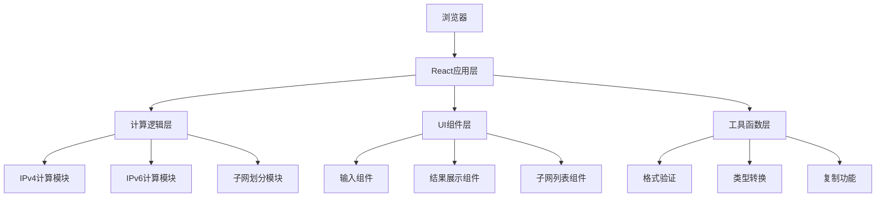

## 1. 架构设计

本项目为纯前端计算工具，无需后端服务，所有计算逻辑在浏览器端完成。



## 2. 技术描述

- **前端框架**: React@18 + TypeScript
- **构建工具**: Vite@5
- **样式方案**: TailwindCSS@3
- **图标库**: Lucide React
- **状态管理**: React Hooks (useState, useEffect)
- **无后端、无数据库**：所有计算纯前端完成
- **依赖极简**：仅引入必要的UI库，核心计算逻辑自行实现

## 3. 路由定义

| 路由 | 用途 |
|------|------|
| / | 主页，包含所有计算功能 |

单页面应用，无需多路由。

## 4. 核心计算模块

### 4.1 IPv4计算模块

```typescript
// IPv4计算结果类型
interface IPv4Result {
  ipAddress: string;           // 原始IP地址
  subnetMask: string;          // 子网掩码
  cidr: number;                // CIDR前缀
  networkAddress: string;      // 网络地址
  broadcastAddress: string;    // 广播地址
  usableHostRange: string;     // 可用主机范围
  usableHosts: number;         // 可用主机数量
  wildcardMask: string;        // 反掩码
  ipClass: string;             // IP分类 (A/B/C/D/E)
  isPrivate: boolean;          // 是否私网地址
  binaryRepresentation: {
    ip: string;
    mask: string;
    network: string;
  };
}

// 核心函数
function calculateIPv4(ip: string, mask: string | number): IPv4Result;
function cidrToMask(cidr: number): string;
function maskToCidr(mask: string): number;
function isValidIPv4(ip: string): boolean;
function isValidSubnetMask(mask: string): boolean;
```

### 4.2 IPv6计算模块

```typescript
// IPv6计算结果类型
interface IPv6Result {
  ipAddress: string;           // 原始IPv6地址
  compressed: string;          // 压缩格式
  expanded: string;            // 完整格式
  prefixLength: number;        // 前缀长度
  networkAddress: string;      // 网络地址
  networkSize: BigInt;         // 网络大小
  isLinkLocal: boolean;        // 是否链路本地
  isUniqueLocal: boolean;      // 是否唯一本地
  isGlobalUnicast: boolean;    // 是否全局单播
}

// 核心函数
function calculateIPv6(ip: string, prefix: number): IPv6Result;
function compressIPv6(ip: string): string;
function expandIPv6(ip: string): string;
function isValidIPv6(ip: string): boolean;
```

### 4.3 子网划分模块

```typescript
// 子网划分结果类型
interface SubnetInfo {
  index: number;
  networkAddress: string;
  broadcastAddress: string;
  usableHostRange: string;
  usableHosts: number;
  subnetMask: string;
  cidr: number;
}

interface SubnettingResult {
  originalNetwork: string;
  originalMask: string;
  newMask: string;
  newCidr: number;
  subnetCount: number;
  hostsPerSubnet: number;
  subnets: SubnetInfo[];
}

// 核心函数
function subnetByCount(ip: string, mask: string, subnetCount: number): SubnettingResult;
function subnetByHosts(ip: string, mask: string, hostsPerSubnet: number): SubnettingResult;
```

## 5. 数据格式说明

### 5.1 IP地址格式
- IPv4：点分十进制 `xxx.xxx.xxx.xxx`，每段 0-255
- IPv6：冒分十六进制，支持零压缩表示法
- CIDR：`IP/前缀长度` 格式，如 `192.168.1.0/24`

### 5.2 子网掩码格式
- 点分十进制：`255.255.255.0`
- CIDR前缀：`/24` 或数字 `24`

### 5.3 验证规则
- IPv4：4段，每段0-255，排除多播和实验地址段的非法使用
- IPv6：8段十六进制，支持零压缩和::表示法
- 子网掩码：必须是连续的1后跟连续的0的32位二进制数

## 6. 项目结构

```
src/
├── components/
│   ├── IPv4Calculator.tsx    # IPv4计算组件
│   ├── IPv6Calculator.tsx    # IPv6计算组件
│   ├── Subnetting.tsx        # 子网划分组件
│   ├── ResultCard.tsx        # 结果展示卡片
│   ├── CopyButton.tsx        # 复制按钮
│   └── Header.tsx            # 页头组件
├── utils/
│   ├── ipv4.ts               # IPv4计算逻辑
│   ├── ipv6.ts               # IPv6计算逻辑
│   ├── subnetting.ts         # 子网划分逻辑
│   └── validation.ts         # 验证函数
├── types/
│   └── index.ts              # TypeScript类型定义
├── App.tsx                   # 主应用组件
├── main.tsx                  # 入口文件
└── index.css                 # 全局样式
```

## 7. 性能与体验优化

- **实时计算**：输入变化时即时计算，防抖处理避免频繁计算
- **缓存机制**：相同输入不重复计算
- **错误提示**：输入无效时即时友好提示，不阻塞用户操作
- **响应式**：适配各种屏幕尺寸，移动端优先考虑触摸操作
- **无障碍**：键盘操作支持，语义化HTML，适当的ARIA属性
