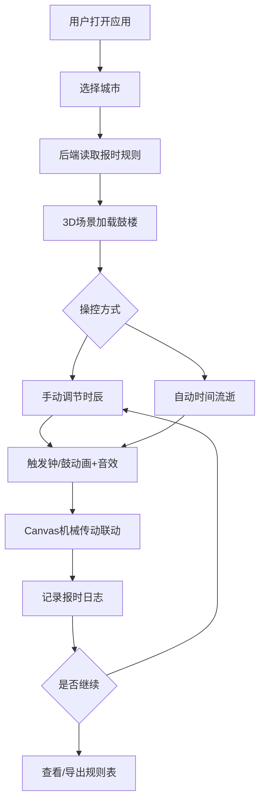

## 1. 产品概述

鼓楼钟声报时模拟系统是一款沉浸式历史文化体验应用，用户可选择中国古代城市（西安、洛阳、北京等），体验传统鼓楼报时的完整流程——从时辰切换、钟鼓机械联动到声音回响，再现古人"晨钟暮鼓"的时间秩序。

- 面向文化爱好者、教育工作者和历史研究者，以交互式3D场景重现古代报时制度
- 核心价值：将抽象的"时辰"概念具象化为可视、可听、可操控的沉浸体验

## 2. 核心功能

### 2.1 用户角色

| 角色 | 注册方式 | 核心权限 |
|------|----------|----------|
| 访客 | 无需注册 | 浏览城市、操控时辰、查看报时动画、导出规则表 |

### 2.2 功能模块

1. **主页面**：城市选择、3D鼓楼场景、时辰控制面板、机械传动剖面图、报时日志
2. **规则表页**：当前城市的完整报时规则数据表，支持导出CSV

### 2.3 页面详情

| 页面名称 | 模块名称 | 功能描述 |
|----------|----------|----------|
| 主页面 | 城市选择器 | 下拉选择城市，切换后重新加载该城报时规则与鼓楼风格 |
| 主页面 | 3D鼓楼场景 | Three.js渲染鼓楼建筑，支持旋转/缩放；时辰变化时触发钟/鼓动画 |
| 主页面 | 时辰控制面板 | 手动拖拽时辰滑块（子时→亥时）；开关自动时间流逝（1时辰≈5秒） |
| 主页面 | 机械传动剖面图 | Canvas 2D绘制齿轮→绳索→锤臂联动动画，随报时触发 |
| 主页面 | 音效系统 | Web Audio API合成钟声/鼓声，按规则次数播放 |
| 主页面 | 报时日志 | 实时显示每次报时的时间戳、时辰名、钟/鼓次数、用户操作 |
| 规则表页 | 规则数据表 | 展示当前城市的十二时辰报时规则（时辰、钟次数、鼓次数、说明） |
| 规则表页 | 导出功能 | 导出CSV格式的报时规则表 |

## 3. 核心流程

用户打开应用 → 选择城市 → 后端读取该城报时规则 → 3D场景加载对应鼓楼 → 用户调节时辰或开启自动流逝 → 触发钟/鼓机械动画+音效 → Canvas同步展示传动联动 → 日志记录报时事件 → 可随时查看/导出规则表

## 4. 用户界面设计

### 4.1 设计风格

- **主色调**：深沉的赭石色(#8B4513)与暗金色(#C5A55A)，营造古建筑厚重感
- **辅助色**：墨黑(#1A1A2E)为背景底色，朱砂红(#C23616)为强调色
- **按钮风格**：圆角方形，带木质纹理边框，悬停时金色发光
- **字体**：标题使用"ZCOOL XiaoWei"（站酷小薇体）展现古风，正文使用"Noto Serif SC"保证可读性
- **布局风格**：左侧3D场景为主（占60%），右侧控制面板+日志，底部机械传动剖面图
- **图标风格**：线性图标，描边2px，融入云纹/回纹装饰

### 4.2 页面设计概览

| 页面名称 | 模块名称 | UI元素 |
|----------|----------|--------|
| 主页面 | 城市选择器 | 下拉框，古风边框，城市名含朝代标注 |
| 主页面 | 3D鼓楼场景 | Three.js Canvas全区域，雾化远景，暖色点光源 |
| 主页面 | 时辰控制面板 | 圆形时辰盘（类似日晷），可拖拽指针；播放/暂停按钮 |
| 主页面 | 机械传动剖面图 | Canvas 2D横条区域，半透明叠加在3D场景下方 |
| 主页面 | 报时日志 | 右侧面板，滚动列表，每行含时间戳+时辰+钟鼓次数 |
| 规则表页 | 规则数据表 | 表格布局，斑马纹行，时辰名用古文字体 |
| 规则表页 | 导出按钮 | 金色边框按钮，点击后下载CSV |

### 4.3 响应式

- 桌面优先设计（1920×1080为基准）
- 平板端：3D场景与控制面板上下排列
- 移动端：3D场景全屏，控制面板浮层叠加

### 4.4 3D场景指引

- **环境/HDRI**：黄昏暖色调天空，低饱和度雾化效果，营造"暮鼓"氛围
- **灯光**：主方向光（暖黄，模拟夕阳），鼓楼内部点光源（暖橙色），环境光（冷蓝微量）
- **摄像机**：45度俯视，轨道控制器允许旋转/缩放，自动缓慢旋转
- **构图**：鼓楼居中，周围配简化的城墙/街道轮廓
- **交互**：鼠标拖拽旋转，滚轮缩放；点击鼓楼门触发开门动画
- **后处理**：轻微Bloom效果让灯笼发光，Vignette暗角增强氛围
- **资产来源**：Three.js程序化建模（Box/Cylinder几何体组合），无外部模型文件

## 5. 数据说明

### 十二时辰与钟鼓规则

| 时辰 | 现代时间 | 钟次数 | 鼓次数 | 说明 |
|------|----------|--------|--------|------|
| 子时 | 23:00-01:00 | 0 | 0 | 夜半，万民皆眠 |
| 丑时 | 01:00-03:00 | 0 | 0 | 鸡鸣，荒鸡 |
| 寅时 | 03:00-05:00 | 3 | 0 | 平旦，晨钟初响 |
| 卯时 | 05:00-07:00 | 108 | 0 | 日出，晨钟108响（西安规则） |
| 辰时 | 07:00-09:00 | 0 | 0 | 食时 |
| 巳时 | 09:00-11:00 | 0 | 0 | 隅中 |
| 午时 | 11:00-13:00 | 0 | 0 | 日中 |
| 未时 | 13:00-15:00 | 0 | 0 | 日昳 |
| 申时 | 15:00-17:00 | 0 | 0 | 晡时 |
| 酉时 | 17:00-19:00 | 0 | 108 | 日入，暮鼓108响（西安规则） |
| 戌时 | 19:00-21:00 | 0 | 3 | 黄昏，暮鼓初响 |
| 亥时 | 21:00-23:00 | 0 | 0 | 人定 |

不同城市的钟鼓次数和触发时辰有所不同（如北京钟鼓楼规则与西安不同），系统从后端SQLite读取差异化规则。
