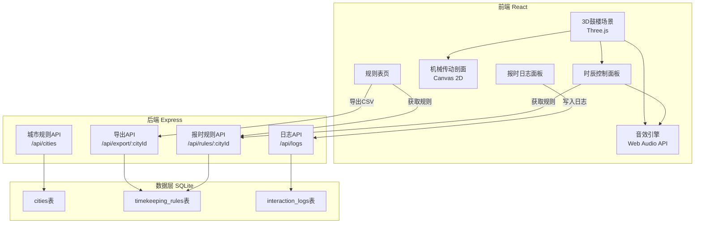
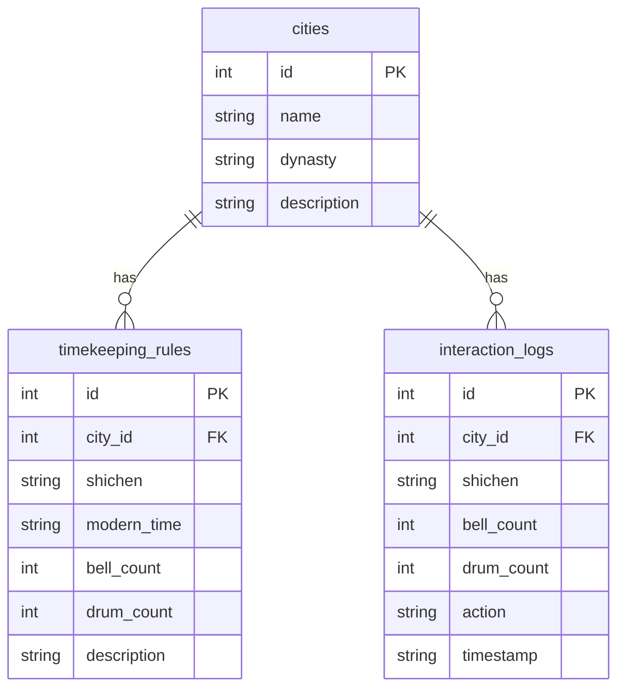

## 1. 架构设计



## 2. 技术说明

- **前端**：React@18 + TypeScript + TailwindCSS@3 + Vite
- **3D渲染**：Three.js + @react-three/fiber + @react-three/drei + @react-three/postprocessing
- **2D机械图**：原生Canvas 2D API（无需额外库）
- **音效**：Web Audio API（程序化合成钟声/鼓声，无需音频文件）
- **状态管理**：Zustand
- **路由**：react-router-dom
- **初始化工具**：vite-init（react-express-ts模板）
- **后端**：Express@4 + TypeScript（ESM格式）
- **数据库**：SQLite（better-sqlite3）
- **导出**：后端生成CSV，前端触发下载

## 3. 路由定义

| 路由 | 用途 |
|------|------|
| / | 主页面：3D鼓楼场景+时辰控制+机械传动+日志 |
| /rules | 规则表页：报时规则数据表+导出功能 |

## 4. API定义

### 4.1 获取城市列表

```
GET /api/cities
Response: { cities: [{ id: number, name: string, dynasty: string, description: string }] }
```

### 4.2 获取城市报时规则

```
GET /api/rules/:cityId
Response: { rules: [{ id: number, city_id: number, shichen: string, modern_time: string, bell_count: number, drum_count: number, description: string }] }
```

### 4.3 记录交互日志

```
POST /api/logs
Body: { city_id: number, shichen: string, bell_count: number, drum_count: number, action: string }
Response: { id: number, timestamp: string }
```

### 4.4 查询交互日志

```
GET /api/logs?city_id=:cityId&limit=:limit
Response: { logs: [{ id: number, city_id: number, city_name: string, shichen: string, bell_count: number, drum_count: number, action: string, timestamp: string }] }
```

### 4.5 导出规则表

```
GET /api/export/:cityId
Response: CSV文件下载（Content-Type: text/csv）
```

## 5. 服务器架构图


## 6. 数据模型

### 6.1 数据模型定义



### 6.2 数据定义语言

```sql
CREATE TABLE IF NOT EXISTS cities (
    id INTEGER PRIMARY KEY AUTOINCREMENT,
    name TEXT NOT NULL,
    dynasty TEXT NOT NULL,
    description TEXT NOT NULL
);

CREATE TABLE IF NOT EXISTS timekeeping_rules (
    id INTEGER PRIMARY KEY AUTOINCREMENT,
    city_id INTEGER NOT NULL,
    shichen TEXT NOT NULL,
    modern_time TEXT NOT NULL,
    bell_count INTEGER NOT NULL DEFAULT 0,
    drum_count INTEGER NOT NULL DEFAULT 0,
    description TEXT NOT NULL DEFAULT '',
    FOREIGN KEY (city_id) REFERENCES cities(id)
);

CREATE TABLE IF NOT EXISTS interaction_logs (
    id INTEGER PRIMARY KEY AUTOINCREMENT,
    city_id INTEGER NOT NULL,
    shichen TEXT NOT NULL,
    bell_count INTEGER NOT NULL DEFAULT 0,
    drum_count INTEGER NOT NULL DEFAULT 0,
    action TEXT NOT NULL,
    timestamp TEXT NOT NULL DEFAULT (datetime('now', 'localtime')),
    FOREIGN KEY (city_id) REFERENCES cities(id)
);

CREATE INDEX IF NOT EXISTS idx_rules_city ON timekeeping_rules(city_id);
CREATE INDEX IF NOT EXISTS idx_logs_city ON interaction_logs(city_id);
CREATE INDEX IF NOT EXISTS idx_logs_timestamp ON interaction_logs(timestamp);

-- 初始城市数据
INSERT INTO cities (name, dynasty, description) VALUES
    ('西安', '唐/明', '长安鼓楼，晨钟暮鼓108响，古都报时典范'),
    ('洛阳', '隋/唐', '东都洛阳，钟鼓次数随朝代更迭而异'),
    ('北京', '明/清', '京城钟鼓楼，晨钟暮鼓各108响，规制最严');

-- 西安报时规则
INSERT INTO timekeeping_rules (city_id, shichen, modern_time, bell_count, drum_count, description) VALUES
    (1, '子时', '23:00-01:00', 0, 0, '夜半，万民皆眠'),
    (1, '丑时', '01:00-03:00', 0, 0, '鸡鸣，荒鸡'),
    (1, '寅时', '03:00-05:00', 3, 0, '平旦，晨钟初响'),
    (1, '卯时', '05:00-07:00', 108, 0, '日出，晨钟108响'),
    (1, '辰时', '07:00-09:00', 0, 0, '食时'),
    (1, '巳时', '09:00-11:00', 0, 0, '隅中'),
    (1, '午时', '11:00-13:00', 0, 0, '日中'),
    (1, '未时', '13:00-15:00', 0, 0, '日昳'),
    (1, '申时', '15:00-17:00', 0, 0, '晡时'),
    (1, '酉时', '17:00-19:00', 0, 108, '日入，暮鼓108响'),
    (1, '戌时', '19:00-21:00', 0, 3, '黄昏，暮鼓初响'),
    (1, '亥时', '21:00-23:00', 0, 0, '人定');

-- 洛阳报时规则
INSERT INTO timekeeping_rules (city_id, shichen, modern_time, bell_count, drum_count, description) VALUES
    (2, '子时', '23:00-01:00', 0, 0, '夜半'),
    (2, '丑时', '01:00-03:00', 0, 0, '鸡鸣'),
    (2, '寅时', '03:00-05:00', 5, 0, '平旦，晨钟五响'),
    (2, '卯时', '05:00-07:00', 54, 0, '日出，晨钟半数'),
    (2, '辰时', '07:00-09:00', 0, 0, '食时'),
    (2, '巳时', '09:00-11:00', 0, 0, '隅中'),
    (2, '午时', '11:00-13:00', 1, 0, '日中，午时钟一响'),
    (2, '未时', '13:00-15:00', 0, 0, '日昳'),
    (2, '申时', '15:00-17:00', 0, 0, '晡时'),
    (2, '酉时', '17:00-19:00', 0, 54, '日入，暮鼓半数'),
    (2, '戌时', '19:00-21:00', 0, 5, '黄昏，暮鼓五响'),
    (2, '亥时', '21:00-23:00', 0, 0, '人定');

-- 北京报时规则
INSERT INTO timekeeping_rules (city_id, shichen, modern_time, bell_count, drum_count, description) VALUES
    (3, '子时', '23:00-01:00', 0, 0, '夜半，京城更鼓起'),
    (3, '丑时', '01:00-03:00', 0, 0, '鸡鸣'),
    (3, '寅时', '03:00-05:00', 0, 0, '平旦'),
    (3, '卯时', '05:00-07:00', 108, 0, '日出，晨钟108响，紧十八慢十八不紧不慢又十八×2'),
    (3, '辰时', '07:00-09:00', 0, 0, '食时'),
    (3, '巳时', '09:00-11:00', 0, 0, '隅中'),
    (3, '午时', '11:00-13:00', 0, 0, '日中'),
    (3, '未时', '13:00-15:00', 0, 0, '日昳'),
    (3, '申时', '15:00-17:00', 0, 0, '晡时'),
    (3, '酉时', '17:00-19:00', 0, 108, '日入，暮鼓108响，紧十八慢十八不紧不慢又十八×2'),
    (3, '戌时', '19:00-21:00', 0, 0, '黄昏'),
    (3, '亥时', '21:00-23:00', 0, 0, '人定，定更鼓止');
```
