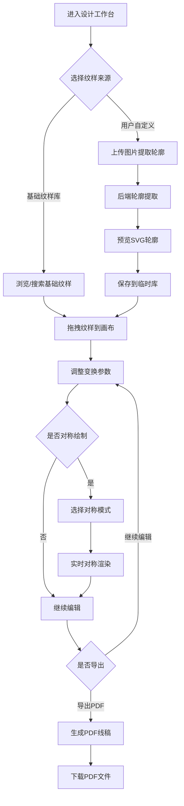

## 1. 产品概述

布依族蜡染纹样设计工具是一款面向非遗文化传承者、设计师和手工艺人的数字化创作平台。基于布依族传统蜡染纹样（涡纹、太阳纹、铜鼓纹等20种经典纹样），用户可通过组合、缩放、旋转、镜像等操作生成全新的蜡染图案，并支持对称绘制模式和PDF线稿导出，为手工蜡染制作提供精准模板。

- 传承与保护布依族蜡染非遗文化，降低传统纹样创作门槛
- 目标用户：非遗传承人、文创设计师、手工爱好者、文化教育工作者

## 2. 核心功能

### 2.1 用户角色

| 角色 | 注册方式 | 核心权限 |
|------|----------|----------|
| 访客 | 无需注册 | 浏览纹样库、使用编辑器基础功能 |
| 设计师 | 邮箱注册 | 上传自定义纹样、保存作品、导出PDF |

### 2.2 功能模块

1. **纹样库页面**：展示20种基础纹样 + 用户自定义纹样，支持分类筛选和搜索
2. **设计工作台**：核心Canvas编辑器，纹样组合/变换/对称绘制/导出
3. **纹样上传页面**：上传图片 → 轮廓提取 → 存入临时库

### 2.3 页面详情

| 页面名称 | 模块名称 | 功能描述 |
|----------|----------|----------|
| 纹样库页面 | 纹样网格展示 | 按类别展示所有纹样SVG缩略图，点击预览大图 |
| 纹样库页面 | 分类筛选栏 | 按纹样类型（自然、几何、动物、植物）分类筛选 |
| 设计工作台 | Canvas画布 | 主编辑区域，支持拖拽、缩放、旋转纹样元素 |
| 设计工作台 | 纹样面板 | 左侧面板，从纹样库拖拽纹样到画布 |
| 设计工作台 | 属性面板 | 右侧面板，调整选中纹样的缩放/旋转/镜像参数 |
| 设计工作台 | 对称模式工具栏 | 上下对称、左右对称、中心旋转对称模式切换 |
| 设计工作台 | 导出工具栏 | 导出PDF线稿、PNG预览图 |
| 纹样上传页面 | 图片上传区 | 拖拽或选择上传纹样图片 |
| 纹样上传页面 | 轮廓预览区 | 显示提取后的SVG轮廓，可手动微调 |
| 纹样上传页面 | 保存到临时库 | 将提取的轮廓存入用户临时纹样库 |

## 3. 核心流程

### 3.1 纹样设计流程
用户从纹样库选择基础纹样 → 拖拽到Canvas画布 → 调整位置/缩放/旋转/镜像 → 开启对称模式 → 完成图案设计 → 导出PDF线稿供手工绘制

### 3.2 纹样上传流程
用户上传纹样图片 → 后端提取轮廓生成SVG → 前端预览轮廓效果 → 用户确认保存到临时库

## 4. 用户界面设计

### 4.1 设计风格

- **主色调**：深靛蓝(#1A2332) — 呼应蜡染靛蓝染料
- **辅助色**：米白(#F5F0E8) — 模拟蜡染布底色
- **强调色**：蜡黄(#D4A84B) — 模拟蜡液颜色
- **按钮风格**：圆角矩形，微阴影，hover时轻微上浮
- **字体**：标题使用"ZCOOL XiaoWei"（站酷小薇体），正文使用"Noto Sans SC"
- **布局风格**：左侧纹样面板 + 中央画布 + 右侧属性面板，三栏布局
- **纹理风格**：背景使用微妙的蜡染布纹理，增加文化氛围

### 4.2 页面设计概览

| 页面名称 | 模块名称 | UI元素 |
|----------|----------|--------|
| 纹样库页面 | 纹样网格 | 卡片网格布局，每张卡片含SVG缩略图+名称+类别标签，hover时放大+阴影 |
| 纹样库页面 | 筛选栏 | 横向标签式筛选，选中标签高亮为蜡黄色 |
| 设计工作台 | 画布区域 | 居中大画布，米白底色，网格辅助线可切换 |
| 设计工作台 | 纹样面板 | 左侧可折叠面板，纹样列表支持搜索和分类 |
| 设计工作台 | 属性面板 | 右侧面板，滑块控件调整缩放/旋转，开关控件切换镜像 |
| 设计工作台 | 对称工具栏 | 画布上方工具栏，图标按钮切换对称模式，高亮当前模式 |
| 设计工作台 | 导出栏 | 顶部右侧，按钮组"导出PDF"/"导出PNG" |
| 纹样上传页面 | 上传区 | 虚线边框拖拽区域，支持PNG/JPG/SVG |
| 纹样上传页面 | 轮廓预览 | 原图与轮廓并排对比，轮廓用SVG线条渲染 |

### 4.3 响应式设计

- 桌面端优先（主要面向设计场景）
- 平板端：面板可折叠，画布自适应宽度
- 移动端：面板切换为底部抽屉式

### 4.4 动效设计

- 纹样拖入画布时的弹性入场动画
- 对称模式切换时的镜像翻转过渡
- 导出PDF时的进度环形动画
- 纹样卡片hover时的微妙旋转和缩放
