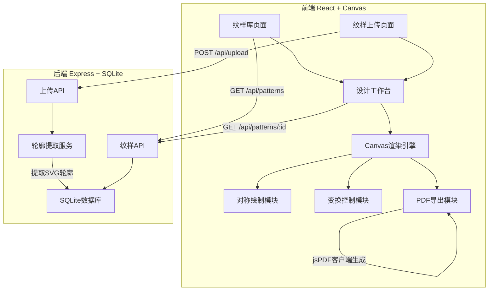
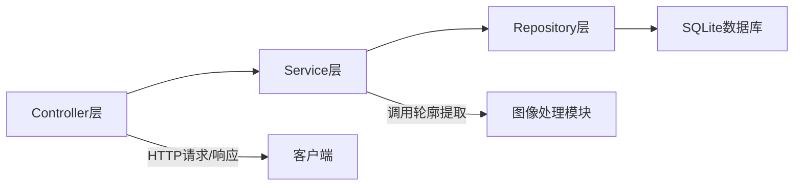
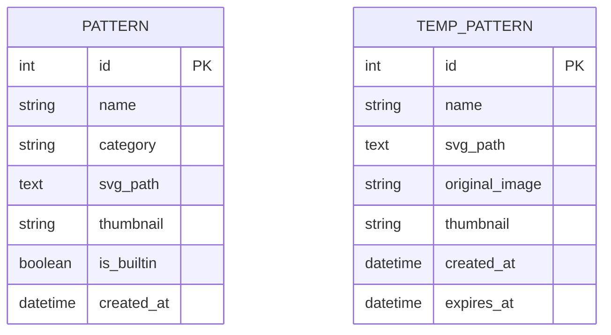

## 1. 架构设计



## 2. 技术说明

- **前端**：React@18 + TypeScript + Tailwind CSS + Vite
- **初始化工具**：vite-init（react-express-ts模板）
- **后端**：Express@4 + TypeScript (ESM)
- **数据库**：SQLite (better-sqlite3)
- **Canvas渲染**：HTML5 Canvas 2D API + 自研渲染引擎
- **SVG解析**：svg-path-commander（解析SVG路径为可渲染指令）
- **PDF导出**：jsPDF（客户端生成PDF线稿）
- **轮廓提取**：sharp（图像处理）+ 自研轮廓追踪算法
- **状态管理**：Zustand

## 3. 路由定义

| 路由 | 用途 |
|------|------|
| / | 纹样库首页，展示所有基础纹样和用户纹样 |
| /editor | 设计工作台，Canvas编辑器主页面 |
| /upload | 纹样上传页面，上传图片提取轮廓 |

## 4. API定义

### 4.1 纹样相关API

```typescript
interface Pattern {
  id: number;
  name: string;
  category: "natural" | "geometric" | "animal" | "plant";
  svg_path: string;
  thumbnail: string;
  is_builtin: boolean;
  created_at: string;
}

// GET /api/patterns - 获取所有纹样
// Query: ?category=natural&search=涡纹
interface GetPatternsResponse {
  patterns: Pattern[];
  total: number;
}

// GET /api/patterns/:id - 获取单个纹样SVG
interface GetPatternResponse {
  pattern: Pattern;
}
```

### 4.2 上传相关API

```typescript
// POST /api/upload - 上传图片提取轮廓
// Content-Type: multipart/form-data
// Body: { file: File }
interface UploadResponse {
  id: number;
  original_url: string;
  svg_path: string;
  thumbnail: string;
}
```

### 4.3 临时纹样库API

```typescript
// GET /api/temp-patterns - 获取用户临时纹样
interface GetTempPatternsResponse {
  patterns: Pattern[];
}

// DELETE /api/temp-patterns/:id - 删除临时纹样
interface DeleteTempPatternResponse {
  success: boolean;
}
```

## 5. 服务器架构图



## 6. 数据模型

### 6.1 数据模型定义



### 6.2 数据定义语言

```sql
CREATE TABLE patterns (
  id INTEGER PRIMARY KEY AUTOINCREMENT,
  name TEXT NOT NULL,
  category TEXT NOT NULL CHECK(category IN ('natural', 'geometric', 'animal', 'plant')),
  svg_path TEXT NOT NULL,
  thumbnail TEXT,
  is_builtin BOOLEAN NOT NULL DEFAULT 0,
  created_at DATETIME NOT NULL DEFAULT CURRENT_TIMESTAMP
);

CREATE TABLE temp_patterns (
  id INTEGER PRIMARY KEY AUTOINCREMENT,
  name TEXT NOT NULL,
  svg_path TEXT NOT NULL,
  original_image TEXT,
  thumbnail TEXT,
  created_at DATETIME NOT NULL DEFAULT CURRENT_TIMESTAMP,
  expires_at DATETIME NOT NULL
);

CREATE INDEX idx_patterns_category ON patterns(category);
CREATE INDEX idx_patterns_name ON patterns(name);
CREATE INDEX idx_temp_patterns_expires ON temp_patterns(expires_at);
```

### 6.3 初始数据（20种基础纹样）

| 编号 | 名称 | 分类 | 说明 |
|------|------|------|------|
| 1 | 涡纹 | natural | 螺旋形涡卷纹，蜡染最经典纹样 |
| 2 | 太阳纹 | natural | 放射状太阳图案 |
| 3 | 铜鼓纹 | geometric | 同心圆+放射线铜鼓纹饰 |
| 4 | 鱼纹 | animal | 简化鱼形轮廓 |
| 5 | 鸟纹 | animal | 飞鸟侧影纹样 |
| 6 | 蝴蝶纹 | animal | 对称蝴蝶轮廓 |
| 7 | 花纹 | plant | 花朵俯视纹样 |
| 8 | 树纹 | plant | 简化树木纹样 |
| 9 | 山纹 | natural | 连绵山形纹样 |
| 10 | 水纹 | natural | 波浪水纹 |
| 11 | 云纹 | natural | 卷云纹样 |
| 12 | 雷纹 | geometric | 回字形雷纹 |
| 13 | 万字纹 | geometric | 卍字连续纹 |
| 14 | 蛇纹 | animal | 蜿蜒蛇形纹 |
| 15 | 蛙纹 | animal | 蛙形纹样 |
| 16 | 螺纹 | natural | 螺壳螺旋纹 |
| 17 | 禾苗纹 | plant | 禾苗生长纹样 |
| 18 | 谷粒纹 | plant | 谷粒排列纹 |
| 19 | 星纹 | natural | 六角星纹样 |
| 20 | 锯齿纹 | geometric | 锯齿连续纹 |
