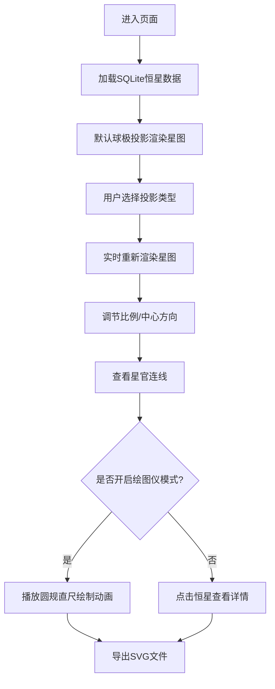

## 1. 产品概述

古代星图极坐标绘制工具，基于《仪象考成》恒星数据，实现中国传统天文星图的数字化绘制与交互展示。

- 面向天文爱好者、历史研究者和教育工作者，提供专业级中国古星图可视化体验
- 融合传统天文学知识与现代Web技术，传承中华天文文化遗产

## 2. 核心功能

### 2.1 用户角色

| 角色 | 注册方式 | 核心权限 |
|------|----------|----------|
| 普通用户 | 无需注册 | 浏览星图、切换投影、调节参数、导出SVG |

### 2.2 功能模块

1. **星图主界面**: 极坐标星图展示、投影类型切换、星官标注
2. **控制面板**: 投影选择、比例调节、中心方向调整、绘图仪模式控制
3. **绘图仪模式**: 模拟古代绘图工具(圆规、直尺)逐步绘制动画
4. **数据展示**: 恒星信息弹窗、星官说明
5. **导出功能**: SVG矢量图导出

### 2.3 页面详情

| 页面名称 | 模块名称 | 功能描述 |
|----------|----------|----------|
| 星图主界面 | 极坐标画布 | 基于Canvas/SVG的星图渲染，支持缩放平移 |
| 星图主界面 | 投影引擎 | 球极投影、等距投影、墨卡托投影三种算法 |
| 星图主界面 | 星官连线 | 三垣(紫微垣、太微垣、天市垣)、二十八宿连线标注 |
| 控制面板 | 投影选择器 | 下拉选择三种投影类型，实时切换 |
| 控制面板 | 参数调节器 | 绘图比例滑块、中心方向角度输入 |
| 控制面板 | 动画控制 | 绘图仪模式开始/暂停/重置、速度调节 |
| 信息面板 | 恒星详情 | 点击恒星显示星名、星等、赤经赤纬 |
| 工具栏 | 导出按钮 | 一键导出高清SVG矢量星图 |

## 3. 核心流程

用户进入页面 → 加载恒星数据 → 选择投影类型 → 调节绘图比例和中心方向 → 查看星图 → 可选：开启绘图仪模式观看绘制动画 → 点击恒星查看详情 → 导出SVG文件

## 4. 用户界面设计

### 4.1 设计风格

- **主色调**: 深空藏青 `#0a1628` 作为背景，星点用象牙白 `#f5f0e6`，星官连线用朱砂红 `#c41e3a`，辅助线用石青 `#2e5eaa`
- **按钮风格**: 仿古籍函套的圆角矩形，深木色边框，悬停时微发光效果
- **字体**: 标题使用「思源宋体」复刻古籍雕版风格，正文使用「思源黑体」保证可读性
- **布局风格**: 左侧固定式控制面板，右侧大面积星图画布，采用非对称黄金分割布局
- **装饰元素**: 角落点缀云纹、回纹等传统纹样，营造古籍氛围

### 4.2 页面设计概述

| 页面名称 | 模块名称 | UI元素 |
|----------|----------|--------|
| 星图主界面 | 极坐标画布 | 同心圆刻度、二十八宿方位标记、渐变星空背景、闪烁星点动画 |
| 星图主界面 | 星官标注 | 传统星官名称采用篆体风格、连线带箭头指示、悬停高亮 |
| 控制面板 | 投影选择器 | 下拉菜单配三种投影示意图标、选项含投影原理说明 |
| 控制面板 | 参数调节器 | 圆形旋钮式比例调节、罗盘式方向选择器 |
| 控制面板 | 动画控制 | 仿古铜钟按钮(播放/暂停/重置)、进度条显示绘制进度 |
| 信息面板 | 恒星详情 | 仿古籍卷轴式弹窗、内附星名篆刻、星等亮度条 |
| 工具栏 | 导出按钮 | 印章样式按钮、点击有盖印动画效果 |

### 4.3 响应性

- 桌面端优先，保证1920×1080分辨率下最佳体验
- 平板端自适应，控制面板可折叠收起
- 移动端简化操作，保留核心浏览和导出功能
- 触摸设备支持双指缩放、单指拖动星图

### 4.4 视觉动效

- **页面加载**: 星点从中心向外渐次显现，如夜幕降临繁星渐出
- **投影切换**: 采用平滑过渡动画，星辰位置渐变迁移
- **绘图仪模式**: 圆规画圆时笔尖有墨痕渐显效果，直尺画线有笔锋顿挫
- **悬停效果**: 恒星悬停时光芒绽放，星官连线如电流游走
- **导出动画**: SVG导出时呈现卷轴收起效果，完成后盖印"仪象考成"朱砂印
