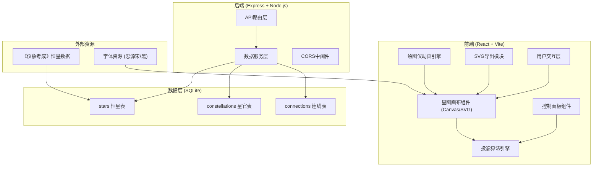
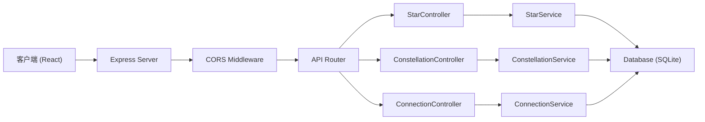
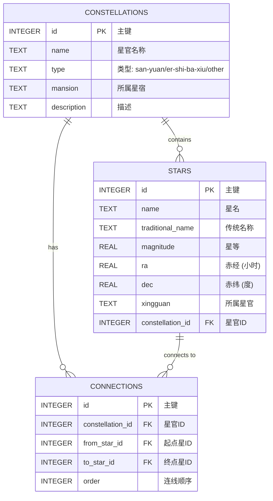

## 1. 架构设计



## 2. 技术描述

- **前端**: React@18 + TypeScript + Vite@5
- **样式**: TailwindCSS@3 + CSS变量主题系统
- **图形渲染**: 原生Canvas API + SVG混合渲染
- **动画引擎**: requestAnimationFrame + 自定义缓动函数
- **状态管理**: React useState/useReducer (轻量场景无需Redux)
- **后端**: Express@4 + Node.js@18
- **数据库**: SQLite3 + better-sqlite3驱动
- **初始化工具**: vite-create初始化React-TS模板

## 3. 路由定义

| 路由 | 用途 |
|------|------|
| `/` | 星图主界面 |
| `/api/stars` | 获取恒星列表 (支持分页/筛选) |
| `/api/stars/:id` | 获取单颗恒星详情 |
| `/api/constellations` | 获取星官列表 |
| `/api/constellations/:id` | 获取星官详情及连线 |
| `/api/connections` | 获取星官连线数据 |

## 4. API 定义

```typescript
// 恒星数据类型
interface Star {
  id: number;
  name: string;           // 星名 (如: 天枢)
  traditionalName: string; // 传统名称
  magnitude: number;      // 星等 (越小越亮)
  ra: number;             // 赤经 (小时, 0-24)
  dec: number;            // 赤纬 (度, -90~90)
  constellationId: number | null;
  xingguan: string | null; // 所属星官
}

// 星官类型
interface Constellation {
  id: number;
  name: string;           // 星官名 (如: 北斗)
  type: 'san-yuan' | 'er-shi-ba-xiu' | 'other';
  mansion: string | null; // 所属星宿
  description: string;
  starIds: number[];
}

// 连线类型
interface Connection {
  id: number;
  constellationId: number;
  fromStarId: number;
  toStarId: number;
  order: number;
}

// 投影参数
interface ProjectionParams {
  type: 'stereographic' | 'equidistant' | 'mercator';
  centerRa: number;       // 中心赤经
  centerDec: number;      // 中心赤纬
  scale: number;          // 绘图比例
  rotation: number;       // 旋转角度
}

// 投影坐标
interface ProjectedPoint {
  x: number;
  y: number;
  visible: boolean;
}
```

### 请求/响应示例

```typescript
// GET /api/stars?magnitude_lte=6
// Response: Star[]

// GET /api/constellations?type=san-yuan
// Response: Constellation[]

// GET /api/connections?constellation_id=1
// Response: Connection[]
```

## 5. 服务器架构图



## 6. 数据模型

### 6.1 数据模型定义



### 6.2 数据定义语言

```sql
-- 恒星表 (基于《仪象考成》数据)
CREATE TABLE IF NOT EXISTS stars (
    id INTEGER PRIMARY KEY AUTOINCREMENT,
    name TEXT NOT NULL,
    traditional_name TEXT,
    magnitude REAL NOT NULL,
    ra REAL NOT NULL CHECK (ra >= 0 AND ra < 24),
    dec REAL NOT NULL CHECK (dec >= -90 AND dec <= 90),
    xingguan TEXT,
    constellation_id INTEGER,
    FOREIGN KEY (constellation_id) REFERENCES constellations(id)
);

-- 星官表 (三垣二十八宿)
CREATE TABLE IF NOT EXISTS constellations (
    id INTEGER PRIMARY KEY AUTOINCREMENT,
    name TEXT NOT NULL UNIQUE,
    type TEXT NOT NULL CHECK (type IN ('san-yuan', 'er-shi-ba-xiu', 'other')),
    mansion TEXT,
    description TEXT
);

-- 星官连线表
CREATE TABLE IF NOT EXISTS connections (
    id INTEGER PRIMARY KEY AUTOINCREMENT,
    constellation_id INTEGER NOT NULL,
    from_star_id INTEGER NOT NULL,
    to_star_id INTEGER NOT NULL,
    order INTEGER NOT NULL,
    FOREIGN KEY (constellation_id) REFERENCES constellations(id),
    FOREIGN KEY (from_star_id) REFERENCES stars(id),
    FOREIGN KEY (to_star_id) REFERENCES stars(id),
    UNIQUE(constellation_id, from_star_id, to_star_id)
);

-- 索引
CREATE INDEX IF NOT EXISTS idx_stars_magnitude ON stars(magnitude);
CREATE INDEX IF NOT EXISTS idx_stars_ra_dec ON stars(ra, dec);
CREATE INDEX IF NOT EXISTS idx_stars_constellation ON stars(constellation_id);
CREATE INDEX IF NOT EXISTS idx_connections_constellation ON connections(constellation_id);

-- 插入三垣数据
INSERT INTO constellations (name, type, description) VALUES
('紫微垣', 'san-yuan', '北天中央，天帝居所'),
('太微垣', 'san-yuan', '五帝坐，朝廷之象'),
('天市垣', 'san-yuan', '天子率诸侯幸都市');

-- 插入二十八宿 (四象各七宿)
INSERT INTO constellations (name, type, mansion, description) VALUES
-- 东方苍龙七宿
('角宿', 'er-shi-ba-xiu', '东方苍龙', '苍龙之首'),
('亢宿', 'er-shi-ba-xiu', '东方苍龙', '苍龙颈'),
('氐宿', 'er-shi-ba-xiu', '东方苍龙', '苍龙之胸'),
('房宿', 'er-shi-ba-xiu', '东方苍龙', '苍龙腹'),
('心宿', 'er-shi-ba-xiu', '东方苍龙', '苍龙之心'),
('尾宿', 'er-shi-ba-xiu', '东方苍龙', '苍龙尾'),
('箕宿', 'er-shi-ba-xiu', '东方苍龙', '龙尾摆动'),
-- 北方玄武七宿
('斗宿', 'er-shi-ba-xiu', '北方玄武', '玄武之首'),
('牛宿', 'er-shi-ba-xiu', '北方玄武', '牛之象'),
('女宿', 'er-shi-ba-xiu', '北方玄武', '女之象'),
('虚宿', 'er-shi-ba-xiu', '北方玄武', '虚耗之象'),
('危宿', 'er-shi-ba-xiu', '北方玄武', '屋栋之象'),
('室宿', 'er-shi-ba-xiu', '北方玄武', '营室之象'),
('壁宿', 'er-shi-ba-xiu', '北方玄武', '图书之府'),
-- 西方白虎七宿
('奎宿', 'er-shi-ba-xiu', '西方白虎', '白虎之首'),
('娄宿', 'er-shi-ba-xiu', '西方白虎', '聚众之象'),
('胃宿', 'er-shi-ba-xiu', '西方白虎', '仓廪之象'),
('昴宿', 'er-shi-ba-xiu', '西方白虎', '白虎之目'),
('毕宿', 'er-shi-ba-xiu', '西方白虎', '猎具之象'),
('觜宿', 'er-shi-ba-xiu', '西方白虎', '白虎之口'),
('参宿', 'er-shi-ba-xiu', '西方白虎', '白虎之身'),
-- 南方朱雀七宿
('井宿', 'er-shi-ba-xiu', '南方朱雀', '朱雀之首'),
('鬼宿', 'er-shi-ba-xiu', '南方朱雀', '朱雀之目'),
('柳宿', 'er-shi-ba-xiu', '南方朱雀', '朱雀之喙'),
('星宿', 'er-shi-ba-xiu', '南方朱雀', '朱雀之颈'),
('张宿', 'er-shi-ba-xiu', '南方朱雀', '朱雀之嗉'),
('翼宿', 'er-shi-ba-xiu', '南方朱雀', '朱雀之翼'),
('轸宿', 'er-shi-ba-xiu', '南方朱雀', '朱雀之尾');
```
