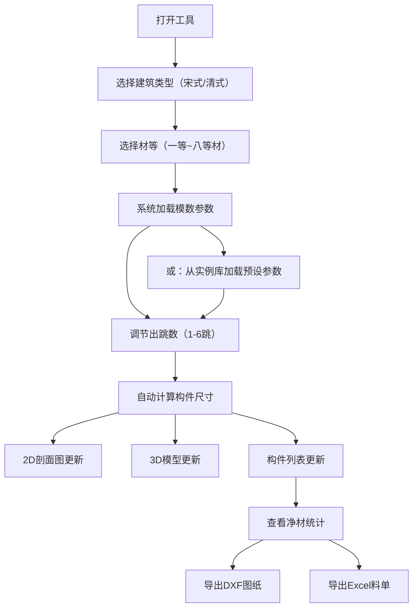

## 1. 产品概述

古建筑斗拱设计辅助工具——面向古建筑研究者、仿古设计师与工艺师，提供宋式/清式斗拱的模数化设计、可视化预览与加工出图能力。系统基于《营造法式》与《工程做法则例》的材等制度，自动推算各构件尺寸，并以2D剖面图和3D模型同步呈现，支持导出DXF加工图纸和Excel料单。

- 核心目标：将传统斗拱设计的复杂模数计算自动化，降低仿古建筑设计门槛
- 目标用户：古建筑研究人员、仿古建筑设计师、古建修缮工程师、建筑院校师生

## 2. 核心功能

### 2.1 用户角色

本工具为单用户桌面端应用，无需角色区分。

### 2.2 功能模块

1. **主设计页**：建筑类型与材等选择、出跳数调节、参数面板、2D/3D视图、构件列表
2. **实例库页**：预置经典实例参数浏览与加载

### 2.3 页面详情

| 页面名称 | 模块名称 | 功能描述 |
|----------|----------|----------|
| 主设计页 | 参数控制面板 | 选择建筑类型（宋式/清式）、材等（一等~八等材）、出跳数（1-6跳），显示基本模数（单材广、单材厚、足材广、栔高） |
| 主设计页 | 2D剖面图 | Canvas渲染斗拱横剖面，标注关键尺寸，随参数实时更新 |
| 主设计页 | 3D示意图 | Three.js渲染斗拱立体模型，可旋转/缩放查看 |
| 主设计页 | 构件列表 | 表格展示各构件名称、数量、尺寸、净材体积，汇总统计 |
| 主设计页 | 导出功能 | 导出DXF加工图纸、导出Excel料单 |
| 实例库页 | 实例列表 | 预置佛光寺大殿、祈年殿等经典实例，一键加载参数 |

## 3. 核心流程

用户打开工具 → 选择建筑类型（宋式/清式）→ 选择材等 → 系统自动加载模数参数 → 调节出跳数 → 系统实时计算各构件尺寸 → 2D剖面图与3D模型同步更新 → 查看构件列表与净材统计 → 导出DXF/Excel

## 4. 用户界面设计

### 4.1 设计风格

- **主题色调**：以深木色（#3E2723）为主色，搭配朱砂红（#C62828）为点缀，宣纸白（#F5F0E8）为底色——营造古建筑书卷气
- **辅助色**：金箔色（#D4A843）用于高亮/选中态，墨灰（#424242）用于文字
- **按钮风格**：圆角矩形（6px），木纹质感边框，悬停时朱砂红描边
- **字体**：标题用"思源宋体"（Noto Serif SC），正文用"思源黑体"（Noto Sans SC）
- **布局风格**：左侧控制面板 + 右侧双视图（2D上方/3D下方），底部构件列表
- **图标风格**：线性图标，笔画粗细2px，墨灰色

### 4.2 页面设计概览

| 页面名称 | 模块名称 | UI元素 |
|----------|----------|--------|
| 主设计页 | 参数控制面板 | 下拉选择器（建筑类型、材等）、滑块（出跳数）、模数数据卡片、实例加载按钮 |
| 主设计页 | 2D剖面图 | Canvas画布，深色底，白色/金色线条，尺寸标注 |
| 主设计页 | 3D示意图 | Three.js画布，木纹材质，轨道控制器，环境光+方向光 |
| 主设计页 | 构件列表 | 表格（构件名/数量/尺寸/净材），汇总行，导出按钮组 |
| 实例库页 | 实例卡片 | 卡片列表（缩略图、名称、朝代、简介），加载按钮 |

### 4.3 响应式设计

- 桌面优先设计（1920×1080基准）
- 中等屏幕（≥1024px）：侧边面板可折叠
- 小屏幕（<1024px）：面板变为顶部折叠，视图纵向堆叠

### 4.4 3D场景指引

- **环境**：淡暖色环境光，模拟古建筑室内氛围
- **灯光**：主方向光（偏暖白）从左上方照射，环境光补充暗面
- **相机**：透视相机，45°俯视，轨道控制器支持旋转/缩放
- **材质**：木纹贴图（程序生成），深浅木色区分不同构件
- **交互**：鼠标悬停高亮构件，点击显示构件详情
- **性能**：构件数量有限（<200个mesh），无需LOD优化
