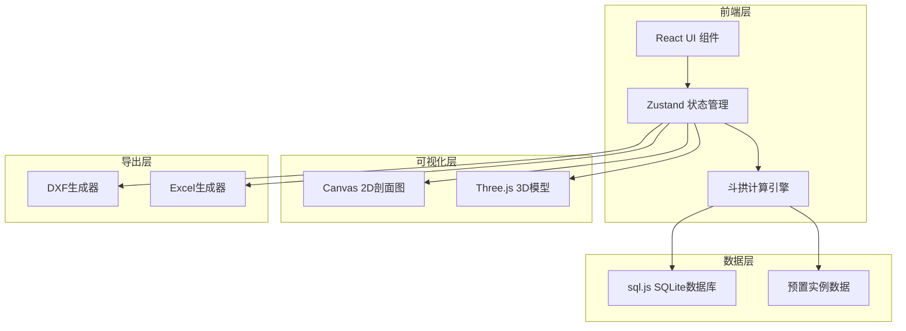
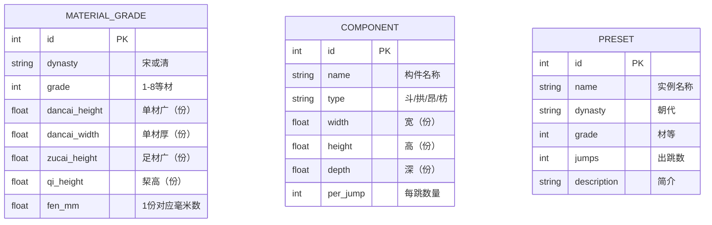

## 1. 架构设计



## 2. 技术说明

- **前端**：React@18 + TypeScript + Tailwind CSS@3 + Vite
- **初始化工具**：vite-init (react-ts 模板)
- **后端**：无（纯前端应用）
- **数据库**：sql.js（浏览器端SQLite，数据内嵌于应用中）
- **3D渲染**：Three.js + @react-three/fiber + @react-three/drei
- **2D渲染**：原生Canvas API
- **导出**：dxf-writer（DXF生成）、xlsx（Excel生成）
- **状态管理**：Zustand

## 3. 路由定义

| 路由 | 用途 |
|------|------|
| / | 主设计页：参数控制、2D/3D视图、构件列表 |
| /presets | 实例库页：预置经典实例浏览与加载 |

## 4. API定义

无后端API，所有数据与计算在前端完成。

## 5. 数据模型

### 5.1 数据模型定义



### 5.2 数据定义语言

```sql
CREATE TABLE material_grade (
    id INTEGER PRIMARY KEY AUTOINCREMENT,
    dynasty TEXT NOT NULL,
    grade INTEGER NOT NULL,
    dancai_height REAL NOT NULL,
    dancai_width REAL NOT NULL,
    zucai_height REAL NOT NULL,
    qi_height REAL NOT NULL,
    fen_mm REAL NOT NULL
);

CREATE TABLE component (
    id INTEGER PRIMARY KEY AUTOINCREMENT,
    name TEXT NOT NULL,
    type TEXT NOT NULL,
    width REAL NOT NULL,
    height REAL NOT NULL,
    depth REAL NOT NULL,
    per_jump INTEGER NOT NULL DEFAULT 0
);

CREATE TABLE preset (
    id INTEGER PRIMARY KEY AUTOINCREMENT,
    name TEXT NOT NULL,
    dynasty TEXT NOT NULL,
    grade INTEGER NOT NULL,
    jumps INTEGER NOT NULL,
    description TEXT
);

-- 宋式材等数据（《营造法式》）
INSERT INTO material_grade (dynasty, grade, dancai_height, dancai_width, zucai_height, qi_height, fen_mm) VALUES
('宋', 1, 15, 10, 21, 6, 33.33),
('宋', 2, 14.25, 9.5, 20, 5.75, 30.0),
('宋', 3, 13.5, 9, 19, 5.5, 26.67),
('宋', 4, 12.75, 8.5, 18, 5.25, 23.33),
('宋', 5, 12, 8, 17, 5, 20.0),
('宋', 6, 11.25, 7.5, 16, 4.75, 16.67),
('宋', 7, 10.5, 7, 15, 4.5, 13.33),
('宋', 8, 9.75, 6.5, 14, 4.25, 10.0);

-- 清式材等数据（《工程做法则例》）
INSERT INTO material_grade (dynasty, grade, dancai_height, dancai_width, zucai_height, qi_height, fen_mm) VALUES
('清', 1, 6, 4, 8.4, 2.4, 25.6),
('清', 2, 5.5, 3.7, 7.7, 2.2, 23.04),
('清', 3, 5, 3.4, 7, 2, 20.48),
('清', 4, 4.5, 3, 6.3, 1.8, 17.92),
('清', 5, 4, 2.6, 5.6, 1.6, 15.36),
('清', 6, 3.5, 2.3, 4.9, 1.4, 12.8),
('清', 7, 3, 2, 4.2, 1.2, 10.24),
('清', 8, 2.5, 1.7, 3.5, 1, 7.68);

-- 预置实例
INSERT INTO preset (name, dynasty, grade, jumps, description) VALUES
('佛光寺东大殿', '宋', 2, 4, '唐代木构，面阔七间，四跳华拱，单材15×10份'),
('祈年殿', '清', 4, 3, '清代皇家坛庙建筑，三跳斗拱，麻叶头'),
('太和殿', '清', 2, 5, '清代宫殿最高等级，五跳斗拱'),
('隆兴寺摩尼殿', '宋', 3, 3, '北宋木构，三跳华拱，补间铺作'),
('应县木塔', '宋', 2, 5, '辽代楼阁式木塔，五跳华拱');
```

## 6. 关键技术决策

### 6.1 sql.js vs 本地JSON

选择sql.js：虽然JSON更简单，但需求明确要求SQLite，sql.js将SQLite编译为WASM运行在浏览器中，满足需求且无需后端。

### 6.2 Three.js封装

使用@react-three/fiber + @react-three/drei，以React组件方式管理3D场景，状态与UI统一管理。

### 6.3 DXF导出

使用dxf-writer库生成DXF文件，将2D剖面图中的线条和标注转换为DXF实体。

### 6.4 Excel导出

使用xlsx库（SheetJS）生成Excel文件，将构件列表数据写入工作表。
