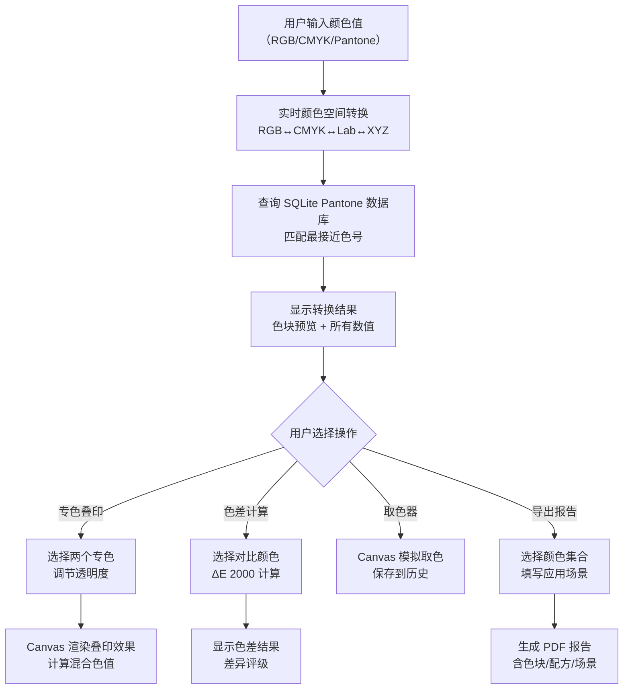

## 1. 产品概述

专业级颜色空间转换与管理工具，支持 RGB、CMYK、Pantone 专色等多颜色体系的实时互转，面向设计师、印刷从业人员和色彩爱好者。提供精确的色差计算、专色叠印模拟和专业报告导出功能。

- 主要用途：多颜色空间精确转换、Pantone 色卡查询、印刷前色彩校验
- 目标用户：平面设计师、印刷工程师、包装设计师、色彩研究人员
- 市场价值：填补国内在线 Pantone 色卡精准转换工具的空白，提供专业级色彩管理解决方案

## 2. 核心 Features

### 2.1 用户角色

| 角色 | 注册方式 | 核心权限 |
|------|----------|----------|
| 普通用户 | 无需注册，直接使用 | 完整使用所有转换、查询、计算、导出功能 |

### 2.2 Feature Module

1. **颜色转换工作台**：RGB/CMYK/Pantone 输入、实时转换、多格式结果显示
2. **Pantone 色卡查询**：色号搜索、色块预览、色名与配方显示
3. **专色叠印模拟器**：双层专色叠加、混合效果预览、不透明度调节
4. **色差计算器**：ΔE 2000 专业算法、双颜色对比、差异可视化
5. **取色器工具**：屏幕像素取色（浏览器扩展模拟）、历史记录
6. **颜色报告导出**：PDF 格式、色块/配方/应用场景完整报告

### 2.3 Page Details

| 页面名称 | 模块名称 | Feature description |
|----------|----------|---------------------|
| 主工作台 | 颜色输入区 | 支持 RGB（0-255）、CMYK（%）、Pantone 色号三种输入模式，实时校验 |
| 主工作台 | 转换结果区 | 显示转换后的所有颜色值（Hex、RGB、CMYK、Lab、XYZ），大尺寸色块预览 |
| 主工作台 | Pantone 匹配区 | 从 SQLite 数据库匹配最接近的 Pantone 色号，显示色名和配方 |
| 专色叠印页 | 叠印控制区 | 选择两个 Pantone 专色，调节透明度和叠印顺序 |
| 专色叠印页 | 效果预览区 | Canvas 实时渲染叠印混合效果，显示混合色的各空间值 |
| 色差计算页 | 双颜色对比区 | 两个颜色选择器，ΔE 2000 计算结果，差异程度评级 |
| 取色器页 | 取色模拟区 | Canvas 模拟屏幕区域，鼠标取色，历史记录保存 |
| 报告导出页 | 报告生成区 | 选择颜色集合，填写应用场景，一键生成 PDF 报告 |

## 3. Core Process

用户输入颜色值 → 系统实时转换所有颜色空间 → 查询 Pantone 数据库匹配最接近色号 → 用户可进行叠印模拟/色差计算 → 选择导出 PDF 报告

## 4. User Interface Design

### 4.1 Design Style

**设计风格：专业科技风 + 印刷工业感**
- 主色调：深灰蓝 `#1a1f2e`（专业感）+ 亮青 `#00d4ff`（科技感）+ 警示橙 `#ff6b35`（强调色）
- 背景：深色主题配合微妙的网点纹理（印刷感）
- 按钮：扁平化设计，细边框，悬停时色块填充动画
- 字体：主标题 `Space Grotesk`（现代几何感），正文 `Inter`（高可读性），数值显示 `JetBrains Mono`（等宽精确）
- 布局：卡片式模块化布局，清晰的视觉层级
- 图标：线性简约风格，使用 Font Awesome 图标库
- 特殊效果：色块边缘添加微光晕，模拟印刷专色的光泽感

### 4.2 Page Design Overview

| 页面名称 | 模块名称 | UI Elements |
|----------|----------|-------------|
| 主工作台 | 颜色输入区 | 三栏选项卡切换（RGB/CMYK/Pantone），滑块 + 数字输入联动，实时校验反馈 |
| 主工作台 | 转换结果区 | 左侧大尺寸色块（200px+）带光泽效果，右侧分栏显示各颜色空间数值，数值可一键复制 |
| 主工作台 | Pantone 匹配区 | 横向滚动色卡列表，显示色号、色名、色块，点击快速选中 |
| 专色叠印页 | 效果预览区 | 双层 Canvas 叠加，上半层显示专色1，下半层显示专色2，中间区域显示叠印混合效果，可拖拽调节叠印比例 |
| 色差计算页 | 对比区 | 左右对称布局，两个大色块中间显示 ΔE 数值和差异程度条 |
| 报告导出页 | 预览区 | A4 尺寸 PDF 预览缩略图，实时显示报告内容 |

### 4.3 Responsiveness

- 桌面优先设计（1280px+），三栏布局展示完整功能
- 平板端（768-1279px）：两栏布局，叠印和色差模块堆叠
- 移动端（<768px）：单栏流式布局，保留核心转换功能，隐藏高级功能入口
- 触摸优化：色块点击区域 ≥ 48px，滑块支持触摸拖动

### 4.4 3D Scene Guidance

本项目不涉及 3D 场景。
