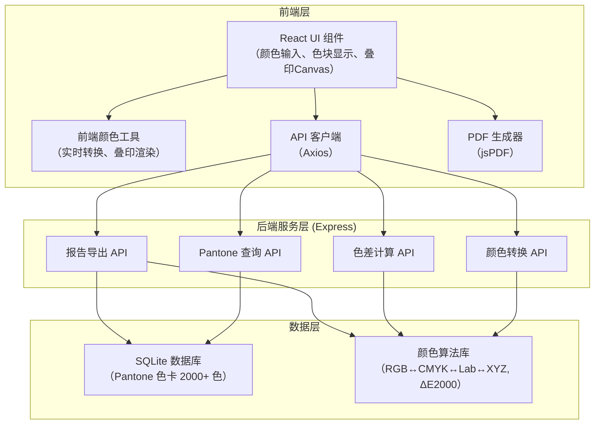
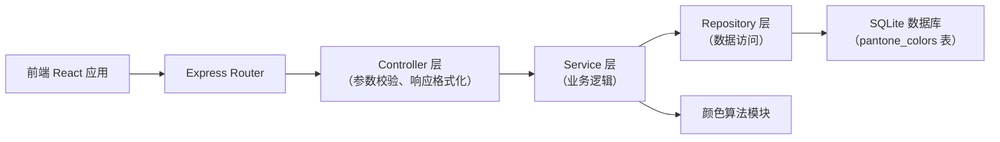
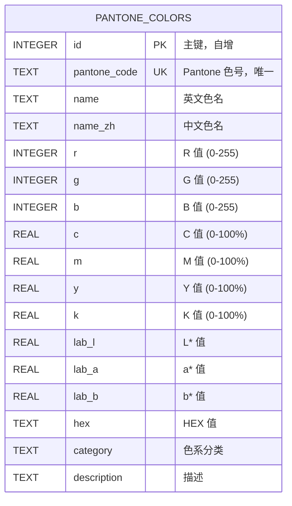

## 1. Architecture Design



## 2. Technology Description

- **前端**：React@18 + TypeScript + Vite + TailwindCSS@3 + jsPDF + Axios
- **初始化工具**：Vite 4.4.0（React + TypeScript 模板）
- **后端**：Node.js + Express@4 + better-sqlite3 + cors
- **数据库**：SQLite 3（本地文件存储，Pantone 色卡数据约 2000 条）
- **颜色算法**：自定义实现（基于 CIE 标准）+ 部分参考 color-convert 库
- **PDF 生成**：jsPDF + html2canvas（前端生成，无需后端依赖）

## 3. Route Definitions

| Route | Purpose |
|-------|---------|
| / | 主工作台（颜色转换 + Pantone 查询） |
| /overprint | 专色叠印模拟器 |
| /delta-e | 色差计算器（ΔE 2000） |
| /color-picker | 取色器工具 |
| /export | PDF 报告导出 |

**后端 API 路由**：
| Route | Method | Purpose |
|-------|--------|---------|
| /api/convert/rgb-to-all | POST | RGB 转所有颜色空间 |
| /api/convert/cmyk-to-all | POST | CMYK 转所有颜色空间 |
| /api/convert/pantone-to-all | POST | Pantone 色号转所有颜色空间 |
| /api/pantone/search | GET | 搜索 Pantone 色号/色名 |
| /api/pantone/match | POST | 根据 RGB 匹配最接近 Pantone 色 |
| /api/pantone/list | GET | 获取 Pantone 色卡列表（分页） |
| /api/delta-e/cie2000 | POST | 计算 ΔE 2000 色差 |
| /api/export/report | POST | 生成颜色报告数据（PDF 由前端生成） |

## 4. API Definitions

### 类型定义
```typescript
interface RGB { r: number; g: number; b: number; }
interface CMYK { c: number; m: number; y: number; k: number; }
interface Lab { L: number; a: number; b: number; }
interface XYZ { X: number; Y: number; Z: number; }

interface PantoneColor {
  id: number;
  pantoneCode: string;      // e.g. "PANTONE 185 C"
  name: string;             // 色名，e.g. "Bright Red"
  nameZh: string;           // 中文色名
  rgb: RGB;
  cmyk: CMYK;
  lab: Lab;
  hex: string;
  category: string;         // 色系分类
}

interface ColorConversionResult {
  rgb: RGB;
  cmyk: CMYK;
  lab: Lab;
  xyz: XYZ;
  hex: string;
  pantoneMatch: PantoneColor | null;
}

interface DeltaEResult {
  deltaE2000: number;
  difference: string;       // "几乎无差异" / "很小" / "中等" / "明显" / "很大"
  lab1: Lab;
  lab2: Lab;
}
```

### API 请求/响应示例

**POST /api/convert/rgb-to-all**
```json
// Request
{ "rgb": { "r": 255, "g": 0, "b": 0 } }

// Response
{
  "success": true,
  "data": {
    "rgb": { "r": 255, "g": 0, "b": 0 },
    "cmyk": { "c": 0, "m": 100, "y": 100, "k": 0 },
    "lab": { "L": 53.23, "a": 80.11, "b": 67.22 },
    "xyz": { "X": 41.24, "Y": 21.26, "Z": 1.93 },
    "hex": "#FF0000",
    "pantoneMatch": {
      "id": 185,
      "pantoneCode": "PANTONE 185 C",
      "name": "Bright Red",
      "nameZh": "亮红",
      "rgb": { "r": 230, "g": 25, "b": 45 },
      "cmyk": { "c": 0, "m": 90, "y": 80, "k": 10 },
      "hex": "#E6192D"
    }
  }
}
```

**POST /api/delta-e/cie2000**
```json
// Request
{
  "lab1": { "L": 53.23, "a": 80.11, "b": 67.22 },
  "lab2": { "L": 50.0, "a": 75.0, "b": 60.0 }
}

// Response
{
  "success": true,
  "data": {
    "deltaE2000": 5.23,
    "difference": "中等",
    "lab1": { "L": 53.23, "a": 80.11, "b": 67.22 },
    "lab2": { "L": 50.0, "a": 75.0, "b": 60.0 }
  }
}
```

## 5. Server Architecture Diagram



## 6. Data Model

### 6.1 Data Model Definition



### 6.2 Data Definition Language

```sql
-- Pantone 色卡表
CREATE TABLE IF NOT EXISTS pantone_colors (
    id INTEGER PRIMARY KEY AUTOINCREMENT,
    pantone_code TEXT NOT NULL UNIQUE,
    name TEXT NOT NULL,
    name_zh TEXT,
    r INTEGER NOT NULL CHECK (r BETWEEN 0 AND 255),
    g INTEGER NOT NULL CHECK (g BETWEEN 0 AND 255),
    b INTEGER NOT NULL CHECK (b BETWEEN 0 AND 255),
    c REAL NOT NULL CHECK (c BETWEEN 0 AND 100),
    m REAL NOT NULL CHECK (m BETWEEN 0 AND 100),
    y REAL NOT NULL CHECK (y BETWEEN 0 AND 100),
    k REAL NOT NULL CHECK (k BETWEEN 0 AND 100),
    lab_l REAL NOT NULL,
    lab_a REAL NOT NULL,
    lab_b REAL NOT NULL,
    hex TEXT NOT NULL,
    category TEXT,
    description TEXT,
    created_at TIMESTAMP DEFAULT CURRENT_TIMESTAMP
);

-- 索引
CREATE INDEX IF NOT EXISTS idx_pantone_code ON pantone_colors(pantone_code);
CREATE INDEX IF NOT EXISTS idx_pantone_name ON pantone_colors(name);
CREATE INDEX IF NOT EXISTS idx_pantone_rgb ON pantone_colors(r, g, b);
CREATE INDEX IF NOT EXISTS idx_pantone_category ON pantone_colors(category);

-- 预置常用专色（示例）
INSERT OR IGNORE INTO pantone_colors (pantone_code, name, name_zh, r, g, b, c, m, y, k, lab_l, lab_a, lab_b, hex, category) VALUES
('PANTONE 185 C', 'Bright Red', '亮红', 230, 25, 45, 0, 90, 80, 10, 47.05, 68.80, 43.13, '#E6192D', '红色系'),
('PANTONE 293 C', 'Reflex Blue', '反射蓝', 0, 51, 153, 100, 70, 0, 40, 23.17, 30.78, -73.26, '#003399', '蓝色系'),
('PANTONE 109 C', 'Yellow', '黄色', 255, 205, 0, 0, 10, 100, 0, 84.59, 5.49, 92.55, '#FFCD00', '黄色系'),
('PANTONE 354 C', 'Green', '绿色', 0, 132, 61, 100, 0, 100, 30, 47.29, -54.66, 33.07, '#00843D', '绿色系'),
('PANTONE 2685 C', 'Purple', '紫色', 102, 45, 145, 60, 90, 0, 20, 32.75, 54.03, -47.08, '#662D91', '紫色系');
```
