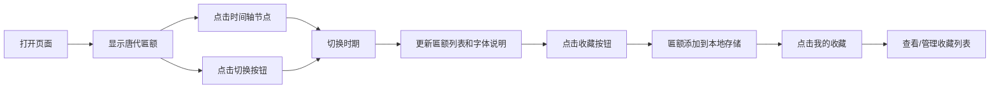

## 1. 产品概述
老字号匾额字体演变时间轴展示系统，通过交互式时间轴呈现唐宋元明清至民国六个时期的著名匾额，让用户了解中国传统匾额书法艺术的演变历程。
- 主要目的：展示中国传统匾额文化，呈现不同历史时期匾额字体风格特点
- 目标用户：文化爱好者、书法研究者、设计师、学生
- 产品价值：弘扬中华传统文化，提供沉浸式匾额艺术学习体验

## 2. 核心功能

### 2.1 用户角色
| 角色 | 注册方式 | 核心权限 |
|------|----------|----------|
| 普通用户 | 无需注册 | 浏览匾额、切换时期、收藏匾额 |

### 2.2 功能模块
1. **时间轴导航区**：横向可滚动时间轴，6个历史时期节点
2. **匾额展示区**：当前时期匾额卡片列表（图片+名称+店铺+字体类型）
3. **字体特点说明区**：当前时期匾额字体风格特点介绍
4. **时期切换按钮**：上一个时期/下一个时期快速切换
5. **我的收藏**：收藏匾额列表，数据存储在本地

### 2.3 页面详情
| 页面名称 | 模块名称 | 功能描述 |
|----------|----------|----------|
| 主页面 | 时间轴导航 | 横向滚动，点击节点切换时期，当前时期高亮显示 |
| 主页面 | 匾额展示区 | 2-3块匾额卡片，悬停动画效果，点击收藏按钮 |
| 主页面 | 字体特点说明 | 展示当前时期匾额字体特点、历史背景、代表风格 |
| 主页面 | 时期切换按钮 | 左右箭头按钮快速切换时期，首尾时期对应按钮禁用 |
| 主页面 | 我的收藏面板 | 侧边滑出面板，展示已收藏匾额，可取消收藏 |

## 3. 核心流程
用户打开页面 → 默认显示第一个时期（唐代）匾额 → 点击时间轴节点/切换按钮 → 展示对应时期匾额和字体说明 → 点击收藏按钮 → 匾额添加到我的收藏 → 点击我的收藏 → 查看收藏列表

## 4. 用户界面设计

### 4.1 设计风格
- **主色调**：深棕色 #8B4513，金色 #D4AF37，米白色 #F5F5DC
- **辅助色**：深灰色 #333333，浅棕色 #CD853F
- **按钮风格**：圆角矩形，木质纹理效果，悬停时金色高亮
- **字体**：标题使用宋体/楷体风格字体，正文使用思源黑体
- **布局风格**：古典中式风格，对称布局，卷轴效果
- **图标风格**：线描中式图标，印章风格按钮

### 4.2 页面设计概述
| 页面名称 | 模块名称 | UI 元素 |
|----------|----------|----------|
| 主页面 | 时间轴导航 | 木质卷轴背景，圆形节点，连接线动画，横向滚动条 |
| 主页面 | 匾额展示区 | 卡片式布局，阴影效果，悬停放大动画，收藏按钮 |
| 主页面 | 字体特点说明 | 卷轴边框，古典排版，分段说明 |
| 主页面 | 时期切换按钮 | 左右箭头，木质纹理，禁用状态灰度 |
| 主页面 | 我的收藏面板 | 右侧滑出，半透明遮罩，列表布局 |

### 4.3 响应式
- 桌面端：横向时间轴，3列匾额卡片布局
- 平板端：横向时间轴，2列匾额卡片布局
- 移动端：纵向时间轴，1列匾额卡片布局，触控优化

### 4.4 动画效果
- 页面加载：卷轴展开动画，元素渐入
- 时期切换：淡入淡出过渡，匾额卡片滑入效果
- 悬停效果：卡片轻微放大，金色边框高亮
- 收藏动画：心跳效果，收藏图标变色
- 面板切换：平滑滑入滑出
