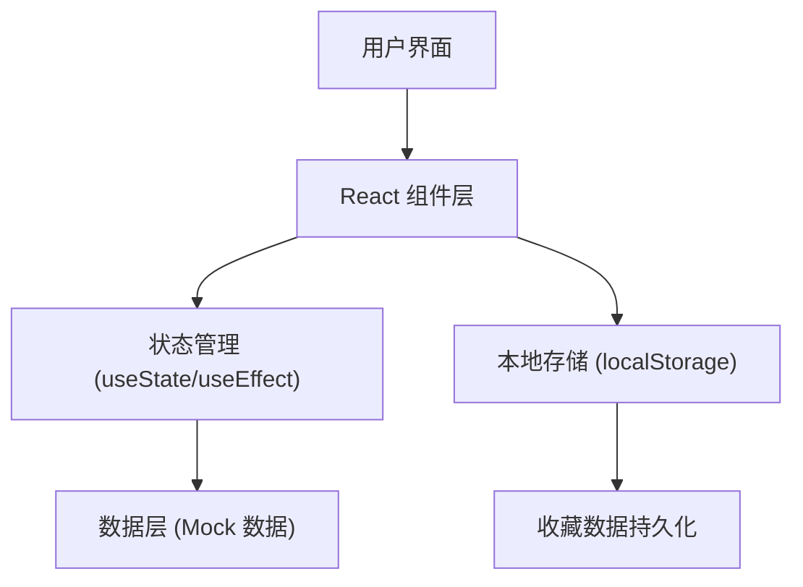

## 1. 架构设计


## 2. 技术描述
- **前端**: React@18 + TypeScript + Vite
- **样式**: TailwindCSS@3 + 自定义 CSS
- **构建工具**: Vite
- **后端**: 无（纯前端应用）
- **数据存储**: localStorage 本地存储

## 3. 路由定义
| 路由 | 用途 |
|------|------|
| / | 主页面 - 时间轴和匾额展示 |

## 4. 数据模型

### 4.1 数据结构定义

```typescript
// 历史时期
interface Period {
  id: string;
  name: string;       // 时期名称（唐、宋、元、明、清、民国）
  yearRange: string;  // 年代范围
  description: string; // 字体特点说明
}

// 匾额
interface Plaque {
  id: string;
  periodId: string;   // 所属时期ID
  name: string;       // 匾额名称
  shopName: string;   // 店铺名称
  fontType: string;   // 字体类型
  imageUrl: string;   // 匾额图片URL
  description?: string; // 匾额简介
}

// 收藏状态
interface FavoriteState {
  plaqueIds: string[]; // 收藏的匾额ID列表
}
```

### 4.2 Mock 数据结构
- periods: 6个历史时期数据
- plaques: 每个时期2-3块匾额数据，共15块左右

## 5. 组件结构

```
src/
├── components/
│   ├── Timeline/          # 时间轴组件
│   ├── PlaqueCard/        # 匾额卡片组件
│   ├── PlaqueList/        # 匾额列表组件
│   ├── FontDescription/   # 字体特点说明组件
│   ├── PeriodNavButtons/  # 时期切换按钮组件
│   └── FavoritesPanel/    # 我的收藏面板组件
├── data/
│   └── mockData.ts        # Mock数据
├── hooks/
│   └── useFavorites.ts    # 收藏功能Hook
├── types/
│   └── index.ts           # 类型定义
├── App.tsx
└── main.tsx
```

## 6. 核心功能实现要点

### 6.1 时间轴交互
- 横向滚动容器，使用 overflow-x: auto
- 点击节点触发时期切换，滚动到可视区域
- 当前时期节点高亮动画

### 6.2 时期切换
- 上一个/下一个按钮，边界判断禁用
- 切换时平滑过渡动画
- 更新URL hash（可选，用于刷新保持状态）

### 6.3 收藏功能
- 使用 localStorage 持久化收藏数据
- 自定义 Hook 封装收藏逻辑
- 收藏/取消收藏动画反馈

### 6.4 动画效果
- CSS transitions 实现平滑过渡
- React 动画库（如 framer-motion）实现复杂动画
- 卷轴展开、卡片滑入、悬停效果
