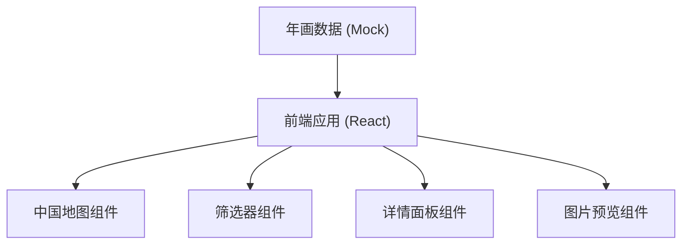

## 1. 架构设计



## 2. 技术描述
- **前端**：React@18 + TypeScript + Vite
- **样式**：TailwindCSS@3 + CSS Modules
- **地图**：SVG矢量地图
- **图标**：Lucide React
- **状态管理**：React Hooks (useState, useContext)

## 3. 目录结构
```
src/
├── components/
│   ├── ChinaMap/          # 中国地图组件
│   │   ├── index.tsx
│   │   └── Marker.tsx
│   ├── FilterBar/         # 主题筛选器
│   │   └── index.tsx
│   ├── DetailPanel/       # 详情面板
│   │   ├── index.tsx
│   │   ├── StyleFeatures.tsx
│   │   └── ThemeInfo.tsx
│   ├── ImageGallery/      # 图片画廊
│   │   ├── index.tsx
│   │   └── ImageModal.tsx
│   └── Layout/            # 布局组件
│       └── index.tsx
├── data/
│   └── nianhuaData.ts     # 年画产地数据
├── types/
│   └── index.ts           # 类型定义
├── App.tsx
├── main.tsx
└── index.css
```

## 4. 数据模型定义

### 4.1 类型定义
```typescript
interface NianhuaLocation {
  id: string;
  name: string;          // 产地名称
  englishName: string;   // 英文名称
  position: {
    x: number;          // 地图上的x坐标 (百分比)
    y: number;          // 地图上的y坐标 (百分比)
  };
  styleFeatures: string[];  // 风格特点
  commonThemes: string[];   // 常见主题
  representativeWorks: {
    id: string;
    title: string;
    imageUrl: string;
    theme: string;      // 所属主题
  }[];
  description: string;  // 产地简介
}

type ThemeType = 'all' | '门神' | '吉祥喜庆' | '戏文故事';
```

### 4.2 八大年画产地数据
- 天津杨柳青
- 苏州桃花坞
- 山东杨家埠
- 河南朱仙镇
- 河北武强
- 陕西凤翔
- 四川绵竹
- 广东佛山

## 5. 核心组件设计

### 5.1 ChinaMap 组件
- 渲染SVG中国地图
- 根据位置数据渲染8个标记点
- 支持标记点点击和悬停交互
- 根据筛选主题高亮对应产地

### 5.2 FilterBar 组件
- 主题筛选按钮组（全部/门神/吉祥喜庆/戏文故事）
- 点击筛选后更新地图标记状态

### 5.3 DetailPanel 组件
- 展示选中产地的详细信息
- 包含产地简介、风格特点、常见主题
- 集成图片画廊组件

### 5.4 ImageGallery 组件
- 网格布局展示代表作图片
- 点击图片打开放大预览模态框
- 支持键盘ESC关闭

## 6. 交互逻辑
1. 页面初始化：加载所有产地数据，渲染地图
2. 筛选交互：选择主题 → 过滤有该主题年画的产地 → 高亮标记
3. 标记点击：更新选中状态 → 右侧面板展示详情
4. 图片点击：打开模态框 → 放大展示图片
