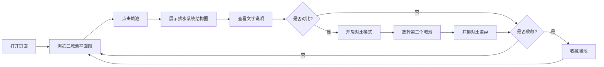

## 1. 产品概述

本产品是一个古代城池排水系统设计对比的交互式展示平台，通过可视化方式呈现中国古代三座典型城池（楚纪南城、汉长安城、唐洛阳城）的排水系统设计，帮助历史爱好者、建筑学专业人士和学生深入了解中国古代城市水利工程的智慧。

- 核心价值：将专业的考古研究成果转化为直观易懂的交互式展示，让用户能够对比不同朝代城池排水系统的设计理念与技术特点
- 目标用户：历史文化爱好者、建筑学/城市规划专业师生、博物馆教育工作者

## 2. 核心功能

### 2.1 用户角色

| 角色 | 注册方式 | 核心权限 |
|------|----------|----------|
| 普通用户 | 无需注册，直接使用 | 浏览城池平面图、查看排水系统详情、对比城池、收藏城池（本地存储） |

### 2.2 功能模块

1. **城池概览区**：三城池平面示意图并列展示，支持点击交互
2. **排水系统详情区**：右侧展示选中城池的排水系统结构图，标注关键设施
3. **文字说明区**：展示排水方式的详细说明（明沟暗渠结合、地势引水、排水与防御结合）
4. **对比功能区**：支持选择两个城池进行排水系统差异对比
5. **收藏功能**：支持收藏感兴趣的城池，本地持久化存储

### 2.3 页面详情

| 页面名称 | 模块名称 | 功能描述 |
|---------|----------|----------|
| 主页面 | 城池概览模块 | 并排展示三座古城池平面示意图，鼠标悬停显示城池名称和朝代，点击选中城池 |
| 主页面 | 排水系统结构图模块 | SVG 绘制排水系统结构图，标注出水口、排水渠、蓄水池、壕沟位置，支持缩放查看 |
| 主页面 | 排水说明模块 | 三段式文字说明：明沟暗渠结合、地势引水、排水与防御结合 |
| 主页面 | 对比功能模块 | 对比模式切换，选择两个城池并排展示，高亮显示差异点 |
| 主页面 | 收藏功能模块 | 心形按钮收藏/取消收藏，收藏状态本地存储，收藏列表快速访问 |

## 3. 核心流程

用户打开页面 → 浏览三座城池平面图 → 点击感兴趣的城池 → 右侧展示排水系统结构图和文字说明 → 可选择开启对比模式 → 选择第二个城池进行对比 → 可收藏感兴趣的城池 → 查看收藏列表

## 4. 用户界面设计

### 4.1 设计风格

- **设计理念**：古典雅致的东方美学，融合现代交互设计
- **主色调**：赭石色 (#8B4513)、青灰色 (#708090)、米白色 (#F5F5DC)
- **辅助色**：藏蓝色 (#191970)、鎏金色 (#DAA520)
- **按钮风格**：圆角矩形，古典纹样边框，悬停时有金色描边效果
- **字体**：标题使用 "Noto Serif SC"（思源宋体），正文使用 "Noto Sans SC"（思源黑体）
- **布局风格**：三栏式布局（左侧城池列表、中间详情、右侧说明），采用古典卷轴装饰元素
- **图标风格**：线性古风图标，融入回纹、云纹等传统纹样

### 4.2 页面设计概述

| 页面名称 | 模块名称 | UI 元素 |
|---------|----------|----------|
| 主页面 | 城池概览模块 | 古风边框卡片、城池 SVG 示意图、悬停放大效果、朝代标签 |
| 主页面 | 排水系统结构图模块 | SVG 可交互图、热点标注、图例说明、缩放控制 |
| 主页面 | 排水说明模块 | 三段式卡片、古典分隔线、图标点缀 |
| 主页面 | 对比功能模块 | 切换开关、城池选择器、差异高亮、并排布局 |
| 主页面 | 收藏功能模块 | 心形按钮、收藏抽屉、快速跳转 |

### 4.3 响应式设计

- 采用桌面端优先设计，支持 1280px 及以上分辨率
- 平板端（768px-1279px）：调整为上下布局，城池图在上，详情在下
- 移动端（<768px）：单列布局，优化触控交互，增大点击区域
- 所有 SVG 图表支持自适应缩放

### 4.4 交互动效

- 页面加载：卷轴展开动效，内容渐入
- 城池选中：边框鎏金流动效果
- 排水系统标注：脉冲动画提示热点位置
- 对比切换：平滑过渡动画，差异点高亮闪烁
- 收藏按钮：心形填充动画
