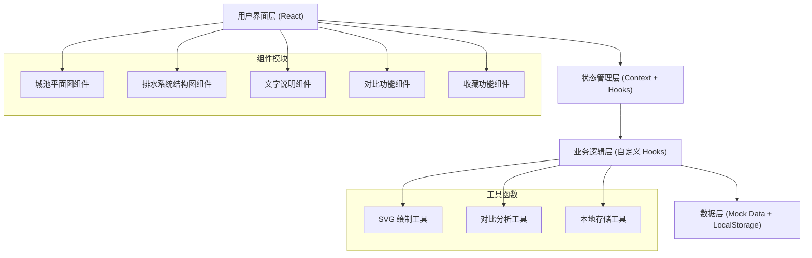
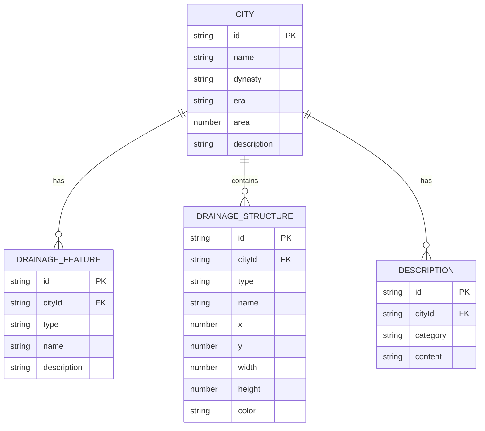

## 1. 架构设计



## 2. 技术描述

- **前端框架**：React@18 + TypeScript + Vite@5
- **样式方案**：Tailwind CSS@3 + CSS 变量（主题系统）
- **图标库**：Lucide React（自定义古风风格）
- **状态管理**：React Context + useReducer（全局状态）+ 自定义 Hooks
- **数据持久化**：LocalStorage（收藏功能）
- **可视化**：原生 SVG + CSS 动画（无需额外图表库）
- **构建工具**：Vite
- **代码规范**：ESLint + Prettier

## 3. 目录结构

```
src/
├── components/           # 组件目录
│   ├── CityOverview/     # 城池概览模块
│   │   ├── CityCard.tsx
│   │   └── CityList.tsx
│   ├── DrainageSystem/   # 排水系统结构图模块
│   │   ├── DrainageMap.tsx
│   │   └── Legend.tsx
│   ├── Description/      # 文字说明模块
│   │   └── DrainageDescription.tsx
│   ├── Compare/          # 对比功能模块
│   │   ├── CompareMode.tsx
│   │   └── DifferenceHighlight.tsx
│   └── Favorite/         # 收藏功能模块
│       ├── FavoriteButton.tsx
│       └── FavoriteList.tsx
├── data/                 # 数据目录
│   ├── cities.ts         # 城池基础数据
│   └── drainageData.ts   # 排水系统数据
├── hooks/                # 自定义 Hooks
│   ├── useCitySelection.ts
│   ├── useCompareMode.ts
│   └── useFavorites.ts
├── context/              # Context
│   └── AppContext.tsx
├── types/                # TypeScript 类型定义
│   └── index.ts
├── utils/                # 工具函数
│   ├── svgUtils.ts
│   ├── compareUtils.ts
│   └── storage.ts
├── styles/               # 全局样式
│   ├── globals.css
│   └── theme.css
├── App.tsx
└── main.tsx
```

## 4. 路由定义

| 路由 | 用途 |
|------|------|
| / | 主页面（单页应用，所有功能在首页展示） |

本项目为单页应用，无需多路由配置。

## 5. 数据模型

### 5.1 数据模型定义



### 5.2 TypeScript 类型定义

```typescript
// 城池基础信息
interface City {
  id: string;
  name: string;
  dynasty: string;
  era: string;
  area: number;
  description: string;
  outline: SVGPathData;
}

// 排水结构类型
type StructureType = 'outlet' | 'canal' | 'reservoir' | 'moat';

// 排水系统结构
interface DrainageStructure {
  id: string;
  cityId: string;
  type: StructureType;
  name: string;
  x: number;
  y: number;
  width: number;
  height: number;
  description: string;
}

// 排水方式说明
interface DrainageDescription {
  id: string;
  cityId: string;
  category: 'open_ditch' | 'terrain' | 'defense';
  title: string;
  content: string;
}

// 收藏项
interface FavoriteItem {
  cityId: string;
  timestamp: number;
}

// 应用状态
interface AppState {
  selectedCityId: string | null;
  compareMode: boolean;
  compareCityIds: [string, string] | [string] | [];
  favorites: string[];
}
```
