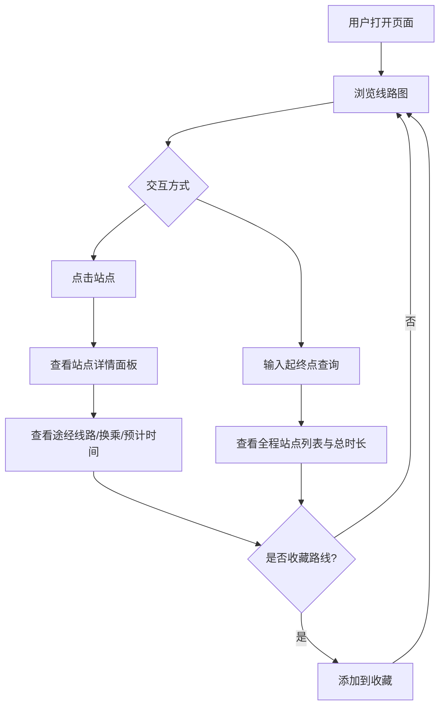

## 1. 产品概述

全国高铁线路图与站点换乘查询系统，以交互式地图为核心展示中国8条高铁主干线及站点信息，帮助用户快速了解线路布局、查询站点换乘方案与全程时刻，并支持收藏常用路线。

- 目标用户：经常出行的旅客、铁路爱好者、差旅规划人员
- 核心价值：可视化高铁网络、一站查询换乘与时刻、快速规划行程

## 2. 核心功能

### 2.1 用户角色

| 角色 | 注册方式 | 核心权限 |
|------|----------|----------|
| 普通用户 | 无需注册 | 浏览线路图、查询站点、查询路线、收藏路线 |

### 2.2 功能模块

1. **线路图主页**：交互式高铁线路地图，展示8条主干线与站点
2. **站点详情面板**：站点途经线路、可换乘线路、到主要城市预计时间
3. **路线查询面板**：输入起终点查询全程站点列表与总时长
4. **收藏管理面板**：收藏与查看常用路线

### 2.3 页面详情

| 页面名称 | 模块名称 | 功能描述 |
|----------|----------|----------|
| 线路图主页 | 地图区域 | 展示8条主干线的SVG线路图，站点可点击，支持缩放与拖拽 |
| 线路图主页 | 线路图例 | 左侧/底部展示8条线路的颜色与名称图例，点击可高亮对应线路 |
| 线路图主页 | 站点详情面板 | 右侧滑出面板，展示选中站点的途经线路、换乘信息、到主要城市预计时间 |
| 路线查询面板 | 起终点输入 | 顶部搜索栏输入起点和终点站名，支持自动补全 |
| 路线查询面板 | 查询结果 | 显示全程站点列表、总时长、经过线路、中转换乘信息 |
| 收藏管理面板 | 收藏列表 | 展示已收藏路线，点击可快速查询 |
| 收藏管理面板 | 收藏操作 | 在查询结果中添加/移除收藏 |

## 3. 核心流程

用户打开页面 → 浏览线路图 → 点击站点查看详情 → 或输入起终点查询路线 → 收藏常用路线

## 4. 用户界面设计

### 4.1 设计风格

- **主色调**：深蓝 (#0A1628) 为底色，科技感高铁主题；线路使用8种鲜明色系区分
- **辅助色**：浅蓝 (#3B82F6) 用于按钮与交互高亮，白色用于文字与站点标记
- **按钮风格**：圆角胶囊按钮，hover时发光效果
- **字体**：标题使用 Noto Sans SC Bold，正文使用 Noto Sans SC Regular
- **布局风格**：左侧地图占主区域，右侧面板滑出；顶部搜索栏
- **图标风格**：线性图标，与高铁交通主题一致
- **背景**：深色渐变背景 + 网格线纹理，营造科技感地图氛围

### 4.2 页面设计概览

| 页面名称 | 模块名称 | UI元素 |
|----------|----------|--------|
| 线路图主页 | 地图区域 | SVG线路图，深色背景，线路彩色曲线，站点圆点标记，缩放/拖拽控件 |
| 线路图主页 | 线路图例 | 左下角半透明面板，8条线路色块+名称，点击高亮 |
| 线路图主页 | 站点详情面板 | 右侧滑出面板，深色半透明背景，途经线路标签、换乘卡片、时间列表 |
| 路线查询面板 | 起终点输入 | 顶部搜索栏，两个输入框+交换按钮+查询按钮，下拉自动补全 |
| 路线查询面板 | 查询结果 | 中间弹窗/面板，站点时间轴列表，总时长高亮，经过线路标签 |
| 收藏管理面板 | 收藏列表 | 右侧面板tab，路线卡片列表，点击快速查询，支持删除 |

### 4.3 响应式设计

- 桌面端优先：地图占满主区域，右侧面板固定宽度
- 平板端：地图缩小，面板底部弹出
- 移动端：全屏地图，底部抽屉式面板

### 4.4 8条主干线路色系

| 线路名称 | 颜色 |
|----------|------|
| 京沪线 | #EF4444 (红) |
| 京广线 | #F59E0B (橙) |
| 沪昆线 | #10B981 (绿) |
| 哈大线 | #3B82F6 (蓝) |
| 京哈线 | #8B5CF6 (紫) |
| 徐兰线 | #EC4899 (粉) |
| 沪汉蓉线 | #06B6D4 (青) |
| 东南沿海线 | #F97316 (橘) |
