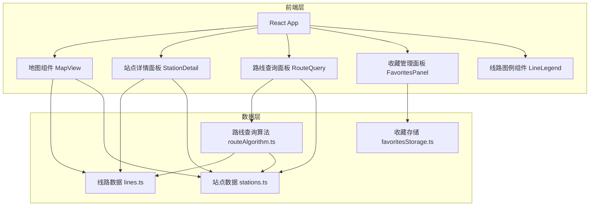
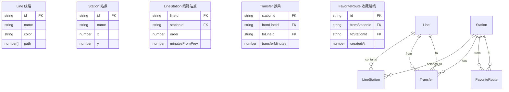

## 1. 架构设计



## 2. 技术说明

- **前端框架**：React@18 + TypeScript + Vite
- **样式方案**：Tailwind CSS@3
- **地图渲染**：SVG + 自定义缩放拖拽（react-zoom-pan-pinch）
- **状态管理**：React Context + useReducer
- **数据存储**：LocalStorage（收藏路线持久化）
- **后端**：无，纯前端应用，所有数据内置于前端

## 3. 路由定义

| 路由 | 用途 |
|------|------|
| / | 线路图主页，包含地图、站点详情、路线查询、收藏管理所有功能 |

> 单页应用，所有功能通过面板切换实现，无需多路由

## 4. 模块划分与职责

### 4.1 组件模块

| 模块 | 职责 |
|------|------|
| `MapView` | SVG线路图渲染、缩放拖拽、站点交互 |
| `StationDetail` | 展示站点途经线路、换乘信息、预计时间 |
| `RouteQuery` | 起终点输入、自动补全、查询触发 |
| `RouteResult` | 全程站点列表、总时长、经过线路 |
| `FavoritesPanel` | 收藏列表展示、删除、快速查询 |
| `LineLegend` | 线路图例展示、高亮切换 |
| `SearchBar` | 站名搜索输入、自动补全下拉 |

### 4.2 数据模块

| 模块 | 职责 |
|------|------|
| `data/lines.ts` | 8条主干线定义：名称、颜色、站点序列、SVG路径坐标 |
| `data/stations.ts` | 站点定义：名称、坐标、所属线路、换乘线路、到主要城市时间 |
| `utils/routeAlgorithm.ts` | BFS/Dijkstra路线搜索算法，求最短时间路径 |
| `utils/favoritesStorage.ts` | LocalStorage读写收藏路线 |
| `context/AppContext.tsx` | 全局状态：选中站点、查询结果、收藏列表、高亮线路 |
| `types/index.ts` | TypeScript类型定义 |

## 5. 数据模型

### 5.1 数据模型定义



### 5.2 TypeScript 类型定义

```typescript
interface Line {
  id: string;
  name: string;
  color: string;
  path: [number, number][]; // SVG路径坐标点
}

interface Station {
  id: string;
  name: string;
  x: number; // SVG x坐标
  y: number; // SVG y坐标
  lines: string[]; // 所属线路ID列表
}

interface LineStation {
  lineId: string;
  stationId: string;
  order: number; // 站点在线路上的顺序
  minutesFromPrev: number; // 距前一站分钟数
}

interface Transfer {
  stationId: string;
  fromLineId: string;
  toLineId: string;
  transferMinutes: number; // 换乘时间
}

interface FavoriteRoute {
  id: string;
  fromStationId: string;
  toStationId: string;
  createdAt: number;
}

interface RouteResult {
  stations: { station: Station; line: Line; arrivalMinutes: number }[];
  totalMinutes: number;
  transfers: { station: Station; fromLine: Line; toLine: Line }[];
}
```

## 6. 核心算法

路线查询采用 BFS（广度优先搜索）算法：
- 以站点为节点，相邻站点（同线路相邻或换乘连接）为边
- 边权重为行驶时间或换乘时间
- 求起点到终点的最短时间路径
- 输出途径站点序列、换乘点、总时长
