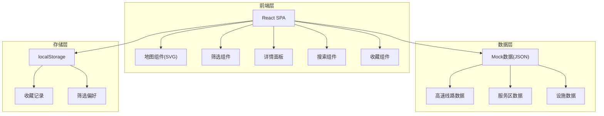
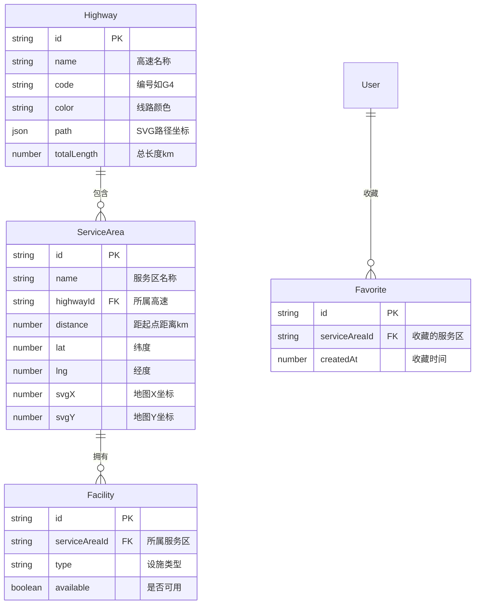

## 1. 架构设计

## 2. 技术说明
- **前端**: React@18 + TailwindCSS@3 + Vite
- **初始化工具**: Vite (vite init react-ts)
- **后端**: 无（纯前端应用，使用Mock数据）
- **数据库**: 无（使用内嵌JSON数据 + localStorage持久化收藏）

### 关键依赖
- **framer-motion**: 面板动画、标记动效
- **react-icons**: 设施图标
- **SVG内联绘制**: 高速公路简图

## 3. 路由定义
| 路由 | 用途 |
|------|------|
| / | 地图主页，含筛选、搜索、收藏全部功能 |

> 单页应用，所有功能在同一页面通过面板交互完成，无需多路由

## 4. 数据模型

### 4.1 数据模型定义

### 4.2 数据定义

**高速线路数据** (6条):
| 编号 | 名称 | 起止城市 | 总里程 |
|------|------|----------|--------|
| G4 | 京港澳高速 | 北京-珠海 | 2285km |
| G2 | 京沪高速 | 北京-上海 | 1262km |
| G5 | 京昆高速 | 北京-昆明 | 2865km |
| G15 | 沈海高速 | 沈阳-海口 | 3710km |
| G30 | 连霍高速 | 连云港-霍尔果斯 | 4395km |
| G50 | 沪渝高速 | 上海-重庆 | 1768km |

**设施类型枚举**: gas_station(加油站), charging(充电桩), restaurant(餐厅), restroom(卫生间), nursery(母婴室), auto_repair(汽修点)

**每条高速约8-12个服务区**，共约60个服务区数据点，每个服务区包含1-6种设施
