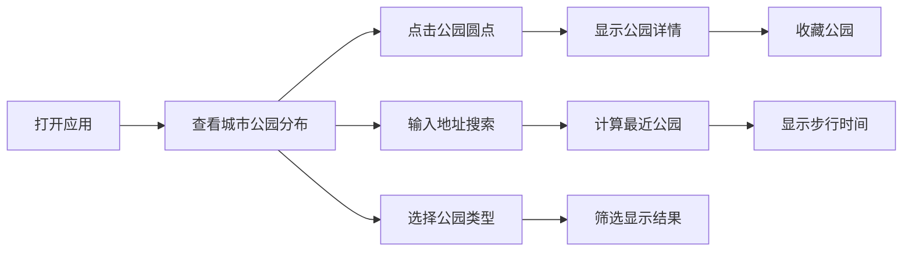

## 1. 产品概述

城市公园绿地分布与步行可达性分析系统，为城市居民提供直观的公园分布可视化展示和步行可达性分析。

- 主要目的：帮助用户快速了解城市公园分布情况，查找最近的公园，评估步行可达性
- 解决的问题：城市居民难以快速找到适合的休闲绿地，缺乏直观的公园分布信息
- 目标用户：城市居民、城市规划者、环境研究者

## 2. 核心功能

### 2.1 Feature Module

1. **地图展示页**：城市行政区地图、公园位置标注、面积可视化
2. **公园信息面板**：公园详细信息展示、收藏功能
3. **地址搜索模块**：地址输入、最近公园计算、步行时间估算
4. **筛选功能**：按公园类型筛选显示

### 2.2 Page Details

| 页面名称 | 模块名称 | 功能描述 |
|-----------|-------------|---------------------|
| 主页面 | 城市地图区域 | SVG绘制6个行政区边界，公园位置用不同大小圆点表示面积 |
| 主页面 | 公园信息面板 | 显示选中公园的名称、面积、设施类型、开放时间，收藏按钮 |
| 主页面 | 地址搜索栏 | 输入地址，计算最近两个公园及步行时间 |
| 主页面 | 类型筛选器 | 综合公园、社区公园、专类公园、游园四种类型筛选 |
| 主页面 | 收藏列表 | 展示用户收藏的公园，可快速定位 |

## 3. 核心流程

1. 用户打开应用 → 查看城市地图和公园分布
2. 用户点击地图上的公园圆点 → 右侧显示公园详细信息 → 用户可点击收藏
3. 用户在搜索框输入地址 → 系统计算距离最近的两个公园 → 显示步行时间
4. 用户选择公园类型 → 地图实时过滤显示对应类型的公园

## 4. 用户界面设计

### 4.1 设计风格

- **主色调**：深绿色（#2D5A27）代表自然与生态，搭配天蓝色（#4A90D9）代表城市与活力
- **辅助色**：暖橙色（#E67E22）用于强调交互元素，浅灰色（#F5F5F5）作为背景
- **按钮风格**：圆角矩形，微阴影效果，悬停时有轻微放大动画
- **字体**：标题使用「思源黑体 Bold」，正文使用「思源宋体 Regular」
- **布局风格**：左右分栏布局，左侧地图区域占70%，右侧信息面板占30%
- **图标风格**：线性简约图标，统一24px尺寸

### 4.2 Page Design Overview

| 页面名称 | 模块名称 | UI Elements |
|-----------|-------------|-------------|
| 主页面 | 城市地图区域 | SVG交互式地图，不同颜色区分行政区，圆点大小表示公园面积，悬停显示公园名称 |
| 主页面 | 公园信息面板 | 卡片式布局，标题区、信息详情区、设施图标组、收藏按钮 |
| 主页面 | 地址搜索栏 | 顶部搜索框，带搜索图标，输入时实时建议 |
| 主页面 | 类型筛选器 | 标签式按钮组，选中状态有颜色填充 |
| 主页面 | 收藏列表 | 可折叠侧边栏，收藏项带快速定位按钮 |

### 4.3 Responsiveness

- 桌面端（1200px+）：左右分栏布局，地图70% + 面板30%
- 平板端（768px-1199px）：上下布局，地图在上占60%，面板在下占40%
- 移动端（<768px）：全屏地图，底部可滑出信息面板，筛选器改用底部导航
