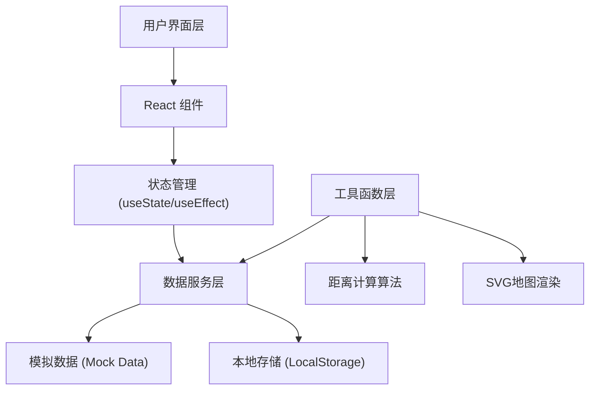
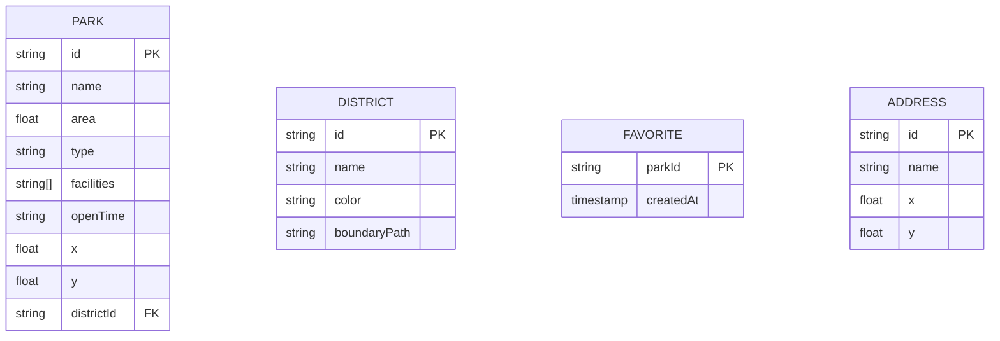

## 1. Architecture Design



## 2. Technology Description

- **Frontend**: React@18 + TypeScript + Vite
- **样式方案**: TailwindCSS@3
- **地图渲染**: 原生 SVG（无需第三方地图库，轻量可控）
- **状态管理**: React Hooks (useState, useEffect, useContext)
- **本地存储**: localStorage（用于收藏功能持久化）
- **构建工具**: Vite@5

## 3. Route Definitions

| Route | Purpose |
|-------|---------|
| / | 主页面 - 城市公园分布地图与分析 |

## 4. Data Model

### 4.1 Data Model Definition



### 4.2 Data Type Definitions (TypeScript)

```typescript
// 公园类型
type ParkType = 'comprehensive' | 'community' | 'specialized' | 'garden';

// 行政区
interface District {
  id: string;
  name: string;
  color: string;
  boundary: string; // SVG path
}

// 公园
interface Park {
  id: string;
  name: string;
  area: number; // 平方米
  type: ParkType;
  facilities: string[];
  openTime: string;
  x: number;
  y: number;
  districtId: string;
}

// 地址
interface Address {
  name: string;
  x: number;
  y: number;
}

// 步行可达性结果
interface WalkabilityResult {
  park: Park;
  distance: number; // 米
  walkTime: number; // 分钟
}

// 收藏项
interface Favorite {
  parkId: string;
  createdAt: number;
}
```

### 4.3 Mock Data

- **6个行政区**：东城区、西城区、南城区、北城区、中心区、开发区
- **20个公园**：分布在各个行政区，包含4种类型
- **预设地址列表**：用于地址搜索的自动建议

## 5. Component Structure

```
src/
├── components/
│   ├── Map/
│   │   ├── CityMap.tsx          # SVG城市地图
│   │   ├── District.tsx         # 行政区组件
│   │   └── ParkMarker.tsx       # 公园标记点
│   ├── ParkInfo/
│   │   ├── ParkDetail.tsx       # 公园详情面板
│   │   └── FavoriteList.tsx     # 收藏列表
│   ├── Search/
│   │   ├── AddressSearch.tsx    # 地址搜索框
│   │   └── WalkabilityResult.tsx # 步行结果
│   └── Filter/
│       └── ParkTypeFilter.tsx   # 类型筛选器
├── data/
│   ├── districts.ts             # 行政区数据
│   └── parks.ts                 # 公园数据
├── hooks/
│   ├── useFavorites.ts          # 收藏管理Hook
│   └── useWalkability.ts        # 步行计算Hook
├── utils/
│   ├── distance.ts              # 距离计算工具
│   └── parkTypes.ts             # 公园类型配置
└── App.tsx
```

## 6. Core Algorithms

### 6.1 欧几里得距离计算
```typescript
function calculateDistance(x1: number, y1: number, x2: number, y2: number): number {
  return Math.sqrt(Math.pow(x2 - x1, 2) + Math.pow(y2 - y1, 2));
}
```

### 6.2 步行时间计算
```typescript
// 步行速度: 5km/h = 83.33米/分钟
function calculateWalkTime(distance: number): number {
  const speed = 5000 / 60; // 米/分钟
  return Math.ceil(distance / speed);
}
```
