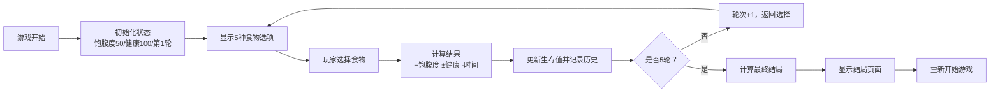

## 1. 产品概述

野外生存情景决策游戏是一款互动式生存模拟游戏，玩家扮演被困山林的幸存者，通过5次食物来源选择来决定最终命运。游戏结合了策略选择和随机事件机制，让玩家体验野外生存的紧张感与挑战性。

- 核心目标：通过合理选择食物来源，在5轮决策后保持足够的生存值以获得获救结局
- 目标用户：喜欢策略类小游戏、生存题材的休闲玩家

## 2. 核心 Features

### 2.1 Feature Module
1. **游戏主页**：场景展示、生存状态面板、食物选择区域
2. **历史记录**：显示每轮选择详情及结果变化
3. **结局展示**：根据最终生存值显示不同结局

### 2.3 Page Details
| Page Name | Module Name | Feature description |
|-----------|-------------|---------------------|
| 游戏主页 | 场景展示 | 山林被困背景、当前轮次显示、生存值实时更新 |
| 游戏主页 | 食物选择 | 5种食物选项（野果、蘑菇、树皮、捕鱼、捕猎），显示各选项参数 |
| 游戏主页 | 状态面板 | 显示饱腹度、健康值、剩余轮次 |
| 游戏主页 | 历史记录 | 显示每轮选择的食物、获得的饱腹度、健康变化、时间消耗 |
| 结局页面 | 结果展示 | 根据最终生存值显示3种结局（获救成功/勉强存活/遇难）、详细统计数据、重新开始按钮 |

## 3. 核心流程

玩家进入游戏后，系统初始化生存状态（饱腹度50、健康值100、第1轮）。每轮玩家从5种食物中选择一种，系统根据选择计算饱腹度变化、健康风险（可能中毒或受伤）和时间消耗，更新生存值后进入下一轮。完成5轮后，根据最终生存值判定结局。

## 4. User Interface Design

### 4.1 Design Style
- **主色调**：深绿色系（#1B4332 主色、#2D6A4F 辅助色），营造野外丛林氛围
- **强调色**：橙色（#FF9F1C）用于重要按钮和数值变化
- **危险色**：红色（#E63946）用于健康下降提示
- **成功色**：绿色（#2EC4B6）用于健康上升提示
- **按钮风格**：立体按钮带微阴影，悬停时有缩放动画
- **字体**：标题使用特殊衬线字体增强沉浸感，正文使用清晰易读的无衬线字体
- **布局风格**：卡片式布局，左侧状态面板、中间选择区域、右侧历史记录
- **图标风格**：使用emoji增强视觉效果（🍄🐟🍖🌿🪵）

### 4.2 Page Design Overview
| Page Name | Module Name | UI Elements |
|-----------|-------------|-------------|
| 游戏主页 | 场景展示 | 丛林背景图、半透明遮罩、标题文字发光效果 |
| 游戏主页 | 状态面板 | 进度条动画显示饱腹度和健康值，数值变化时颜色闪烁 |
| 游戏主页 | 食物选择 | 卡片式选项，悬停时上浮阴影，选中时有橙色边框高亮 |
| 游戏主页 | 历史记录 | 时间线样式展示，每轮结果有不同颜色标记 |
| 结局页面 | 结果展示 | 大标题动画，结局图标放大，数据统计表格 |

### 4.3 Responsiveness
- 桌面端：三列布局（状态面板 + 选择区域 + 历史记录）
- 平板端：两列布局（状态面板在上，选择区域和历史记录并列）
- 移动端：单列布局，历史记录折叠为可展开面板
- 所有交互元素优化触控体验，按钮最小尺寸48px

### 4.4 动画效果
- 页面加载时元素依次淡入
- 选择食物时卡片缩放+弹跳动画
- 数值变化时滚动数字动画
- 健康/饱腹度进度条平滑过渡
- 结局页面标题从大到小弹性动画
