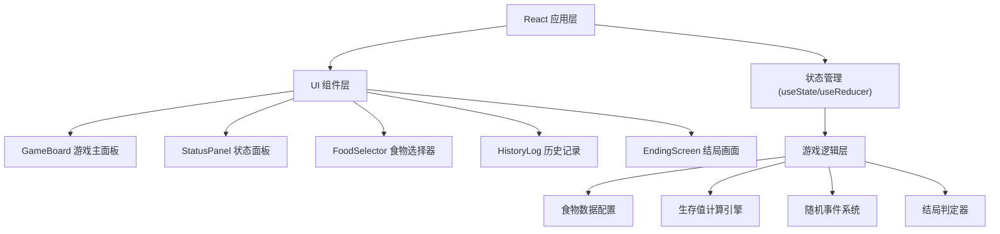

## 1. Architecture Design



## 2. Technology Description
- **Frontend**: React@18 + TypeScript + tailwindcss@3 + vite
- **初始化工具**: vite-init
- **状态管理**: React Hooks (useState, useReducer)
- **动画**: CSS transitions + keyframes 动画
- **图标**: Emoji + 纯 CSS 绘制

## 3. Route Definitions
| Route | Purpose |
|-------|---------|
| / | 游戏主页面（包含所有游戏流程） |

## 4. Data Model

### 4.1 食物数据模型

```typescript
interface FoodOption {
  id: string;
  name: string;
  icon: string;
  description: string;
  satiety: { min: number; max: number };  // 饱腹度范围
  healthRisk: { 
    probability: number;  // 风险概率 0-1
    damage: { min: number; max: number };  // 伤害值
    type: 'poison' | 'injury' | 'none';
  };
  timeCost: number;  // 时间消耗（影响健康恢复）
}
```

### 4.2 游戏状态模型

```typescript
interface GameState {
  round: number;  // 当前轮次 1-5
  maxRounds: number;
  satiety: number;  // 饱腹度 0-100
  health: number;  // 健康值 0-100
  isGameOver: boolean;
  ending: 'rescued' | 'survived' | 'dead' | null;
  history: HistoryRecord[];
}

interface HistoryRecord {
  round: number;
  foodId: string;
  foodName: string;
  satietyGain: number;
  healthChange: number;
  timeCost: number;
  riskEvent: string | null;  // 发生的风险事件描述
}
```

### 4.3 食物配置数据

```typescript
const FOOD_OPTIONS: FoodOption[] = [
  {
    id: 'berry',
    name: '野果',
    icon: '🫐',
    description: '丛林中常见的野果，容易获取',
    satiety: { min: 8, max: 15 },
    healthRisk: { probability: 0.1, damage: { min: 5, max: 15 }, type: 'poison' },
    timeCost: 1
  },
  {
    id: 'mushroom',
    name: '蘑菇',
    icon: '🍄',
    description: '湿润处生长的菌类，营养价值高但需辨识',
    satiety: { min: 15, max: 25 },
    healthRisk: { probability: 0.3, damage: { min: 10, max: 30 }, type: 'poison' },
    timeCost: 2
  },
  {
    id: 'bark',
    name: '树皮',
    icon: '🪵',
    description: '树木的内层树皮，聊胜于无',
    satiety: { min: 3, max: 8 },
    healthRisk: { probability: 0.05, damage: { min: 3, max: 8 }, type: 'injury' },
    timeCost: 1
  },
  {
    id: 'fish',
    name: '捕鱼',
    icon: '🐟',
    description: '溪流中捕鱼，营养丰富但耗时',
    satiety: { min: 25, max: 40 },
    healthRisk: { probability: 0.15, damage: { min: 5, max: 15 }, type: 'injury' },
    timeCost: 4
  },
  {
    id: 'hunt',
    name: '捕猎',
    icon: '🏹',
    description: '设陷阱捕猎小型动物，高风险高回报',
    satiety: { min: 35, max: 55 },
    healthRisk: { probability: 0.35, damage: { min: 15, max: 35 }, type: 'injury' },
    timeCost: 5
  }
];
```

### 4.4 结局判定规则

```typescript
// 结局判定逻辑
function determineEnding(state: GameState): 'rescued' | 'survived' | 'dead' {
  const { satiety, health } = state;
  
  if (health <= 0 || satiety <= 0) {
    return 'dead';
  }
  if (satiety >= 60 && health >= 70) {
    return 'rescued';
  }
  return 'survived';
}
```

## 5. 核心游戏逻辑

### 5.1 状态更新流程

```typescript
function processFoodSelection(state: GameState, food: FoodOption): GameState {
  // 1. 计算随机饱腹度
  const satietyGain = randomInRange(food.satiety.min, food.satiety.max);
  
  // 2. 计算健康变化
  let healthChange = 0;
  let riskEvent = null;
  
  if (Math.random() < food.healthRisk.probability) {
    healthChange = -randomInRange(food.healthRisk.damage.min, food.healthRisk.damage.max);
    riskEvent = food.healthRisk.type === 'poison' ? '中毒了！' : '受伤了！';
  } else {
    // 时间消耗带来的健康恢复
    healthChange = Math.max(0, 10 - food.timeCost);
  }
  
  // 3. 更新状态
  const newSatiety = Math.min(100, Math.max(0, state.satiety + satietyGain - food.timeCost * 2));
  const newHealth = Math.min(100, Math.max(0, state.health + healthChange));
  
  // 4. 记录历史
  // ...
  
  return updatedState;
}
```
