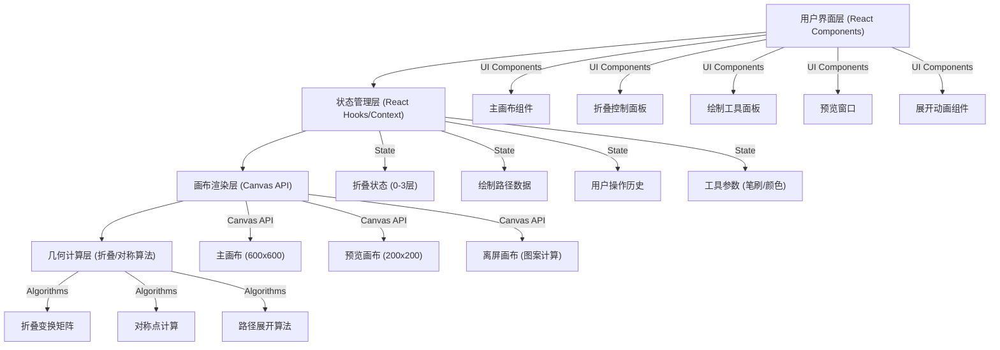

## 1. 架构设计

本项目为纯前端单页应用，无需后端服务。使用 React + TypeScript + Vite 构建，通过 Canvas API 实现纸张折叠和绘制功能。



## 2. 技术描述

- **前端框架**：React@18 + TypeScript@5
- **构建工具**：Vite@5
- **样式方案**：TailwindCSS@3
- **图标库**：Lucide React（自定义为剪纸风格）
- **核心技术**：
  - HTML5 Canvas API - 实现纸张绘制和渲染
  - CSS 3D Transform - 实现折叠动画效果
  - 几何变换算法 - 实现对称图案生成
- **无后端服务**，所有功能在浏览器端完成
- **数据持久化**：无需数据库，支持导出图片功能

## 3. 目录结构

```
src/
├── components/
│   ├── PaperCanvas.tsx        # 主纸张画布组件
│   ├── FoldControls.tsx       # 折叠控制面板
│   ├── DrawTools.tsx          # 绘制工具面板
│   ├── PreviewWindow.tsx      # 预览窗口
│   └── UnfoldAnimation.tsx    # 展开动画组件
├── hooks/
│   ├── useFoldState.ts        # 折叠状态管理
│   ├── useCanvasDraw.ts       # 画布绘制逻辑
│   └── useSymmetry.ts         # 对称计算逻辑
├── utils/
│   ├── geometry.ts            # 几何计算工具
│   ├── foldTransforms.ts      # 折叠变换矩阵
│   └── paperRenderer.ts       # 纸张渲染器
├── types/
│   └── index.ts               # 类型定义
├── App.tsx                    # 主应用组件
├── main.tsx                   # 入口文件
└── index.css                  # 全局样式
```

## 4. 路由定义

| 路由 | 用途 |
|-------|---------|
| / | 主操作页面，包含所有功能模块 |

本项目为单页应用，无多页面路由。

## 5. 类型定义

```typescript
// 折叠状态
type FoldStep = 0 | 1 | 2 | 3;  // 0:未折叠, 1:左右对折, 2:上下对折, 3:角对角折

// 绘制点
interface Point {
  x: number;
  y: number;
}

// 绘制路径
interface DrawPath {
  id: string;
  points: Point[];
  color: string;
  lineWidth: number;
}

// 折叠区域
interface FoldRegion {
  // 当前可见区域的顶点坐标
  vertices: Point[];
  // 变换矩阵（用于展开时的对称计算）
  transform: DOMMatrix;
}

// 应用状态
interface AppState {
  currentFoldStep: FoldStep;
  drawPaths: DrawPath[];
  currentPath: DrawPath | null;
  isDrawing: boolean;
  isUnfolding: boolean;
  showFinalResult: boolean;
  toolSettings: {
    lineWidth: number;
    color: string;
    tool: 'brush' | 'eraser';
  };
}
```

## 6. 核心算法设计

### 6.1 折叠变换算法

```typescript
// 第一次折叠：左右对折（沿y轴中线翻转左半部分到右半部分）
// 变换：x' = width - x (对于x < width/2的点)
const foldLeftRight = (point: Point, width: number): Point => {
  if (point.x < width / 2) {
    return { x: width - point.x, y: point.y };
  }
  return point;
};

// 第二次折叠：上下对折（沿x轴中线翻转上半部分到下半部分）
const foldTopBottom = (point: Point, width: number, height: number): Point => {
  const halfW = width / 2;
  const halfH = height / 2;
  // 先限制在第一次折叠后的区域
  let p = { ...point };
  if (p.x < halfW) p.x = width - p.x;
  if (p.y < halfH) p.y = height - p.y;
  return p;
};

// 第三次折叠：角对角折（沿对角线翻转左上到右下）
const foldDiagonal = (point: Point, width: number, height: number): Point => {
  const halfW = width / 2;
  const halfH = height / 2;
  let p = { ...point };
  // 先应用前两次折叠
  if (p.x < halfW) p.x = width - p.x;
  if (p.y < halfH) p.y = height - p.y;
  // 第三次折叠：在四分之一区域内沿对角线折叠
  const relX = p.x - halfW;
  const relY = p.y - halfH;
  if (relY > relX) {
    // 在对角线上方，翻转到下方
    return { x: halfW + relY, y: halfH + relX };
  }
  return p;
};
```

### 6.2 对称展开算法

当用户在折叠后的三角形区域绘制一条线时，需要根据折叠层数生成所有对称位置的线条：

1. **第一次折叠后（2层）**：每条线生成2个对称副本
2. **第二次折叠后（4层）**：每条线生成4个对称副本
3. **第三次折叠后（8层）**：每条线生成8个对称副本

展开时，依次逆操作每次折叠，为每条绘制路径生成对称的镜像路径。

## 7. 性能优化

- 使用离屏 Canvas 进行对称图案的预计算
- 绘制时使用 requestAnimationFrame 进行帧率控制
- 路径数据使用增量更新，避免全量重绘
- 展开动画使用 CSS transform 而非 Canvas 重绘以获得更好性能
- 限制最大绘制路径数量，避免内存溢出

