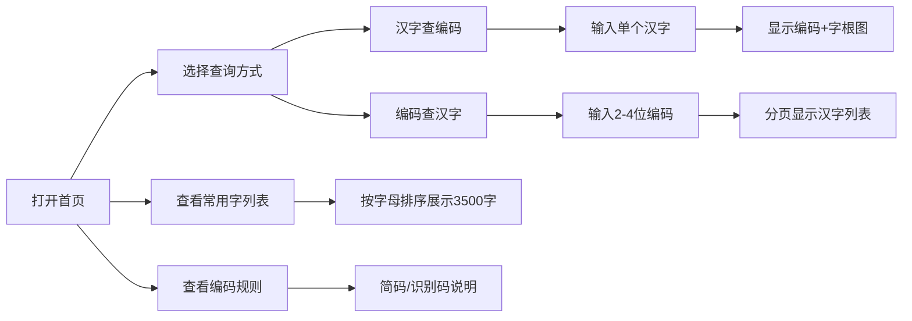

## 1. 产品概述
五笔编码查询系统是一个面向中文输入法学习者和使用者的在线工具，提供86版五笔编码的正查与反查功能，帮助用户快速查询汉字的五笔编码以及通过编码反查汉字。
- 核心价值：降低五笔学习门槛，提供便捷的编码查询服务，辅助用户掌握五笔输入法
- 目标用户：五笔输入法初学者、打字员、中文录入工作者

## 2. 核心功能

### 2.1 用户角色
| 角色 | 注册方式 | 核心权限 |
|------|----------|----------|
| 普通用户 | 无需注册 | 使用所有查询功能、浏览编码规则 |

### 2.2 功能模块
1. **首页/查询页**：汉字编码查询、编码反查、字根拆解图展示
2. **常用字列表**：按编码字母排序的3500常用字展示
3. **编码规则说明**：一级简码、二级简码、识别码等规则说明

### 2.3 页面详情
| 页面名称 | 模块名称 | 功能描述 |
|----------|----------|----------|
| 首页/查询页 | 汉字编码查询 | 用户输入单个汉字，显示86版五笔编码 |
| 首页/查询页 | 编码反查 | 用户输入2-4个字母的五笔编码，分页显示对应汉字列表 |
| 首页/查询页 | 字根拆解图 | 按笔画顺序高亮展示汉字的字根拆解过程 |
| 常用字列表页 | 常用字展示 | 按编码字母排序展示3500个常用字及其编码 |
| 编码规则页 | 规则说明 | 详细说明一级简码、二级简码、识别码的使用规则 |

## 3. 核心流程
用户打开首页 → 选择查询方式（汉字查编码/编码查汉字） → 输入内容 → 系统展示查询结果（含编码/汉字列表、字根拆解图） → 用户可切换到常用字列表或编码规则页面

## 4. 用户界面设计

### 4.1 设计风格
- 主色调：采用深蓝色系（#1e3a8a）作为主色，搭配深灰色（#1f2937）作为背景，体现专业、稳重的学习工具特质
- 辅助色：使用亮青色（#06b6d4）作为高亮和交互元素，提升视觉层次感
- 按钮风格：圆角设计，带有微妙的悬停动效，点击时有轻微凹陷感
- 字体：使用"Noto Serif SC"作为标题字体（书法感），"Noto Sans SC"作为正文字体（清晰易读）
- 布局：卡片式布局，信息层次分明，左侧查询区，右侧结果展示区
- 图标风格：线性图标，简洁明了，统一使用24px网格

### 4.2 页面设计概述
| 页面名称 | 模块名称 | UI元素 |
|----------|----------|--------|
| 首页/查询页 | 查询区域 | 切换标签页（汉字查/编码查）、输入框、查询按钮、快捷示例 |
| 首页/查询页 | 结果展示区 | 大号汉字展示、编码标签、字根拆解动画区、笔画顺序指示 |
| 常用字列表页 | 列表区域 | 字母索引导航、表格展示（汉字/编码/拼音/字根）、分页器 |
| 编码规则页 | 规则说明区 | 分段标题、示例卡片、表格对比、高亮重点内容 |

### 4.3 响应式
- 桌面端优先设计（1280px以上），采用双栏布局
- 平板端（768px-1279px）：切换为单栏布局，查询区在上，结果区在下
- 移动端（768px以下）：简化布局，优化触摸交互，按钮尺寸不小于44px
- 所有交互元素支持键盘操作（Tab导航、Enter提交）

### 4.4 字根拆解动画
- 字根图使用SVG绘制，确保清晰可缩放
- 笔画顺序高亮：按书写顺序逐个高亮字根，配合数字标识
- 动画时长：每个字根高亮500ms，间隔200ms，可重播
- 颜色编码：不同字根使用不同的半透明色块区分
