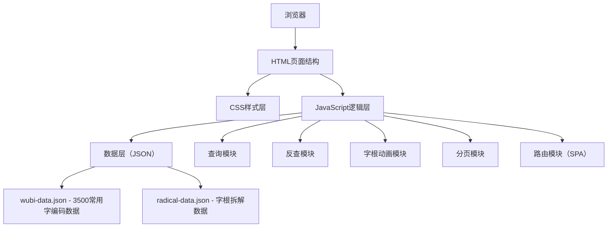
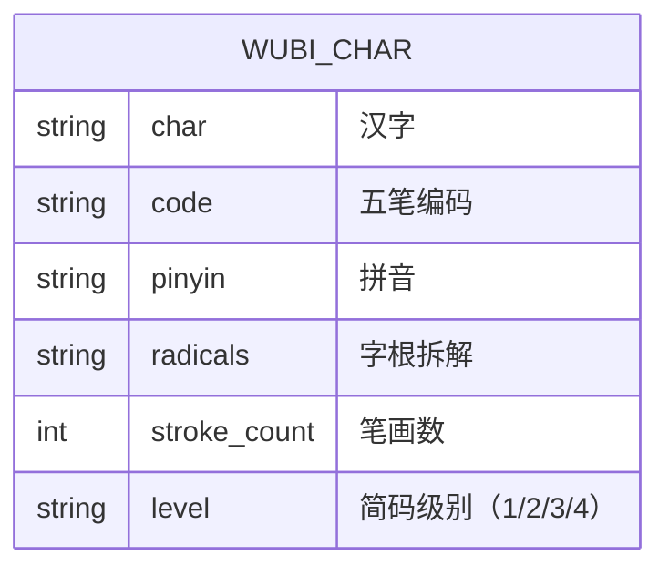

## 1. 架构设计
本项目为纯前端单页应用，无需后端服务，所有数据本地存储，通过JavaScript实现交互逻辑。



## 2. 技术描述
- 前端技术栈：纯原生 HTML5 + CSS3 + JavaScript (ES6+)，不使用框架
- 构建工具：无需构建，直接部署静态文件
- 数据存储：本地JSON文件，预置3500常用汉字的86版五笔编码数据
- 字体资源：使用 Google Fonts 在线加载 Noto Serif SC 和 Noto Sans SC
- 图标：使用 SVG 内联图标，无需额外图标库
- 动画：CSS3 动画 + JavaScript 控制字根拆解动画

## 3. 路由定义
单页应用使用Hash路由实现页面切换：

| 路由 | 用途 |
|------|------|
| #/ | 首页 - 编码查询与反查 |
| #/common | 常用字列表 - 按编码排序展示3500常用字 |
| #/rules | 编码规则说明 - 一级简码、二级简码、识别码说明 |

## 4. 数据模型

### 4.1 数据模型定义


### 4.2 数据格式说明
**wubi-data.json** 结构：
```json
{
  "data": [
    {
      "char": "好",
      "code": "VB",
      "pinyin": "hǎo",
      "radicals": ["女", "子"],
      "stroke_count": 6,
      "level": 2
    }
  ]
}
```

**radical-data.json** 结构（字根SVG路径数据）：
```json
{
  "好": {
    "strokes": [
      { "path": "M10,20 L30,40", "radical": "女", "order": 1 },
      { "path": "M50,20 L70,40", "radical": "子", "order": 2 }
    ],
    "viewBox": "0 0 100 100"
  }
}
```

## 5. 项目目录结构
```
e:\trae-project\0508-411\
├── index.html              # 主页面
├── css/
│   └── style.css           # 样式文件
├── js/
│   ├── app.js              # 主应用逻辑
│   ├── data.js             # 数据加载与处理
│   ├── query.js            # 查询与反查逻辑
│   ├── animation.js        # 字根动画控制
│   └── pagination.js       # 分页逻辑
├── data/
│   ├── wubi-data.json      # 五笔编码数据（3500字）
│   └── radical-data.json   # 字根拆解数据
└── .trae/
    └── documents/          # 项目文档
```

## 6. 核心模块说明

### 6.1 查询模块
- 输入验证：确保输入为单个汉字
- 数据检索：在wubi-data.json中查找对应汉字
- 结果展示：显示编码、拼音、简码级别、字根拆解

### 6.2 反查模块
- 输入验证：确保输入为2-4个英文字母
- 模糊匹配：支持前缀匹配（如输入"V"显示所有V开头的编码）
- 分页展示：每页显示20个结果，支持上下页跳转

### 6.3 字根动画模块
- SVG渲染：使用SVG绘制汉字轮廓
- 高亮动画：按笔画顺序依次高亮字根
- 重播控制：提供重播按钮重新播放动画

### 6.4 常用字列表模块
- 字母索引：按编码首字母A-Z分组展示
- 排序：按编码字母顺序排序
- 搜索过滤：支持在列表中进一步搜索
