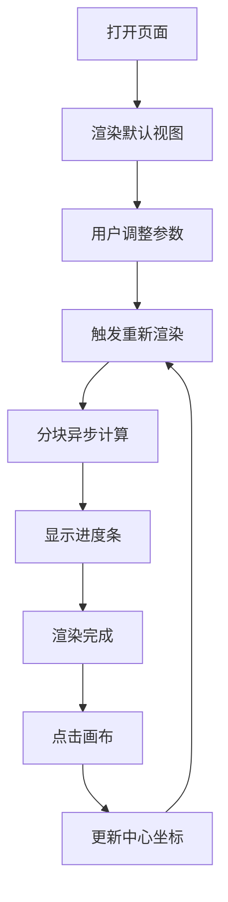

## 1. 产品概述

曼德尔布罗特集分形探索器是一个交互式数学可视化工具，用户可以通过调整参数探索分形几何的无限细节。支持实时渲染、无级缩放、多种色彩方案，让用户沉浸于数学之美。

- 核心用途：数学可视化、分形探索、教育演示
- 目标用户：数学爱好者、学生、设计师、对分形几何感兴趣的大众
- 产品价值：让复杂的数学概念变得直观可见，提供沉浸式的探索体验

## 2. 核心功能

### 2.1 功能模块
1. **主画布**：Canvas实时渲染曼德尔布罗特集分形图
2. **控制面板**：坐标输入、缩放调节、迭代次数设置、调色板选择
3. **信息显示**：当前坐标、缩放比例、渲染进度
4. **交互系统**：点击画布跳转、分块异步渲染

### 2.2 页面详情

| 页面名称 | 模块名称 | 功能描述 |
|-----------|-------------|---------------------|
| 主页面 | 分形画布 | 800x600 Canvas，支持点击跳转，分块渲染显示进度 |
| 主页面 | 坐标控制 | 实数/虚数输入框，默认值 -0.7269, 0.1889，支持手动输入 |
| 主页面 | 缩放控制 | 滑块 + 数字输入，范围 1-1e12，对数刻度显示 |
| 主页面 | 迭代控制 | 滑块调节迭代次数，范围 10-256 |
| 主页面 | 调色板选择 | 下拉菜单：灰度、火焰、海洋、彩虹、霓虹、复古 |
| 主页面 | 信息面板 | 实时显示当前坐标、缩放级别、渲染进度百分比 |
| 主页面 | 操作按钮 | 重置视图、停止渲染、重新渲染 |

## 3. 核心流程

用户打开页面 → 看到默认视图的分形渲染 → 调整参数（坐标/缩放/迭代/调色板）→ 触发重新渲染 → 分块异步计算并显示进度 → 渲染完成 → 点击画布任意位置 → 自动更新中心坐标 → 重新渲染新视图

## 4. 用户界面设计

### 4.1 设计风格
- **主色调**：深空蓝 (#0a0e27) 背景，配合分形的绚丽色彩
- **强调色**：霓虹紫 (#8b5cf6) 用于交互元素，科技感十足
- **字体**：显示字体用 Space Mono（等宽科技感），正文用 Inter
- **布局**：左侧控制面板（固定宽度280px），右侧画布区域自适应
- **视觉风格**：科技感、赛博朋克风、深色主题，适合展示绚丽的分形色彩

### 4.2 页面设计概览

| 页面名称 | 模块名称 | UI 元素 |
|-----------|-------------|-------------|
| 主页面 | 整体布局 | 深色背景、左侧控制面板 + 右侧大画布、顶部标题栏 |
| 主页面 | 控制面板 | 玻璃拟态卡片、等宽字体数字显示、自定义滑块样式 |
| 主页面 | 画布区域 | 细边框、悬停时光标变为十字准星、渲染时叠加进度条 |
| 主页面 | 信息面板 | 半透明悬浮在画布右下角，实时更新数值 |

### 4.3 交互细节
- 滑块拖动时实时预览变化（低精度快速渲染）
- 输入框支持科学计数法（如 1e6）
- 渲染中显示进度条和百分比
- 点击画布时有缩放过渡动画
- 调色板切换时实时预览效果

### 4.4 响应式
- 桌面端：左右布局，控制面板固定，画布自适应
- 平板端：控制面板折叠为抽屉
- 移动端：上下布局，控制面板在上，画布在下
