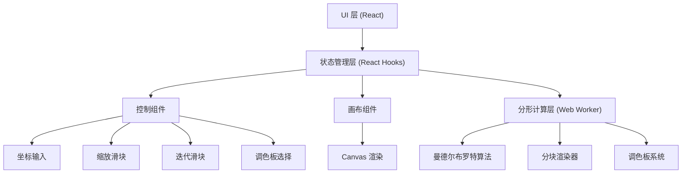

## 1. 架构设计



## 2. 技术描述

- **前端框架**: React@18 + Vite@5
- **样式方案**: TailwindCSS@3 + 自定义 CSS 变量
- **状态管理**: React Hooks (useState, useEffect, useRef, useCallback)
- **计算层**: Web Worker 异步计算，避免阻塞主线程
- **渲染技术**: HTML5 Canvas 2D API，ImageData 像素操作
- **字体**: Google Fonts (Space Mono + Inter)
- **无后端、无数据库**

## 3. 目录结构

```
e:\trae-project\0508-413
├── .trae/documents/
├── src/
│   ├── components/
│   │   ├── ControlPanel.jsx    # 左侧控制面板
│   │   ├── FractalCanvas.jsx   # 分形画布组件
│   │   ├── InfoPanel.jsx       # 信息显示面板
│   │   └── ProgressBar.jsx     # 渲染进度条
│   ├── hooks/
│   │   └── useFractalRenderer.js  # 分形渲染 Hook
│   ├── workers/
│   │   └── fractal.worker.js   # Web Worker 计算逻辑
│   ├── utils/
│   │   ├── mandelbrot.js       # 曼德尔布罗特核心算法
│   │   └── palettes.js         # 调色板定义
│   ├── App.jsx                 # 主应用组件
│   ├── main.jsx                # 入口文件
│   └── index.css               # 全局样式
├── index.html
├── vite.config.js
├── tailwind.config.js
└── package.json
```

## 4. 核心数据结构

### 4.1 视图状态 (ViewState)
```typescript
interface ViewState {
  centerX: number;      // 中心实部坐标，默认 -0.7269
  centerY: number;      // 中心虚部坐标，默认 0.1889
  zoom: number;         // 缩放级别，范围 1 - 1e12
  maxIterations: number; // 迭代次数，范围 10 - 256，默认 100
  palette: string;      // 调色板名称：grayscale | fire | ocean | rainbow | neon | vintage
}
```

### 4.2 渲染进度 (RenderProgress)
```typescript
interface RenderProgress {
  totalBlocks: number;   // 总块数
  completedBlocks: number; // 已完成块数
  percentage: number;    // 进度百分比 0-100
  isRendering: boolean;  // 是否正在渲染
}
```

### 4.3 分块任务 (BlockTask)
```typescript
interface BlockTask {
  startX: number;        // 块起始 X 像素
  startY: number;        // 块起始 Y 像素
  width: number;         // 块宽度
  height: number;        // 块高度
  viewState: ViewState;  // 视图状态
  canvasWidth: number;   // 画布总宽度
  canvasHeight: number;  // 画布总高度
}
```

## 5. 核心算法设计

### 5.1 曼德尔布罗特集算法
```
函数 mandelbrot(cx, cy, maxIter):
    x = 0, y = 0
    iteration = 0
    while x*x + y*y <= 4 且 iteration < maxIter:
        xtemp = x*x - y*y + cx
        y = 2*x*y + cy
        x = xtemp
        iteration = iteration + 1
    返回 iteration
```

### 5.2 像素坐标到复平面坐标转换
```
复平面宽度 = 4 / zoom
复平面高度 = (4 / zoom) * (canvasHeight / canvasWidth)

像素 (px, py) 对应的复坐标:
    cx = centerX + (px - canvasWidth/2) * (复平面宽度 / canvasWidth)
    cy = centerY + (py - canvasHeight/2) * (复平面高度 / canvasHeight)
```

### 5.3 分块渲染策略
- 将画布分为 32x32 像素的小块（约 60 块对于 800x600）
- Web Worker 按队列处理每个块
- 每完成一块，主线程更新画布和进度
- 使用 requestIdleCallback 或 setTimeout 让出主线程
- 支持取消正在进行的渲染任务

### 5.4 调色板系统
预定义 6 种调色板，每种包含 256 个 RGB 颜色值：
- **灰度**: 线性灰度渐变
- **火焰**: 黑 → 红 → 橙 → 黄 → 白
- **海洋**: 黑 → 深蓝 → 青 → 浅蓝 → 白
- **彩虹**: 彩虹色谱循环
- **霓虹**: 深色背景 + 荧光色系
- **复古**: 低饱和度复古配色

## 6. 性能优化策略

1. **Web Worker 计算**: 所有数学计算在 Worker 线程进行，UI 不卡顿
2. **分块渲染**: 小块逐步渲染，用户可看到渐进式结果
3. **低精度预览**: 滑块拖动时使用低迭代次数快速预览
4. **图像数据复用**: 复用 ImageData 对象，减少内存分配
5. **取消机制**: 参数变化时取消上一次渲染任务
6. **平滑着色**: 使用归一化迭代计数实现平滑的颜色过渡
