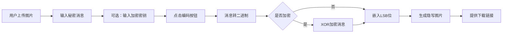
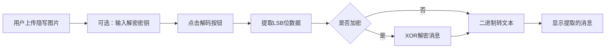

## 1. 产品概述

LSB图像隐写术工具是一个基于Web的应用，允许用户在图片中隐藏秘密消息，并从隐写图片中提取消息。该工具使用最低有效位（Least Significant Bit）算法，将消息的二进制数据嵌入到图片像素的RGB通道最低位。

### 目标价值
- 提供简单易用的图片隐写功能，保护敏感信息传输
- 支持加密选项，增强隐写内容的安全性
- 实时显示嵌入容量，帮助用户了解图片的隐藏能力

---

## 2. 核心功能

### 2.1 用户角色
| 角色 | 注册方式 | 核心权限 |
|------|----------|----------|
| 普通用户 | 无需注册 | 使用全部隐写和解码功能 |

### 2.2 功能模块
1. **主页**: 图片上传区、消息输入区、操作按钮区、结果展示区
2. **编码功能**: 将文本消息嵌入图片像素
3. **解码功能**: 从隐写图片中提取隐藏消息
4. **加密功能**: 使用XOR算法对消息进行加密/解密
5. **容量计算**: 实时显示图片可隐藏的最大字符数

### 2.3 页面详情
| 页面名称 | 模块名称 | 功能描述 |
|-----------|-------------|---------------------|
| 主页 | 图片上传区 | 支持拖拽上传PNG/BMP图片，实时预览 |
| 主页 | 消息输入区 | 文本框输入秘密消息，支持多行 |
| 主页 | 加密选项 | 可选输入加密密钥，启用XOR加密 |
| 主页 | 容量显示 | 实时计算并显示图片可隐藏的最大字符数 |
| 主页 | 操作按钮 | 编码按钮（生成隐写图片）、解码按钮（提取消息） |
| 主页 | 结果展示区 | 显示编码后的图片（可下载）、显示解码提取的消息 |

---

## 3. 核心流程

### 编码流程

### 解码流程

---

## 4. 用户界面设计

### 4.1 设计风格
- **主色调**: 深蓝紫色系 (#1a1a2e)，代表神秘与安全
- **辅助色**: 霓虹青色 (#00f5d4)，用于强调和交互元素
- **按钮风格**: 圆角矩形，带有微妙的发光效果
- **字体**: 使用 JetBrains Mono 等宽字体，体现技术感
- **布局风格**: 卡片式布局，深色主题，玻璃态效果
- **图标风格**: 简约线性图标，统一线条粗细

### 4.2 页面设计概述
| 页面名称 | 模块名称 | UI元素 |
|-----------|-------------|-------------|
| 主页 | 头部 | 应用标题、简短说明、图标 |
| 主页 | 上传区 | 虚线边框拖拽区域、文件选择按钮、图片预览 |
| 主页 | 输入区 | 文本域、密钥输入框、容量指示器 |
| 主页 | 操作区 | 并排的编码/解码按钮、悬停动画 |
| 主页 | 结果区 | 结果卡片、下载按钮、消息展示框 |

### 4.3 响应式
- Desktop-first 设计，适配 1920px、1440px、1024px
- 移动端自适应，单列布局
- 触摸优化，按钮最小尺寸 48px

### 4.4 动效设计
- 页面加载：元素渐入 + 轻微上移动画
- 图片上传：平滑过渡 + 边框颜色变化
- 按钮悬停：发光效果 + 轻微放大
- 编码/解码：加载动画 + 进度指示
- 结果展示：滑入动画 + 淡入效果
