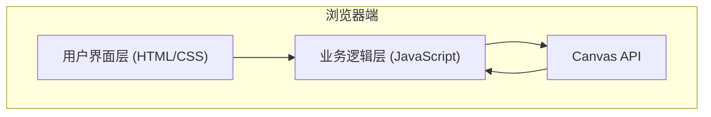

## 1. 架构设计



---

## 2. 技术描述

- **前端技术栈**: 
  - HTML5 (语义化标签)
  - CSS3 (Tailwind CSS v3 + 自定义动画)
  - 原生 JavaScript (ES6+)
  - Canvas API (图像处理)
  - File API (文件读写)
- **构建工具**: 无构建工具，纯静态页面
- **后端**: 无后端，纯前端实现
- **数据库**: 无需数据库

---

## 3. 核心模块设计

### 3.1 文件结构
```
e:\trae-project\0508-414\
├── index.html          # 主页面
├── styles.css          # 样式文件
└── app.js              # 核心逻辑
```

### 3.2 模块划分

| 模块 | 文件名 | 功能描述 |
|------|--------|----------|
| UI交互 | index.html + styles.css | 页面布局、样式、用户交互 |
| LSB编码 | app.js | 将消息嵌入图片像素 |
| LSB解码 | app.js | 从图片像素提取消息 |
| XOR加密 | app.js | 消息加密/解密 |
| 工具函数 | app.js | 二进制转换、容量计算等 |

---

## 4. 核心算法

### 4.1 LSB嵌入算法
```javascript
// 每个像素3个通道(RGB)，每通道嵌入1位
// 计算容量: (width * height * 3) / 8 字节
// 预留1字节用于消息结束标记(0x00)
```

### 4.2 XOR加密算法
```javascript
// 简单的XOR流加密
// encrypted[i] = message[i] ^ key[i % key.length]
```

### 4.3 数据格式
```
[消息长度(4字节)] + [消息内容(N字节)] + [结束标记(0x00)]
```

---

## 5. 关键函数定义

### 5.1 容量计算
```typescript
function calculateCapacity(imageData: ImageData): number
// 返回: 可隐藏的最大字符数
```

### 5.2 编码函数
```typescript
function encodeMessage(
  imageData: ImageData,
  message: string,
  key?: string
): ImageData
```

### 5.3 解码函数
```typescript
function decodeMessage(
  imageData: ImageData,
  key?: string
): string
```

### 5.4 二进制工具
```typescript
function stringToBinary(str: string): number[]
function binaryToString(bytes: number[]): string
```

---

## 6. 性能考虑

- 使用 Uint8ClampedArray 直接操作像素数据
- 避免频繁的 DOM 操作
- 大图片处理时使用 Web Workers (可选优化)
- 实时显示处理进度
