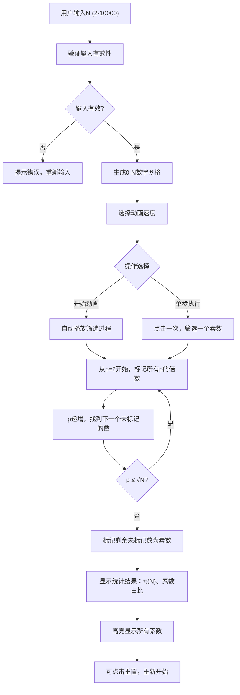

## 1. 产品概述

埃拉托色尼筛法（Sieve of Eratosthenes）交互式可视化工具，帮助用户直观理解素数筛选算法的工作原理。通过动画演示从2到√N逐步标记合数的过程，让数学学习变得生动有趣。

- 核心目标：将抽象的数论算法转化为可视化的交互体验
- 目标用户：学生、数学爱好者、编程学习者
- 产品价值：降低算法理解门槛，提升学习效率

## 2. 核心功能

### 2.1 功能模块

1. **主页面**：数字网格展示区、控制面板、统计结果区

### 2.2 页面详情

| 页面名称 | 模块名称 | 功能描述 |
|---------|----------|---------|
| 主页面 | 输入控制区 | 用户输入整数N（2-10000），验证输入有效性，生成0到N的数字网格 |
| 主页面 | 速度控制区 | 三档速度切换（慢/中/快），控制动画播放速度 |
| 主页面 | 播放控制区 | "开始动画"按钮启动自动播放，"单步执行"按钮手动逐步筛选 |
| 主页面 | 网格展示区 | 以响应式网格展示0到N的所有数字，不同状态（未处理/素数/合数）用不同样式区分 |
| 主页面 | 状态提示区 | 显示当前正在处理的素数、已完成筛选步骤 |
| 主页面 | 统计结果区 | 动画结束后显示素数个数π(N)、素数占比(π(N)/N) |
| 主页面 | 重置功能 | 重置所有状态，允许重新输入N并开始新的筛选过程 |

## 3. 核心流程

用户输入N值后点击"开始动画"，系统从素数2开始，依次将每个素数的所有倍数标记为合数（显示删除线效果），然后自动跳转到下一个未被标记的数字（即下一个素数），重复此过程直到处理完√N为止。用户也可以选择"单步执行"模式，每次点击只完成一个素数的筛选。

## 4. 用户界面设计

### 4.1 设计风格

- **设计方向**：学术/科技感，深色主题配合霓虹高亮
- **主色调**：深靛蓝背景 (#0f172a)，搭配高对比度素数标记
- **素数样式**：翠绿色高亮 (#10b981)，粗体，发光效果
- **合数样式**：灰色调 (#64748b)，红色删除线 (#ef4444) 贯穿
- **当前处理数字**：琥珀色脉冲动画 (#f59e0b)
- **字体**：等宽字体 JetBrains Mono 用于数字展示，Inter 用于界面文字
- **按钮风格**：胶囊形，微立体，悬停时有上浮效果
- **布局风格**：卡片式分区，顶部控制区 + 中部网格区 + 底部统计区
- **视觉细节**：网格背景使用细微网格纹理，卡片有微妙的渐变边框

### 4.2 页面设计概览

| 页面名称 | 模块名称 | UI元素 |
|---------|----------|--------|
| 主页面 | 输入控制区 | 数字输入框（带范围提示）、提交按钮 |
| 主页面 | 速度控制区 | 三态切换按钮组（慢/中/快），选中态有明显视觉反馈 |
| 主页面 | 播放控制区 | 主按钮"开始动画"、次按钮"单步执行"、"重置"按钮 |
| 主页面 | 网格展示区 | CSS Grid 布局，数字卡片大小自适应，数字居中显示，状态变化有过渡动画 |
| 主页面 | 状态提示区 | 动态文字提示，显示"当前处理素数：p"、"已完成：x/N 步" |
| 主页面 | 统计结果区 | 大字号显示 π(N)，百分比显示占比，结果区有淡入动画 |

### 4.3 响应式设计

- **桌面端优先**：主内容区最大宽度1400px，网格密度根据屏幕宽度自动调整
- **平板适配**：网格列数减少，按钮尺寸保持触控友好
- **移动端**：控制区垂直堆叠，网格自适应屏幕宽度，确保数字清晰可读
- **触控优化**：按钮最小高度48px，点击区域有适当扩展

### 4.4 动画设计

- **入场动画**：页面加载时网格数字依次淡入（staggered reveal）
- **标记动画**：合数被标记时，删除线从左到右划出，颜色渐变
- **素数确认**：当一个数字被确定为素数时，有缩放脉冲效果
- **当前素数**：正在处理的素数有呼吸灯效果，持续吸引注意力
- **结果展示**：统计结果从下往上滑入，数字有滚动计数动画
