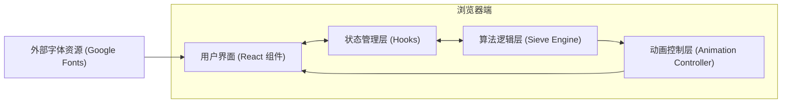
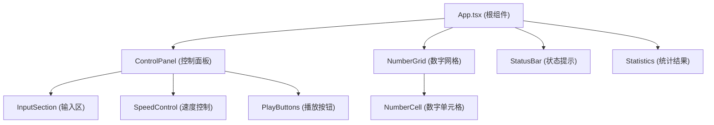

## 1. 架构设计

纯前端单页应用，无需后端服务。所有算法逻辑在客户端浏览器中执行，状态管理使用 React useState/useReducer。



## 2. 技术选型

- **前端框架**：React@18 + TypeScript
- **构建工具**：Vite@5
- **样式方案**：TailwindCSS@3
- **初始化方式**：`npm create vite@latest`
- **后端**：无（纯前端应用）
- **数据库**：无
- **外部依赖**：仅核心依赖，无额外第三方库

### 技术决策说明

1. **React + TypeScript**：提供类型安全，便于维护复杂的状态逻辑（动画状态、数字状态、步骤追踪）
2. **TailwindCSS**：快速实现响应式布局和复杂的动画效果，便于实现数字卡片的多种状态样式
3. **纯前端实现**：筛法算法计算量小（N≤10000），完全可以在浏览器端高效执行
4. **无状态管理库**：使用 React 内置 Hooks 即可满足需求，避免过度工程化

## 3. 路由定义

| 路由 | 用途 |
|-----|------|
| `/` | 主页面，包含所有功能模块 |

## 4. 核心数据结构与状态

### 4.1 数字状态枚举

```typescript
enum NumberStatus {
  UNPROCESSED = 'unprocessed',  // 未处理
  PRIME = 'prime',              // 素数
  COMPOSITE = 'composite',      // 合数
  CURRENT = 'current',          // 当前处理的素数
  BEING_MARKED = 'being_marked' // 正在被标记
}
```

### 4.2 应用状态

```typescript
interface AppState {
  n: number;                    // 用户输入的N值
  numbers: {
    value: number;
    status: NumberStatus;
  }[];
  currentPrime: number | null;  // 当前处理的素数
  isRunning: boolean;           // 动画是否在运行
  isCompleted: boolean;         // 是否完成
  speed: 'slow' | 'medium' | 'fast';  // 动画速度
  stepsCompleted: number;       // 已完成步数
  totalSteps: number;           // 总步数
  primeCount: number;           // 素数个数 π(N)
}
```

### 4.3 速度配置

```typescript
const SPEED_CONFIG = {
  slow: { markDelay: 200, stepDelay: 1000 },
  medium: { markDelay: 80, stepDelay: 500 },
  fast: { markDelay: 30, stepDelay: 200 }
};
```

## 5. 核心算法实现

### 5.1 埃拉托色尼筛法引擎

```typescript
class SieveEngine {
  // 生成0到N的数字数组
  generateNumbers(n: number): NumberItem[];
  
  // 获取下一步需要处理的素数
  getNextPrime(current: number, numbers: NumberItem[]): number | null;
  
  // 获取当前素数p的所有倍数（未被标记的）
  getMultiples(p: number, n: number, numbers: NumberItem[]): number[];
  
  // 标记单个数字为合数
  markComposite(index: number): void;
  
  // 标记数字为素数
  markPrime(index: number): void;
  
  // 计算素数个数
  countPrimes(numbers: NumberItem[]): number;
  
  // 判断是否完成（p > √N）
  isComplete(p: number, n: number): boolean;
}
```

### 5.2 动画控制器

```typescript
class AnimationController {
  // 自动播放整个筛选过程
  async autoPlay(): Promise<void>;
  
  // 执行单步筛选（处理一个素数）
  async stepForward(): Promise<void>;
  
  // 标记一系列数字为合数（带动画）
  async markNumbersWithAnimation(indices: number[]): Promise<void>;
  
  // 暂停动画
  pause(): void;
  
  // 重置所有状态
  reset(): void;
}
```

## 6. 组件结构



### 组件职责

| 组件 | 职责 |
|-----|------|
| `App.tsx` | 管理全局状态，协调算法引擎和动画控制器 |
| `ControlPanel` | 包含输入、速度选择、播放控制 |
| `NumberGrid` | 渲染数字网格，响应式布局 |
| `NumberCell` | 单个数字单元格，处理状态样式和动画 |
| `StatusBar` | 显示当前处理素数、进度信息 |
| `Statistics` | 显示最终统计结果（π(N)、占比） |

## 7. 性能考虑

1. **虚拟滚动**：当N=10000时，DOM元素数量较大，考虑使用 CSS `contain` 优化渲染性能
2. **批量更新**：标记多个数字时，使用 React 批量更新减少重渲染
3. **动画优化**：使用 CSS transforms 和 opacity 实现动画，避免布局抖动
4. **内存管理**：重置时及时清理定时器和动画队列
