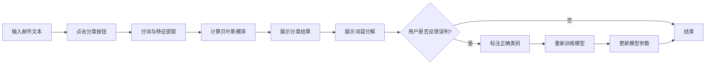

## 1. 产品概述
基于朴素贝叶斯算法的垃圾邮件分类器Web应用，用户输入邮件文本后系统自动判断是否为垃圾邮件，并展示详细的词袋分解和概率贡献分析。

- 主要用途：邮件分类、垃圾邮件识别、机器学习算法可视化演示
- 解决问题：帮助用户理解朴素贝叶斯分类原理，提供可交互的分类体验
- 目标用户：学习机器学习的学生、开发者、对算法感兴趣的普通用户
- 产品价值：将抽象的机器学习算法转化为可视化、可交互的用户体验

## 2. 核心功能

### 2.1 用户角色
| 角色 | 注册方式 | 核心权限 |
|------|----------|----------|
| 普通用户 | 无需注册 | 使用所有分类功能、添加训练样本、重置模型 |

### 2.2 功能模块
1. **主页**：邮件输入区、分类结果展示、词袋分解可视化
2. **模型控制面板**：误判反馈、重置训练集、准确率展示

### 2.3 页面详情
| 页面名称 | 模块名称 | 功能描述 |
|-----------|-------------|---------------------|
| 主页 | 邮件输入区 | 多行文本输入框，支持粘贴邮件内容，"开始分类"按钮 |
| 主页 | 分类结果区 | 展示垃圾/正常邮件后验概率，可视化进度条，分类结论 |
| 主页 | 词袋分解区 | 分词列表，每个词的条件概率贡献，正负贡献颜色区分 |
| 主页 | 模型控制区 | "误判"按钮弹出标注对话框，"重置训练集"按钮，准确率卡片 |

## 3. 核心流程
用户在输入框粘贴邮件内容 → 点击"开始分类" → 系统进行分词和特征提取 → 计算朴素贝叶斯后验概率 → 展示分类结果和词袋分解 → 用户可选择"误判"标注正确类别 → 模型重新训练更新 → 或点击"重置"恢复预置状态

## 4. 用户界面设计

### 4.1 设计风格
- **主色调**：深蓝系 (#1e3a5f) 搭配科技感的青色 (#00d4aa)，营造专业数据分析氛围
- **辅助色**：红色 (#ff6b6b) 表示垃圾邮件正贡献，绿色 (#51cf66) 表示正常邮件正贡献
- **按钮样式**：圆角 8px，悬停时有轻微上浮和阴影变化
- **字体**：标题使用 'Space Grotesk'，正文使用 'Inter'
- **布局风格**：卡片式布局，左侧输入区，右侧结果区，顶部导航栏
- **图标风格**：简洁线性图标，使用 emoji 增强视觉表达

### 4.2 页面设计概述
| 页面名称 | 模块名称 | UI元素 |
|-----------|-------------|-------------|
| 主页 | 导航栏 | 标题、图标、准确率徽章 |
| 主页 | 输入卡片 | 文本域、分类按钮、清空按钮 |
| 主页 | 结果卡片 | 概率进度条、分类标签、置信度评分 |
| 主页 | 词袋卡片 | 词云风格布局、颜色编码概率贡献、悬停详情 |
| 主页 | 控制卡片 | 操作按钮组、模型状态信息 |

### 4.3 响应式
- 桌面端：左右两栏布局（输入/控制在左，结果/词袋在右）
- 平板端：上下堆叠，保持卡片完整性
- 移动端：单列布局，优化触控区域

### 4.4 动效设计
- 页面加载：卡片淡入动画，错落有致的延迟
- 分类过程：加载动画，进度条填充动效
- 概率条：数字滚动动画，进度条平滑过渡
- 悬停效果：卡片微浮起，按钮阴影加深
