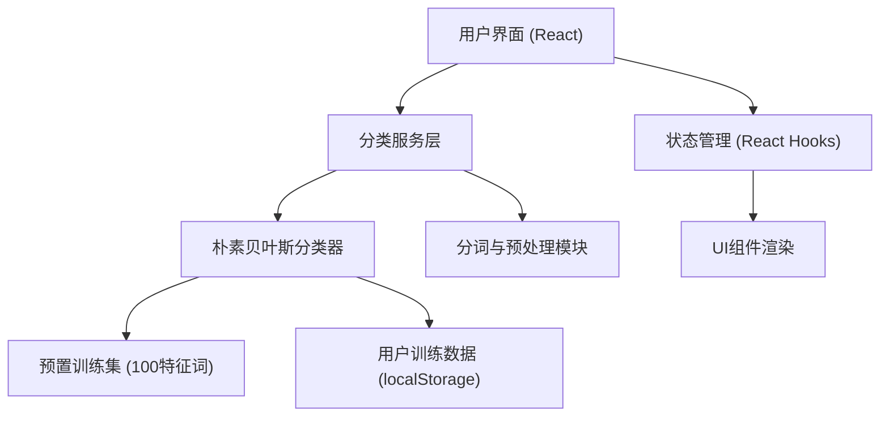
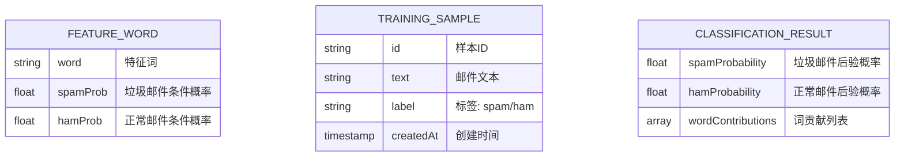

## 1. 架构设计



## 2. 技术描述
- **前端**：React@18 + TypeScript + TailwindCSS@3 + Vite
- **初始化工具**：Vite
- **后端**：无（纯前端应用，所有逻辑在浏览器执行）
- **数据存储**：localStorage 存储用户训练数据
- **核心算法**：朴素贝叶斯分类器（Multinomial Naive Bayes）

## 3. 路由定义
| 路由 | 用途 |
|-------|---------|
| / | 主页 - 包含所有功能模块 |

## 4. 数据模型

### 4.1 数据模型定义



### 4.2 预置训练集数据结构
```typescript
interface FeatureWord {
  word: string;
  spamProb: number;  // P(word|spam)
  hamProb: number;   // P(word|ham)
}

interface TrainingData {
  featureWords: FeatureWord[];
  priorSpam: number;  // P(spam)
  priorHam: number;   // P(ham)
  spamWordCount: number;
  hamWordCount: number;
}
```

### 4.3 分类结果数据结构
```typescript
interface WordContribution {
  word: string;
  spamLogProb: number;
  hamLogProb: number;
  contribution: number;  // 对最终分类的贡献值
  isInVocabulary: boolean;
}

interface ClassificationResult {
  spamProbability: number;
  hamProbability: number;
  isSpam: boolean;
  wordContributions: WordContribution[];
  confidence: number;
}
```

## 5. 核心算法实现

### 5.1 朴素贝叶斯分类原理
使用对数概率避免下溢：
- log(P(spam|words)) ∝ log(P(spam)) + Σ log(P(word|spam))
- log(P(ham|words)) ∝ log(P(ham)) + Σ log(P(word|ham))

### 5.2 拉普拉斯平滑
对未登录词使用平滑处理：
- P(word|spam) = (count + 1) / (total + vocab_size)

### 5.3 用户反馈机制
用户标注误判后：
1. 将邮件文本加入训练集
2. 重新计算所有特征词的条件概率
3. 更新先验概率
4. 持久化到 localStorage

## 6. 准确率计算

内置测试集模拟准确率：
- 使用预置的测试邮件样本（20封垃圾邮件 + 20封正常邮件）
- 每次模型更新后重新计算准确率
- 显示当前模型在测试集上的表现
