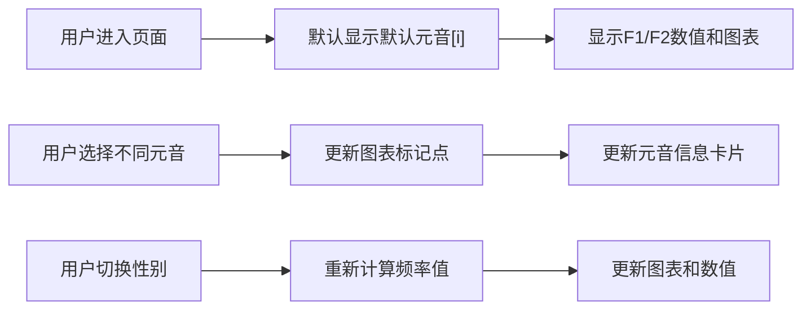

## 1. 产品概述

元音声学特性可视化工具，用于展示元音的第一共振峰(F1)和第二共振峰(F2)在二维平面上的分布。面向语音学学生、语言学研究者和声学爱好者。通过交互式可视化帮助用户理解元音的声学特性与舌位的关系。

## 2. 核心功能

### 2.1 功能模块

1. **主页面**：元音选择器、F1-F2声学图表、元音信息展示区、性别切换、参考四边形展示。

### 2.2 页面详情

| 页面名称 | 模块名称 | 功能描述 |
|-----------|-------------|---------------------|
| 主页面 | 元音选择器 | 下拉列表选择[i]、[e]、[a]、[o]、[u]五个元音音素 |
| 主页面 | F1-F2声学图表 | Canvas绘制F1-F2二维平面图，纵轴F1上小下大，横轴F2左大右小 |
| 主页面 | 元音信息卡片 | 显示国际音标符号、示例单词、F1/F2数值 |
| 主页面 | 性别切换 | 切换男声/女声，女声共振峰频率比男声高约20% |
| 主页面 | 参考四边形 | 展示Ladefoged标准元音四边形图的标准参考位置 |

## 3. 核心流程

用户选择元音音素后，系统根据当前性别设置计算F1/F2频率值，在图表上标记对应点，显示元音详情信息。

## 4. 用户界面设计

### 4.1 设计风格

- **设计基调**：学术科研风格，简洁专业，深色主题配合科技感
- **主色调**：深蓝色 (#0ea5e9 天蓝 (#06b6d4)
- **辅助色**：紫色 (#8b5cf6) 用于标记选中状态
- **背景**：深色渐变背景 (#0f172a 到 #1e293b)
- **字体**：显示字体使用 "Cormorant Garamond" 衬线字体用于学术感标题；等宽字体 "JetBrains Mono" 用于数值显示；无衬线 "Inter" 用于正文

### 4.2 页面设计概览

| 页面名称 | 模块名称 | UI元素 |
|-----------|-------------|-------------|
| 主页面 | 元音选择器 | 下拉选择器，国际音标显示，卡片式设计 |
| 主页面 | F1-F2声学图表 | Canvas绘制，带坐标轴标签，网格线，选中点高亮动画 |
| 主页面 | 元音信息卡片 | 玻璃态设计，渐变边框，悬停动效 |
| 主页面 | 性别切换 | 双态切换按钮，平滑过渡动画 |
| 主页面 | 参考四边形 | 虚线连接，半透明填充，Ladefoged标准值 |

### 4.3 响应式

桌面端为主，支持平板自适应，图表随容器缩放。

### 4.4 交互动效

- 元音切换时，数据点平滑过渡动画
- 性别切换时，频率数值滚动动画
- 页面加载时，元素淡入交错出现
- 悬停时，数据点放大并显示提示框

## 5. 数据说明

### 5.1 Ladefoged 男声标准值（单位：Hz

| 元音 | IPA | 示例单词 | F1(男) | F2(男) |
|------|-----|-----------|--------|--------|
| i | i | see | 270 | 2290 |
| e | ɛ | bed | 530 | 1840 |
| a | ɑ | father | 730 | 1090 |
| o | ɔ | law | 570 | 840 |
| u | u | boot | 300 | 870 |

女声频率 = 男声频率 × 1.2
