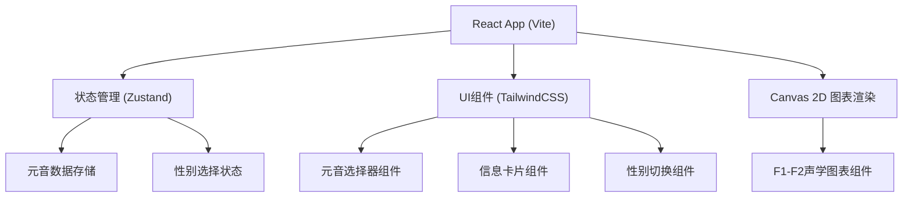

## 1. 架构设计



## 2. 技术描述

- **前端框架**: React 18 + TypeScript
- **构建工具**: Vite 5
- **样式方案**: TailwindCSS 3
- **状态管理**: Zustand
- **图表渲染**: HTML5 Canvas 2D API
- **图标库**: Lucide React

## 3. 路由定义

| 路由 | 用途 |
|-------|---------|
| / | 主页面 - 元音声学特性可视化工具 |

## 4. 数据模型

### 4.1 元音数据结构

```typescript
interface VowelData {
  id: string;
  ipa: string;           // 国际音标符号
  exampleWord: string;   // 示例单词
  f1Male: number;        // 男声 F1 频率 (Hz)
  f2Male: number;        // 男声 F2 频率 (Hz)
}

type Gender = 'male' | 'female';

interface AppState {
  selectedVowel: string;
  gender: Gender;
  setSelectedVowel: (id: string) => void;
  setGender: (gender: Gender) => void;
  getF1: (vowel: VowelData) => number;
  getF2: (vowel: VowelData) => number;
}
```

### 4.2 常量数据

Ladefoged 标准值（男声）:

```typescript
const VOWELS: VowelData[] = [
  { id: 'i', ipa: 'i', exampleWord: 'see', f1Male: 270, f2Male: 2290 },
  { id: 'e', ipa: 'ɛ', exampleWord: 'bed', f1Male: 530, f2Male: 1840 },
  { id: 'a', ipa: 'ɑ', exampleWord: 'father', f1Male: 730, f2Male: 1090 },
  { id: 'o', ipa: 'ɔ', exampleWord: 'law', f1Male: 570, f2Male: 840 },
  { id: 'u', ipa: 'u', exampleWord: 'boot', f1Male: 300, f2Male: 870 },
];
```

女声频率计算：
- F1(女) = F1(男) × 1.2
- F2(女) = F2(男) × 1.2

## 5. 项目结构

```
src/
├── components/
│   ├── VowelSelector.tsx      # 元音下拉选择器
│   ├── GenderToggle.tsx       # 男/女切换按钮
│   ├── VowelInfoCard.tsx      # 元音信息卡片
│   └── F1F2Chart.tsx          # F1-F2声学图表 (Canvas)
├── store/
│   └── useAppStore.ts         # Zustand 状态管理
├── data/
│   └── vowels.ts              # 元音数据常量
├── types/
│   └── index.ts               # TypeScript 类型定义
├── utils/
│   └── acoustics.ts           # 声学计算工具函数
├── App.tsx                    # 主应用组件
├── main.tsx                   # 入口文件
└── index.css                  # 全局样式
```
