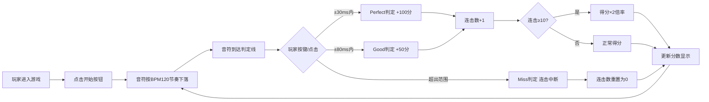

## 1. 产品概述

音乐节奏模拟小游戏是一款下落式节奏游戏，玩家需要在圆形目标点下落到判定线时按下空格键或点击屏幕获得分数。游戏以BPM120的速度生成目标点，配合节拍器音效，为玩家提供沉浸式的节奏体验。

## 2. 核心特性

### 2.1 功能模块

1. **游戏主界面**：游戏区域、判定线、下落音符
2. **分数系统**：实时分数、连击计数、最高连击记录
3. **判定系统**：Perfect/Good/Miss三级判定
4. **音频系统**：节拍器音效，配合音符节奏播放
5. **游戏控制**：开始/暂停/重新开始功能

### 2.2 页面详情

| 页面名称 | 模块名称 | 功能描述 |
|-----------|-------------|---------------------|
| 游戏主页面 | 游戏区域 | 显示下落的圆形目标点和底部判定线 |
| 游戏主页面 | 信息面板 | 显示当前分数、连击数、最高连击、判定结果 |
| 游戏主页面 | 控制面板 | 开始游戏、暂停、重新开始按钮 |

## 3. 核心流程

## 4. 用户界面设计

### 4.1 设计风格
- **主色调**：深色背景（#0a0a1a）配合霓虹色彩
- **强调色**：紫色（#8b5cf6）、青色（#06b6d4）、粉色（#ec4899）
- **按钮风格**：圆角玻璃拟态，带有霓虹发光效果
- **字体**：使用Orbitron作为数字显示字体，搭配现代无衬线字体
- **布局风格**：游戏区域居中，信息面板分布在顶部和侧边
- **视觉效果**：音符下落带有拖尾效果，判定时有粒子爆炸特效

### 4.2 页面设计概述

| 页面名称 | 模块名称 | UI元素 |
|-----------|-------------|-------------|
| 游戏主页面 | 游戏区域 | 深色渐变背景、下落圆形音符（带发光效果）、判定线（霓虹光效）、判定反馈文字动画 |
| 游戏主页面 | 信息面板 | 大号数字显示分数、连击计数器（带倍率提示）、最高连击记录 |
| 游戏主页面 | 控制面板 | 半透明玻璃质感按钮、悬停发光效果 |

### 4.3 响应式设计
- 桌面端优先设计，游戏区域固定宽高比
- 移动端适配触摸操作，点击屏幕任意位置即可判定
- 自适应不同屏幕尺寸，保持游戏区域居中显示

### 4.4 动画效果
- 音符下落：平滑的CSS动画，带拖尾效果
- 判定反馈：Perfect/Good/Miss文字弹出并淡出
- 连击特效：连击达到10时出现倍率提升动画
- 粒子效果：判定成功时产生彩色粒子爆炸
