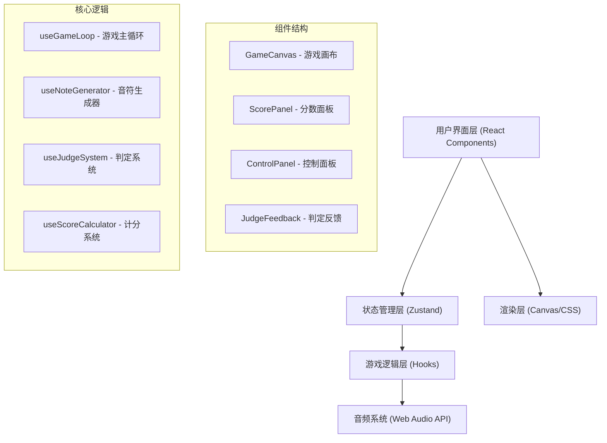

## 1. 架构设计



## 2. 技术描述

- **前端框架**：React@18 + TypeScript
- **构建工具**：Vite
- **样式方案**：TailwindCSS@3
- **状态管理**：Zustand
- **音频处理**：Web Audio API（原生）
- **图标库**：lucide-react

## 3. 路由定义

| 路由 | 用途 |
|-------|---------|
| / | 游戏主页面 |

## 4. 数据模型

### 4.1 游戏状态定义

```typescript
// 音符类型
interface Note {
  id: string;
  targetTime: number;      // 目标判定时间戳
  y: number;               // 当前Y坐标
  hit: boolean;            // 是否已被击中
  missed: boolean;         // 是否已错过
}

// 判定结果类型
type JudgeResult = 'perfect' | 'good' | 'miss' | null;

// 游戏状态
interface GameState {
  isPlaying: boolean;
  isPaused: boolean;
  score: number;
  combo: number;
  maxCombo: number;
  notes: Note[];
  lastJudge: JudgeResult;
  bpm: number;
  noteSpeed: number;       // 音符下落速度 (像素/秒)
}

// 判定配置
interface JudgeConfig {
  perfectWindow: number;   // Perfect判定窗口 (±30ms)
  goodWindow: number;      // Good判定窗口 (±80ms)
}
```

### 4.2 计分规则

| 判定 | 基础分数 | 连击≥10倍率 |
|------|---------|------------|
| Perfect | 100 | ×2 (200分) |
| Good | 50 | ×2 (100分) |
| Miss | 0 | 连击中断 |

## 5. 核心算法

### 5.1 音符生成算法
- BPM = 120，每拍间隔 = 60000ms / 120 = 500ms
- 每个音符提前固定时间（如2秒）生成，从顶部下落到判定线

### 5.2 判定算法
```typescript
function judge(currentTime: number, targetTime: number): JudgeResult {
  const diff = Math.abs(currentTime - targetTime);
  if (diff <= 30) return 'perfect';
  if (diff <= 80) return 'good';
  return 'miss';
}
```

### 5.3 位置计算
- 判定线Y坐标固定
- 音符Y坐标 = 判定线Y - (目标时间 - 当前时间) × 下落速度
